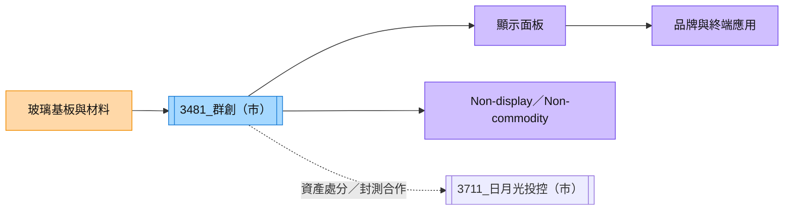

# 3481_群創（市）

## 基本資料

群創是台灣大型面板與顯示器製造商，產品涵蓋大尺寸面板、車用與工控顯示、非顯示器（Non-display）及非商品化（Non-commodity）應用。2026 年公司持續提高高附加價值業務比重，並處分部分廠房予南茂、矽品與日月光，藉此改善資產效率。

## 核心技術／競爭優勢

- 面板製程與大尺寸製造規模，能支援電視、IT 與車用顯示。
- Non-display 與 Non-commodity 轉型可降低純面板週期波動。
- 既有廠房與設備資產可透過處分、轉型或合作提高資本效率。

## 產品與應用

| 產品 / 服務 | 應用 | 供應鏈位置 |
|---|---|---|
| 顯示面板 | 電視、IT、車用 | 面板製造 |
| Non-display | 感測、商用與工控 | 顯示技術延伸 |
| Non-commodity | 高附加價值顯示與新應用 | 轉型業務 |

## 圖片 / 架構圖

圖說：群創以面板製造為核心，向 Non-display／Non-commodity 應用延伸，並透過資產合作改善供應鏈效率。

## 券商觀點

CTBC（2026-08-19）指出 2Q26 營收約 NT$637 億元、EPS 0.57 元，並估 2026E／2027E EPS 為 NT$3.44／0.93；2026 年處分廠房利益估貢獻 EPS 約 NT$2.47。報告以 2027E 每股淨值 1.8 倍評價、目標價 NT$54，評等由增加持股調降至中立；以上均屬券商估計與評等。

## 時間軸

| 時間 | 事件 | 類型 | 備註 |
|---|---|---|---|
| 2026 | 廠房處分予南茂、矽品、日月光 | 資產活化 | 券商估計利益挹注 EPS |
| 2026–2027 | Non-display／Non-commodity 比重提升 | 結構轉型 | 觀察高毛利業務貢獻 |
| 2028 起 | 新應用營收貢獻可能放大 | 新業務 | CTBC 估最快 2028 年 |

## 供應鏈位置

- 上游：玻璃基板、化學材料與面板設備。
- 下游：顯示器品牌、車用與工控應用。
- 資產合作：[[8150_南茂（市）]]、[[3711_日月光投控（市）]]。

## 相關公司

| 公司 | 關係 | 說明 |
|---|---|---|
| [[8150_南茂（市）]] | 資產／封測夥伴 | CTBC 報告提及廠房處分。 |
| [[3711_日月光投控（市）]] | 資產／封測夥伴 | CTBC 報告提及廠房處分。 |

> [!warning] 風險與注意事項
> - 面板報價與終端需求仍具週期性。
> - Non-display 轉型的量產與獲利貢獻時程仍不確定。

## 來源

- [[群創(3481,DG,OW_調降評等,中立)-CTBC260819]] — CTBC，2026-08-19

## 相關頁面

- [[技術_玻璃基板]]
- [[時程_2026記憶體與AI催化劑]]

## 本次 ingest 更新（Morgan Stanley，2026-08-14）

- 2Q26 營收約 NT$637 億、毛利率 14.6%；3Q26 商品顯示器可能季減高個位數，非商品與非顯示器大致持平，屬公司指引／券商整理。
- 玻璃核心基板專案 PoC 已完成、仍在驗證；Morgan Stanley 認為最早 2028 年才可能量產，不能視為已確認訂單。

新增來源：[[報告_MorganStanley_群創_20260814]]。
## Morgan Stanley 2026-08-18／08-20 更新

- 玻璃核心基板仍處於早期供應鏈階段；Morgan Stanley 認為在技術、良率或供應鏈出現更明確突破前，現階段不宜把玻璃機會視為主要獲利貢獻。
- 2H26 面板本業季節性與價格壓力仍是主線；公司 Non-display／Non-commodity 轉型與資產處分是中期改善方向。
- 來源：[[260818_ms_inx]]、[[260820_ms_2h-aug-panel-px]]（Morgan Stanley，2026-08-18／2026-08-20）；玻璃合作與量產時間仍屬待驗證情境，信心水準：低至中。
