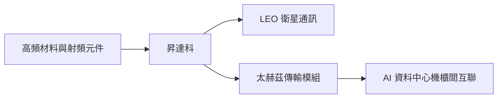

# 3491_昇達科（櫃）

## 基本資料

昇達科聚焦微波、毫米波與高頻通訊元件，低軌衛星為主要成長動能。中信 2026-08-07 指出，客戶產品調整已接近尾聲，8 月起出貨逐步回復；公司並透過取得巨頻科技 51% 股權，強化高頻通訊與太赫茲傳輸模組能力。

## 產品與應用

| 產品 | 應用 | 進度 |
|---|---|---|
| 衛星通訊高頻元件 | LEO 衛星地面與星載設備 | 2H26 低軌衛星營收預期較 1H26 成長 20% 以上 |
| 太赫茲傳輸模組 | AI 資料中心機櫃間高速互聯 | 報告估計 2026 年底量產，仍待驗證 |

## 供應鏈位置

- 上游：高頻材料、射頻與微波元件。
- 下游：低軌衛星通訊與 AI 資料中心高速互聯；特定客戶身分與替代光通訊的市場空間仍屬研究情境。

## 圖片 / 架構圖

## 時間軸

| 日期 | 事件 | 類型 | 重要性 | 備註 |
|---|---|---|---|---|
| 2026-08 | 低軌衛星客戶產品調整後逐步恢復出貨 | 出貨高峰 | ⭐⭐⭐ | 中信 2026-08-07，公司展望 |
| 2026Q4 | 低軌衛星長單認列觀察 | 放量 | ⭐⭐⭐ | 在手訂單與客戶拉貨仍需追蹤 |
| 2026 年底 | 太赫茲傳輸模組量產窗口 | 驗證／放量 | ⭐⭐⭐ | 中信估計，非已確認量產 |

### 風險補充

- 低軌衛星客戶調整再次延長，或發射進度不如預期。
- 太赫茲模組的客戶驗證、散熱與成本優勢未能轉化為訂單。

## 來源

- [[昇達科(3491,OW_增加持股)-CTBC260807]]（中信投顧，2026-08-07）
- [[報告_GoldmanSachs_昇達科3491_20260914]]（Goldman Sachs，2026-09-14）

## 2026-09-14 Goldman Sachs：LEO 規格升級與發射節奏

- 8 月營收 NT$3.21 億，月增 40%；GS 預估 3Q26／4Q26 營收年增 91%／90%，驅動為 LEO 發射加速與新世代衛星提高單星內容值，均屬券商 estimate。
- 公司產品為矩形波導及其衍生 RF 被動元件，應用於衛星 payload 與地面 gateway；GS 估 2025–2028E 營收 CAGR 約 75%，LEO 相關營收 CAGR 約 104%。
- GS 維持 Buy，目標價 NT$2,557；主要風險是發射延遲、新供應商競爭與客戶內製。

## 相關頁面

- [[時程_2026記憶體與AI催化劑]]
