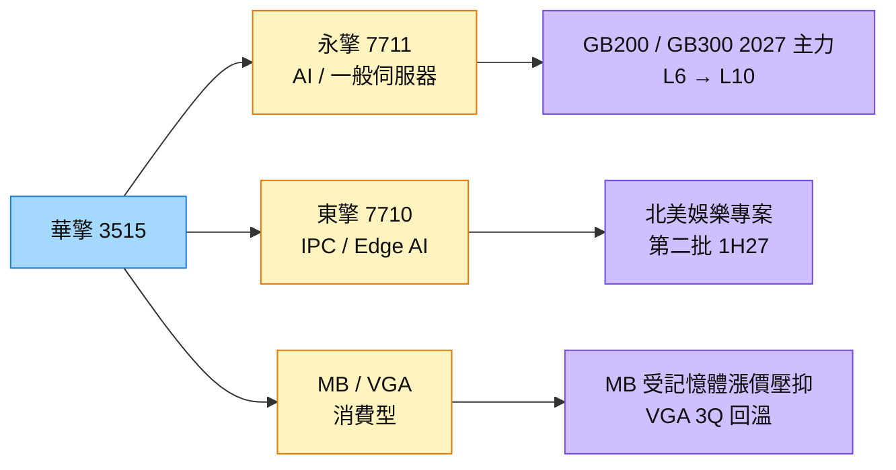

# 3515_華擎（市）

## 基本資料

華擎集團由消費型主機板（MB）與顯示卡（VGA）起家，現已轉向伺服器（子公司 [[7711_永擎（市）]]）與工業電腦（子公司 [[7710_東擎（興）]]）。Server 自 2Q26 起已成為集團最大產品類別，IPC 為第二快成長產品，MB 營收占比降至接近個位數。

- **財務：** 2Q26 營收 101.09 億元（YoY −16%）、毛利率 20%（YoY +6ppts）、營業利益 9.22 億元（YoY +33%）、EPS 2.96 元；1H26 營收 234.75 億元（YoY +4%）、EPS 7.10 元。毛利率提升來自 2Q25 匯率低基期、永擎毛利率改善、高毛利 IPC 占比提高。
- **展望：** 公司認為 2Q26 為消費型產品谷底，3Q26 起營收逐季成長；3Q 毛利率與 2Q 持平、4Q 因 Server 與 VGA 占比增加而略降，但營益率與淨利率隨規模放大改善。
- **Server：** 永擎一般型／AI 由 2Q26 的 40%／60%，4Q 隨 GB 放量 AI 占比回到近 80%；限制來自 GPU 與長短料而非需求，公司已策略備料至 1H27。2027 年以 GB200／GB300 為主（4Q26–1Q27 放量），產品由 L6 往 L10 系統級升級帶動 ASP。
- **消費型：** MB 受記憶體漲價壓抑，公司預估 2026 年 MB 營收年減、需待 2028 年記憶體價格穩定才回到正常；VGA 2Q 觸底後 3Q 回溫，AMD 卡性價比提升拉貨轉強。
- **營運資金：** 6 月底存貨 184.51 億元（YoY +73%），1H26 營業現金流出 37.17 億元，永擎籌資方案評估中。

資料來源：[[活動_華擎3515_CallMemo_20260916]]（元大投顧 Call Memo，2026-09-16）

## 核心技術／競爭優勢

- **集團雙引擎轉型：** 永擎（AI／一般伺服器）與東擎（IPC、Edge AI）取代消費型 MB 成為成長來源。
- **快速交付與備料：** 記憶體採「先保量、後訂價」，出貨前 2–3 個月定價再反映給客戶。
- **AMD 顯示卡供應：** AMD 卡在競品漲價後性價比提升，VGA 回溫較快。

## 產品與應用

| 產品 / 服務 | 應用 | 相關客戶 / 下游 |
|-------------|------|-----------------|
| AI／一般伺服器（永擎） | Neocloud、Tier 2 CSP、企業 AI | 平台來自 [[NVDA.US(nvidia)]]、[[AMD.US(amd)]] |
| 工業電腦、Edge AI（東擎） | 北美娛樂專案、智慧製造、工控 | 北美大型客戶 |
| 主機板 MB | DIY 與品牌 PC | 消費者 |
| 顯示卡 VGA、工作站卡 | 遊戲、工作站 | AMD 卡為主 |

## 圖片 / 架構圖

圖說：華擎營收重心由消費型 MB／VGA 轉向伺服器與工業電腦，毛利率結構隨 Server 占比提升而改變。

## EPS 記錄

| 期間 | EPS (元) | 備註 |
|------|---------|------|
| 2Q26 | 2.96 | 毛利率 20% |
| 1Q26 | 4.14 | 由 1H26 EPS 7.10 元回推 |
| 1H26 | 7.10 | 營收 YoY +4% |

## 時間軸

| 時間 | 事件 | 類型 | 重要性 | 備註 |
|------|------|------|--------|------|
| 3Q26 | 營收逐季回升；VGA 回溫 | 營運 | ⭐⭐ | [[活動_華擎3515_CallMemo_20260916]] |
| 4Q26 | 永擎 GB 產品放量，AI 占比近 80% | 放量 | ⭐⭐⭐ | 毛利率略降、營益率改善 |
| 1H27 | 東擎北美專案第二批出貨 | 放量 | ⭐⭐ | 規格升級帶動 ASP |
| 2027 | Server 由 L6 升級 L10 系統級 | 規格升級 | ⭐⭐⭐ | GB200／GB300 為主 |

→ 跨公司時程詳見 [[時程_2026-2027高速互連與分散式算力]]

## 供應鏈位置

- 上游：GPU（NVIDIA、AMD）、記憶體、CPU、PCB
- 子公司：[[7711_永擎（市）]]（伺服器）、[[7710_東擎（興）]]（工業電腦）
- 所屬供應鏈：AI 伺服器，參見 [[分析_2026Q3半導體供需與AI伺服器供應鏈]]

## 相關公司

| 公司 | 關係 | 說明 |
|------|------|------|
| [[7711_永擎（市）]] | 子公司 | 伺服器業務 |
| [[7710_東擎（興）]] | 子公司 | 工業電腦與 Edge AI |
| [[NVDA.US(nvidia)]] | 上游平台 | GPU 配額為 Server 出貨主要限制 |
| [[AMD.US(amd)]] | 上游平台 | 顯示卡與 Instinct GPU |

## 風險與注意事項

> [!warning] 風險與注意事項
> - **毛利率稀釋：** Server 與 VGA 毛利率低於集團平均，GB 擴張越快毛利率壓力越大。
> - **營運資金：** 存貨 184.51 億元與現金流出，永擎籌資可能稀釋。
> - **記憶體漲價：** MB 需求受壓抑，DRAM 漲價壓力延續至 1H27。

## 來源

- [[活動_華擎3515_CallMemo_20260916]] — 元大投顧 Call Memo，2026-09-16
- [[活動_永擎7711_2Q26法說Memo_20260915]] — 永擎 2Q26 法說，2026-09-15

## 相關頁面

- [[分析_2026Q3法說季_AI供應鏈瓶頸與擴產節奏_LINE彙整]]
