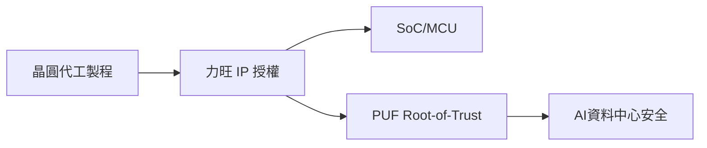

# 3529_力旺（市）

## 基本資料
力旺（eMemory）提供嵌入式非揮發性記憶體、NeoFuse 與 PUF／硬體根信任矽智財，透過晶圓代工製程授權收取權利金。2026-08-25 法說逐字稿稱 2Q26 營收與獲利創高、7 月權利金年增 25%；3nm 與資料中心安全應用是後續驅動，但數字來自 AI 轉錄，信心中低。

## 核心技術／競爭優勢
- 製程嵌入式記憶體 IP 可跨晶圓代工節點複用。
- PUF／Root-of-Trust 將晶片唯一性與金鑰保護嵌入硬體，具長週期權利金。
- 既有生態系與客戶導入形成驗證及轉換成本。

## 產品與應用
|產品|應用|下游|
|---|---|---|
|NeoBit／eNVM|MCU、SoC、車用|[[2330_台積電（市）]]|
|PUF／安全 IP|AI 伺服器、資料中心、IoT|雲端與晶片設計商|

## 圖片 / 架構圖

## 時間軸
|時間|事件|類型|重要性|
|---|---|---|---|
|2026H2|3nm／PUF 權利金擴大|放量|⭐⭐⭐|
|2027|資料中心與邊緣安全 IP 導入|業務擴張|⭐⭐|

## 供應鏈位置
- 上游：晶圓代工製程平台。
- 下游：IC 設計、AI 伺服器與 IoT 裝置；所屬主題：[[供應鏈_AI伺服器PCB]]。

## 相關公司
|公司|關係|說明|
|---|---|---|
|[[2330_台積電（市）]]|製程夥伴|IP 導入晶圓代工節點|
|[[2454_聯發科（市）]]|IC 設計客戶|法說列為生態系案例，待查證|

> [!warning] 風險與注意事項
> - 法說逐字稿為 AI 生成；客戶名單、單價與導入年份需以公司公告或原音檔覆核。
> - 權利金集中於先進製程導入，若客戶量產延後將影響成長。

## 來源
- [[活動_力旺法說_20260825]]（AlphaMemo.ai，2026-08-25）
