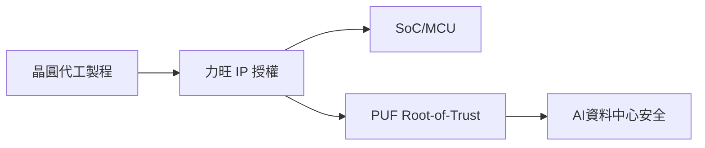

# 3529_力旺（市）

## 基本資料
力旺（eMemory）提供嵌入式非揮發性記憶體、NeoFuse 與 PUF／硬體根信任矽智財，透過晶圓代工製程授權收取權利金。2026-08-25 法說逐字稿稱 2Q26 營收與獲利創高、7 月權利金年增 25%；3nm 與資料中心安全應用是後續驅動，但數字來自 AI 轉錄，信心中低。

### 2026-08-14 法說補充（元大 Call Memo）

- **2Q26：** 營收 10.97 億元（QoQ +0.2%、YoY +17.1%）、營業利益率 60.7%、EPS 7.77 元；1H26 營收 21.91 億元、EPS 15.75 元。授權金 4.30 億元（QoQ +12.8%，先進製程、AI、安全與新世代 Flash 需求）、權利金 6.67 億元（QoQ −6.4%，反映 1Q26 晶圓代工稼動率低與某台灣代工客戶產能調整）。7 月營收較上季首月 +10%、YoY +24%，權利金 YoY +26%。（fact，高）
- **產品別（2Q26）：** NeoBit 21.9%、NeoFuse 56.6%、PUF-Based 10.9%（YoY +154%，PUF 權利金 QoQ +214%）、MTP 10.6%；12 吋權利金 62.5%、8 吋 37.5%（8 吋受惠 AI 資料中心電源管理架構升級與類比參數校正）。
- **安全 IP：** PUF 累計 tape-out 逾 130 個；2025 年切入 AI／AGI CPU 與 BMC、2026 年切入 AI 資料中心 SSD 控制晶片、最新切入 CXL Switch 晶片，安全 IP 由單一晶片擴至伺服器多顆關鍵晶片且多為 3nm；升級為「安全次系統」後單案授權金與權利金規模可達平均 10 倍以上；Caliptra 標準化帶動硬體信任根需求。
- **新動能：** 400V／800V HVDC 與下一代 Power IC 帶動 OTP 校準與 MTP 參數 IP 進入量產；1T NeoFlash 首波鎖定 Standalone NOR，預計 2027 年客戶量產；OTP 已導入美國客戶低軌衛星應用（抗輻射、金鑰、Unique ID）。累計 production processes 772 個，蟬聯 TSMC 最佳 IP 夥伴 16 年。
- **展望：** 2H26 權利金因新平台量產、成熟製程稼動率回升與代工漲價明顯轉強，長期維持 CAGR 20–30% 目標；外資持股達 67–68% 歷史新高。
- 來源：[[活動_力旺3529_CallMemo_20260814]]（元大投顧，2026-08-14 法說），信心中高。

## 核心技術／競爭優勢
- 製程嵌入式記憶體 IP 可跨晶圓代工節點複用。
- PUF／Root-of-Trust 將晶片唯一性與金鑰保護嵌入硬體，具長週期權利金。
- 既有生態系與客戶導入形成驗證及轉換成本。

## 產品與應用
|產品|應用|下游|
|---|---|---|
|NeoBit／eNVM|MCU、SoC、車用|[[2330_台積電（市）]]|
|PUF／安全 IP|AI 伺服器、資料中心、IoT|雲端與晶片設計商|

## 圖片 / 架構圖

```mermaid
flowchart LR
A[晶圓代工製程]-->B[力旺 IP 授權]-->C[SoC/MCU]
B-->D[PUF Root-of-Trust]-->E[AI資料中心安全]
```

## 時間軸
|時間|事件|類型|重要性|
|---|---|---|---|
|2026H2|3nm／PUF 權利金擴大|放量|⭐⭐⭐|
|2027|資料中心與邊緣安全 IP 導入|業務擴張|⭐⭐|
|2027|1T NeoFlash（Standalone NOR）客戶量產|新產品|⭐⭐|
|2H26|CXL Switch、AI SSD 控制晶片安全次系統權利金放量|放量|⭐⭐|

→ 跨公司時程詳見 [[時程_2026-2027高速互連與分散式算力]]

## 供應鏈位置
- 上游：晶圓代工製程平台。
- 下游：IC 設計、AI 伺服器與 IoT 裝置；所屬主題：[[供應鏈_AI伺服器PCB]]。

## 相關公司
|公司|關係|說明|
|---|---|---|
|[[2330_台積電（市）]]|製程夥伴|IP 導入晶圓代工節點|
|[[2454_聯發科（市）]]|IC 設計客戶|法說列為生態系案例，待查證|

> [!warning] 風險與注意事項
> - 法說逐字稿為 AI 生成；客戶名單、單價與導入年份需以公司公告或原音檔覆核。
> - 權利金集中於先進製程導入，若客戶量產延後將影響成長。

## 來源
- [[活動_力旺法說_20260825]]（AlphaMemo.ai，2026-08-25）
- [[活動_力旺3529_CallMemo_20260814]]（元大投顧法說 Call Memo，2026-08-14）

- [[報告_MorganStanley_力旺量子安全_20260908]]（2026-09-08）

## 相關頁面

- [[技術_800VDC供電架構]]
