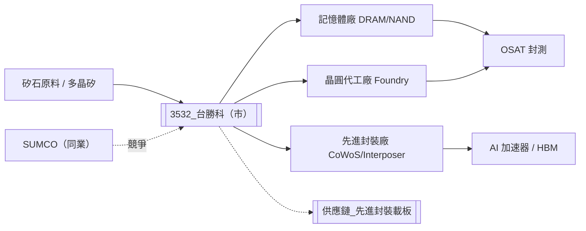

# 3532_台勝科（市）

## 基本資料

台勝科（SAS，Sino American Silicon Products / 台灣勝高科技）是台灣主要矽晶圓（Silicon Wafer）製造商，生產 12 吋與 8 吋拋光矽晶圓，供應記憶體廠、晶圓代工廠及先進封裝製程所需基材。公司由日本 SUMCO 與台灣投資方合資成立，在全球矽晶圓市場佔有一席之地，與 SUMCO 為主要競爭同業。

> [!warning] 公司歸屬確認
> 台勝科（3532）部分資料來源與環球晶（6488，GlobalWafers）旗下子公司有所混淆，請以公開財報確認法人實體。本頁內容依 2026-05-28 法說資料編製，法說發言人為邱紹勛副總。

**主要產品/服務**：
- **12 吋拋光晶圓**（主力，高光晶圓佔 70%）：供應記憶體廠（DRAM、NAND）和晶圓代工廠
- **8 吋拋光晶圓**：供應成熟製程 PMIC、DDIC、功率半導體等晶圓代工需求
- **先進封裝專用特殊矽晶圓**：CoWoS 用特殊矽晶圓、Carrier Wafer（3D 封裝承載片）、矽電容（Silicon Capacitor）、中介片（Interposer）用晶圓

**業務狀況**（資料來源：2026-05-28 法說）：
- 2026Q1 營收 YoY +10.87%，但新廠折舊攤提壓低獲利率
- EBITDA margin >22%（即使新廠折舊影響下仍維持）
- 2026 年資本支出預估約 NT$33 億
- 12 吋產能（不計新廠認證中產能）全面滿載；8 吋接近滿負荷，甚至超過人力負荷產能
- 新廠（12 吋）產能已被客戶預約完售，認證速度預期今年內完成

**成長驅動**：
1. AI 應用拉動記憶體需求，帶動 12 吋高光晶圓出貨量成長
2. AI 伺服器基礎建設帶動 8 吋需求（PMIC、驅動 IC 用成熟製程）
3. 先進封裝（CoWoS、3D Stacking）導致每顆晶片矽晶圓需求面積大幅增加（多晶圓堆疊）
4. 先進封裝中介片、Carrier Wafer 新業務預計 2026 下半年量產

**供應鏈位置**：位於半導體供應鏈最上游，為晶圓廠（Foundry）、記憶體廠（Memory IDM）提供基礎材料（矽晶圓），是先進封裝技術升級的關鍵材料方。

**資料來源**：[[活動_台勝科法說_20260528]]（2026-05-28，發言人邱紹勛副總）

---

## 核心技術／競爭優勢

1. **拋光晶圓品質基準地位**：12 吋高光晶圓已在 DDR 傳統記憶體市場成為客戶品質基準（reference standard），客戶黏著度高，切換成本顯著。

2. **先進封裝特殊矽晶圓的先行佈局**：積極開發 CoWoS 用特殊矽晶圓、Carrier Wafer 及矽電容，與主要客戶共同規格開發，預計 2026H2 量產——此為成長最高潛力的新業務線。

3. **客戶 LTA（長期合約）覆蓋**：多家國際大客戶正積極洽談新年度 LTA，合約期限從一年到兩三年不等，長合約保障基本量價，景氣下行時庫存風險相對可控。

4. **日本技術背景（SUMCO 合資）**：具備日本半導體材料的品管標準與製程技術，在客戶認證門檻高的記憶體與 EUV 製程晶圓市場具備技術信任優勢。

5. **景氣轉折點的卡位**：公司判斷矽晶圓產業最壞時刻已過，客戶庫存策略由去化轉為回補，2027-2028 年全球主要半導體廠商擴產規模為近年最大，將為矽晶圓帶來結構性需求成長。

---

## 產品與應用

| 產品 / 服務 | 應用 | 相關客戶 / 下游 |
|-------------|------|-----------------|
| 12 吋高光拋光晶圓 | DRAM、NAND 記憶體製造 | [[MU.US(micron)]]、Samsung、SK Hynix |
| 12 吋拋光晶圓（標準） | 先進邏輯製程（FinFET/EUV） | [[2330_台積電（市）]]、晶圓代工廠 |
| 8 吋拋光晶圓 | PMIC、功率半導體、DDIC、RF 邏輯 | 成熟製程晶圓代工廠 |
| CoWoS 特殊矽晶圓 | 先進封裝基材（台積電 CoWoS 用） | [[2330_台積電（市）]] |
| Carrier Wafer | 3D 封裝暫時性承載基板 | 先進封裝廠、OSAT |
| 矽電容（Silicon Capacitor） | 去耦電容、先進封裝整合 | 先進封裝客戶 |
| 中介片用晶圓 | Interposer 基材 | 先進封裝廠 |

---

## 圖片 / 架構圖

> 台勝科位於半導體材料最上游，矽晶圓品質直接影響所有下游製程良率；先進封裝特殊晶圓業務為未來最高成長動能。

---

## 時間軸

| 時間 | 事件 | 類型 | 重要性 | 備註 |
|------|------|------|--------|------|
| 2026H2 | 先進封裝中介片 / CoWoS 特殊矽晶圓進入量產 | 新業務放量 | ⭐⭐⭐ | 預約下半年配合客戶量產 |
| 2026 年內 | 新廠（12 吋）認證完成，產能開出 | 產能擴張 | ⭐⭐ | 現已被客戶預約滿，認證是關鍵路徑 |
| 2026H2 起 | 營運逐季提升，Q3/Q4 最樂觀 | 業績催化 | ⭐⭐ | 管理層明確表示對下半年非常期待 |
| 2027 | 客戶 LTA 合約新一輪議價 | 價格催化 | ⭐⭐ | 現貨價已開始上揚，議價能力增強 |
| 2027-2028 | 全球半導體廠擴產規模最大，矽晶圓需求高峰 | 產業趨勢 | ⭐⭐⭐ | 多晶圓堆疊技術使單位需求面積倍增 |

---

## 供應鏈位置

- **上游原材料**：多晶矽（Polysilicon）、液態化學品、特殊氣體
- **競爭同業**：SUMCO（日本，全球矽晶圓前二大）、信越化學（Shin-Etsu，全球最大）
- **下游客戶**：記憶體 IDM（[[MU.US(micron)]]、Samsung、SK Hynix）、晶圓代工廠（[[2330_台積電（市）]]）、OSAT 先進封裝廠
- **所屬供應鏈**：[[供應鏈_先進封裝載板]]（先進封裝用特殊矽晶圓角色）

> 待建供應鏈頁：`# 待建供應鏈頁_矽晶圓`（矽晶圓上游材料供應鏈目前無對應頁面）

---

## 相關公司

| 公司 | 關係 | 說明 |
|------|------|------|
| [[MU.US(micron)]] | 客戶 / 下游 | 12 吋 DRAM 晶圓主要買家之一 |
| [[2330_台積電（市）]] | 客戶 / 下游 | CoWoS 特殊矽晶圓、標準 12 吋晶圓買家 |

---

> [!warning] 風險與注意事項
> - **新廠折舊壓力**：2026 年新廠（12 吋）折舊攤提明顯拖累獲利率，需至產能滿載並價格回升才能完全消化
> - **認證速度風險**：新廠產能已被客戶預訂，但認證進度若延遲，量產時間和實際出貨量將落後
> - **矽晶圓景氣循環**：矽晶圓供需較晶片製造更具週期性；SUMCO 法說提及客戶庫存仍偏高，台勝科觀點較樂觀，需交叉驗證（⚠️ 資訊可能有分歧）
> - **客戶集中**：記憶體廠商前三大（Micron、Samsung、SK Hynix）主導 12 吋晶圓採購，若任一大客戶削減訂單，衝擊顯著
> - **美國設廠評估**：已開始供應美國客戶，若美國在地化需求提升而公司無法配合擴廠，可能流失訂單；但美國設廠成本高昂，短期難以決策

---

## 來源

- [[活動_台勝科法說_20260528]]（2026-05-28，來源類型：法說/法人說明會，信心水準：高）
