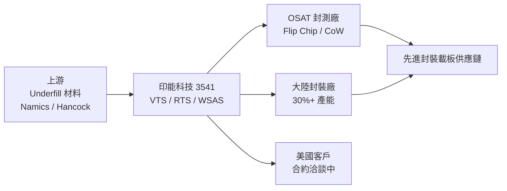

# 3541_印能科技（市）

## 基本資料
印能科技（3541）是台灣先進封裝製程設備廠，專注於 Flip Chip / CoW（Chip-on-Wafer）製程中的熱壓接合（Thermocompression）、Underfill 處理與翹曲（Warpage）管理設備。核心產品線：VTS（真空熱壓系統，主力產品）、RTS（EVO-RTS，進階版，同時解決氣泡與助焊劑殘留）、WSAS（Warpage 矯正與烤箱整合系統）。

2026 Q1 財務表現強勁：營收 8.76 億元（YoY +82%，+4.2 億元），稅後淨利 4.15 億元，EPS 14.68，毛利率 65%，營業利益率 53%，稅後淨利率 47.4%。訂單已排至 2027 Q1，交期由兩個月延長至約四個月。

成長動能：①RTS 出貨量逐步提升（取代 VTS，單價 2X-5X）、②WSAS 下半年開始出貨（未來單獨加 2X-3X）、③大陸設廠釋放台灣產能（30% 訂單轉大陸）、④美國客戶積極洽談合約。

資料來源：[[活動_印能科技法說_20260609]]（2026-06-09）

## 核心技術／競爭優勢
- **VTS → RTS 產品迭代，單價倍增**：VTS 為業界標準，RTS（EVO-RTS）能同時解決氣泡（void）與助焊劑殘留（flux residue）兩大難題，單台售價 2X-5X（視功能組合），且不同材料有專用版本（PRO for SOIC/金屬，PIONEER for NCF，PLURAL for 大陸市場），滿足客戶差異化需求
- **WSAS 翹曲整合解方**：WSAS 針對先進封裝的 warpage 物理挑戰，與烤箱整合成完整製程站，下半年導入量產線，為 VTS/RTS 以外的第三成長引擎
- **多產品取代傳統設備**：公司產品能取代多項傳統設備，有效降低客戶 OPEX 與佔地需求；此特性帶來強競爭優勢但也引起同業不滿（法說明確提及）
- **揮發物收集模組客製化**：針對 poly、on-the-field、含酸鹼等不同材料設計專用揮發物收集器，應對先進封裝多樣化材料需求，提升客戶黏著度
- **獲獎背書 + 技術認可**：EVO-RTS 2024 年於 ECTC 發表，2025 年獲 R&D 100 獎，2026 年升級並獲愛迪生獎，為業界首要技術指標認可

## 產品與應用

| 產品 / 服務 | 應用 | 相關客戶 / 下游 |
|-------------|------|-----------------|
| VTS（真空熱壓系統） | Flip Chip 主流製程，消除 void | OSAT 封測廠、IDM（大陸 30%+） |
| EVO-RTS（進階熱壓） | 同時解決 void + flux residue，NCF 材料 | OSAT 廠（台灣+海外）、美國客戶 |
| WSAS（翹曲矯正 + 烤箱） | CoW / 大尺寸封裝翹曲管理 | 先進封裝廠（預計 2026 下半年首批出貨） |
| 揮發物收集模組（客製） | 多樣化封裝材料（poly、含酸鹼材料）專用處理 | 依客戶材料規格客製 |

## 圖片 / 架構圖

> 印能科技在先進封裝製程中扮演 Underfill 熱壓設備關鍵角色，Namics/Hancock 為上游 Underfill 材料供應商，下游服務 OSAT/IDM 進行 Flip Chip 及 CoW 量產。

## EPS 記錄

| 期間 | EPS (元) | 毛利率 | 備註 |
|------|---------|--------|------|
| 2026 Q1 | 14.68 | 65% | 營收 8.76 億（YoY +82%）；營業利益 4.6 億（利益率 53%）；稅後淨利率 47.4% |
| 2025 Q1（去年同期） | — | 72% | 毛利率較高主因：改機案多、材料支出較少 |

> AI 轉錄，供參考，請以原始音檔為準。來源：[[活動_印能科技法說_20260609]]

## 時間軸（催化劑）

| 時間 | 事件 | 類型 | 重要性 | 備註 |
|------|------|------|--------|------|
| 2026 下半年 | WSAS 首批設備開始出貨 | 新品放量 | ⭐⭐⭐ | 第三成長引擎啟動；與烤箱整合進量產線 |
| 2026 下半年 | 大陸工廠全面投產 | 擴產 | ⭐⭐⭐ | 釋放台灣 30% 產能，使台灣產線承接更多新訂單 |
| 2026 下半年 | 美國客戶合約談判進入決定階段 | 客戶拓展 | ⭐⭐⭐ | 美國客戶對新技術高度興趣 |
| 2027 | WSAS 出貨量顯著增加 | 放量 | ⭐⭐⭐ | 管理層：未來 1-2 年產品組合再次翻轉，RTS 取代 VTS 主力地位 |
| 2027 Q1 | 目前訂單排至此時 | 能見度 | ⭐⭐⭐ | 新訂單交期約 4 個月（從兩個月延長），產能緊張 |

## 供應鏈位置
- **先進封裝熱壓設備**：Flip Chip / CoW 製程設備 → [[供應鏈_先進封裝載板]]
- 上游（材料）：Underfill 材料供應商——Namics（最大）、Hancock（第二）、Amis、Haypole、Rhizomic
- 下游（客戶）：OSAT 封測廠（台灣、海外）、大陸封裝廠（30%+ 產能）、美國客戶（洽談中）
- 競爭者：T 公司（TSMC？）在 CoW 領域有自有方法，採用印能設備較少；其他設備商因印能產品取代其設備而有摩擦

## 相關公司

| 公司 | 關係 | 說明 |
|------|------|------|
| Namics（上游） | 上游材料供應商 | 最大 Underfill 供應商；與公司合作開發相容產品 |
| Hancock（上游） | 上游材料供應商 | 第二大 Underfill 供應商；配合開發相容產品 |
| OSAT 封測廠（未揭露） | 客戶 / 下游 | 台灣及海外主要客戶群；大陸客戶佔 30%+ |

> [!warning] 風險與注意事項
> - **壓力容器委外瓶頸**：關鍵零組件「壓力容器」委外製造廠塞車，造成交期延長（2 個月→ 4 個月），若未解決將限制出貨能力；可能影響客戶建廠進度認列時間
> - **客戶建廠延遲風險**：部分客戶建廠進度延遲，造成相應設備出貨及營收認列時間推後，可能影響全年業績實現節奏
> - **毛利率結構轉變**：去年同期毛利率 72% 因改機案（材料支出少）而較高，目前 65% 是正常製造水準；若新品（RTS/WSAS）占比提升，毛利率維持仍需觀察
> - **大陸市場地緣政治**：大陸客戶佔 30%+ 產能，中美貿易摩擦或出口管制升級可能衝擊大陸設廠計畫及相關訂單

## 來源
- [[活動_印能科技法說_20260609]]（2026-06-09 法說）
