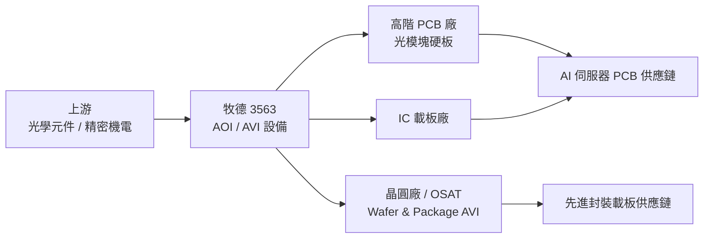

# 3563_牧德（市）

## 基本資料
牧德科技（3563）是台灣 PCB 光學自動檢測設備（AOI）龍頭，主要產品為高精度外觀檢查設備（AOI），應用涵蓋高階 PCB（含光模塊硬板）、IC 載板及半導體晶圓（Wafer AVI）/封裝體（Package AVI）。光模塊 AOI 設備全球市佔率達 81%，AI 運用領域 7-8 款主力產品均為全球市佔率第一；台灣 IC 載板客戶為唯一指定合作廠商。

2025 年全年營收 31.9 億元（YoY 超過一倍），EPS 15.8；2026 Q1 營收 7.92 億元、EPS ~4.61、毛利率 61%；累計 1-5 月營收達 15.56 億元。訂單能見度超過 20 億元，交期由 10-12 週延長至約 6 個月，反映供應緊張。三大基地（崑山二期、新竹三廠、泰國廠）到位後年產值目標 50-60 億元。

成長驅動：高階光模塊 PCB 需求持續放量（AI 伺服器光互連）、半導體新品認證進入出貨期（Wafer/Package AVI、Auto OM）、設備漲價 5-8.7% 部分抵銷成本壓力。

資料來源：[[活動_牧德法說_20260630]]（2026-06-30）

## 核心技術／競爭優勢
- **光模塊高階 AOI 市佔 81%**：光模塊硬板線路寬度僅 12 微米，技術門檻極高；國際客戶認證週期長，牧德已牢固掌握高階市場，後進者難以複製
- **IC 載板台灣唯一指定夥伴**：台灣 IC 載板客戶唯一指定合作廠商，客戶黏著度高；半導體設備毛利率 60-70%，高於 PCB 設備（55-65%），帶動整體毛利提升
- **半導體 AVI 新品矩陣**：Wafer AVI 已通過多家大廠認證並取得訂單；Package AVI 預計 Q4 認證出貨；Auto OM 已送客戶認證，形成覆蓋 PCB→晶圓→封裝的完整 AVI 產品線
- **三大基地全球布局**：崑山二期（大陸）、新竹三廠（台灣）、泰國廠陸續啟用，分散地緣風險；目前台灣產能利用率 80-90%，年產值規模目標 50-60 億元
- **訂單能見度強**：2026 Q3 至 2027 H1 訂單狀況非常樂觀，合約負債（預收訂金）2026 Q1 約 2.5 億元並持續成長；單一光模塊設備訂單超過 20 億元

## 產品與應用

| 產品 / 服務 | 應用 | 相關客戶 / 下游 |
|-------------|------|-----------------|
| PCB AOI（外觀檢查機） | 高階 PCB、光模塊硬板 | 光模組廠、PCB 廠（4-5 家，未揭露） |
| IC 載板 AOI | IC 載板外觀檢測 | 台灣 IC 載板廠（台灣唯一指定） |
| Wafer AVI | 半導體晶圓外觀檢測 | 多家晶圓大廠（已認證出貨） |
| Package AVI | 半導體封裝體外觀檢測 | 先進封裝客戶（預計 2026 Q4 認證） |
| Auto OM | 光學量測 | 客戶認證中（預計 2026 Q4 接單） |

## 圖片 / 架構圖

> 牧德在 PCB 光學檢測市場取得全球領先地位，並同步向半導體 AVI 延伸，形成 PCB→IC 載板→晶圓→封裝的完整檢測設備版圖。

## EPS 記錄

| 期間 | EPS (元) | 毛利率 | 備註 |
|------|---------|--------|------|
| 2025 全年 | 15.8 | — | YoY +約 10.7；年營收 31.9 億元（YoY 翻倍） |
| 2026 Q1 | ~4.61 | 61% | 較去年同期 64% 略低；原因：產品組合變化 + 料件成本上升 |

> AI 轉錄，供參考，請以原始音檔為準。來源：[[活動_牧德法說_20260630]]

## 時間軸

| 時間 | 事件 | 類型 | 重要性 | 備註 |
|------|------|------|--------|------|
| 2026 Q4 | Package AVI 認證出貨 | 新品出貨 | ⭐⭐⭐ | 半導體業務拓展關鍵節點 |
| 2026 Q4 | Auto OM 客戶認證完成、開始接單 | 新品認證 | ⭐⭐ | |
| 2026 Q4 | 光模塊硬板 AOI 4-5 家客戶出貨啟動 | 放量 | ⭐⭐⭐ | 單產品訂單能見度超 20 億元 |
| 2026-2027 | 崑山二期、新竹三廠、泰國廠陸續啟用 | 擴產 | ⭐⭐⭐ | 三大基地年產值目標 50-60 億元 |
| 2027 | 半導體設備出貨量持續成長 | 成長動能 | ⭐⭐⭐ | 明年半導體出貨量確定高於 2026；明年八九成設備用於光模塊 |

## 供應鏈位置
- **PCB 設備**：高階 PCB / 光模塊硬板 AOI → [[供應鏈_AI伺服器PCB]]
- **IC 載板設備**：IC 載板外觀檢測 → [[供應鏈_AI伺服器PCB]]
- **半導體 AVI**：Wafer / Package 外觀檢測 → [[供應鏈_先進封裝載板]]
- 上游：光學元件、精密機電零組件（料件成本持續上漲，交期拉長）
- 下游：高階 PCB 廠、IC 載板廠、晶圓廠、OSAT 封測廠、光模組廠

## 相關公司

| 公司 | 關係 | 說明 |
|------|------|------|
| 東山精密（中國 PCB 廠） | 客戶 / 下游 | 光模塊 PCB 大客戶之一 |
| 深藍盛宏景望（中國 PCB 廠） | 客戶 / 下游 | 光模塊 PCB 客戶 |

> [!warning] 風險與注意事項
> - **供應鏈緊張**：料件成本持續上漲（漲幅 8-15%），設備漲價成交僅 5-8.7%，毛利受壓；交期延長至約 6 個月，若供應鏈未及時擴充將影響出貨能力
> - **中國市場集中風險**：主要營收來自中國市場，地緣政治風險（中美科技管制）可能衝擊客戶投資意願或出口限制
> - **新品認證進度不確定**：Wafer AVI、Package AVI、Auto OM 仍在認證或初期出貨階段，若認證延誤將推遲半導體業務成長貢獻
> - **產品組合轉換期毛利壓力**：2026 Q1 毛利率從 64% 降至 61%；在半導體設備佔比提升前，PCB 設備主導期間毛利率可能持續承壓

## 來源
- [[活動_牧德法說_20260630]]（2026-06-30 法說）
