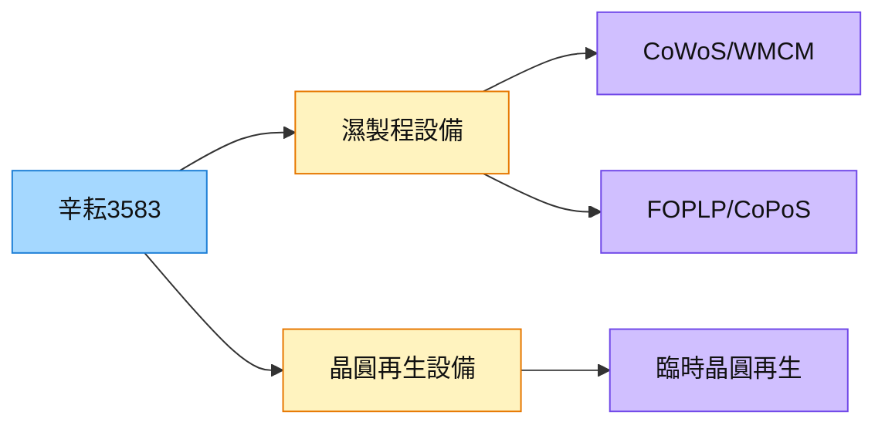

# 3583_辛耘（市）

## 基本資料

辛耘企業（3583 TT）是台灣半導體設備廠，主要產品為晶圓再生（reclaim）設備及濕製程清洗/再生設備。在先進封裝浪潮中受益於 CoWoS、WMCM 製程的濕製程設備需求。玉山證券點名為 WMCM 受惠股，與 [[3595_山太士（市）]] 在 FOPLP 設備同盟合作。

資料來源：[[報告_先進封裝技術發展方向_20260722]]（定錨產業筆記，2026-07-22）

## 核心技術／競爭優勢

- **濕製程設備跨平台覆蓋：** 設備涵蓋 CoWoS、WMCM、面板級 FOPLP 等多個先進封裝平台的濕製程段，跨平台重疊度高，訂單能見度佳。
- **再生晶圓服務：** 先進封裝製程大量使用臨時晶圓（temporary wafer）和再生晶圓，辛耘在再生設備有既有市場。
- **FOPLP 設備聯盟：** 與山太士（3595）、新群設備同盟，形成面板級封裝設備生態。

## 產品與應用

| 產品 / 服務 | 應用 | 相關客戶 / 下游 |
|-------------|------|-----------------|
| 晶圓再生設備 | CoWoS/SoIC 臨時晶圓再生 | [[2330_台積電（市）]]、OSAT |
| 濕製程清洗設備 | CoWoS、WMCM 清洗製程 | 封裝廠通用 |
| FOPLP 相關設備 | 面板級先進封裝 | [[3711_日月光投控（市）]] |

## 圖片 / 架構圖

圖說：辛耘在先進封裝設備的核心角色是「濕製程 + 再生晶圓」，跨 CoWoS、WMCM、FOPLP 多平台。

## 時間軸

| 時間 | 事件 | 類型 | 重要性 | 備註 |
|------|------|------|--------|------|
| 2026 起 | WMCM 產能爬坡 | 放量 | ⭐⭐ | 玉山點名受惠；AP7 P1 tool move-in 為驗證點 |
| 2027 | FOPLP/CoPoS 設備需求放大 | 催化劑 | ⭐⭐ | 辛耘/山太士/新群 聯盟佈局 |

## 供應鏈位置

- 設備供應：先進封裝 CoWoS、WMCM、FOPLP 濕製程段
- 同業：弘塑（3131，濕製程/underfill），敘豐（3485，電鍍）

## 相關公司

| 公司 | 關係 | 說明 |
|------|------|------|
| [[2330_台積電（市）]] | 客戶 | CoWoS/WMCM 設備採購 |
| [[3711_日月光投控（市）]] | 客戶 | FOPLP VIPack 設備 |
| [[3595_山太士（市）]] | 設備聯盟夥伴 | FOPLP 設備生態合作 |

> [!warning] 風險與注意事項
> - **先進封裝資本支出週期：** 設備廠受先進封裝資本支出節奏影響明顯，若 WMCM/CoPoS 時程延遲，訂單能見度下降。
> - **競爭：** 弘塑（3131）在 CoWoS 濕製程設備市占更高，辛耘需差異化競爭。

## 本次 ingest 更新（2026-08-31）

- 2026-08-27 公司簡報／法說：2026 capex 約 NT$1.75bn；12 吋再生晶圓產能約 210k 片/月，2026 年底目標增至約 250k；訂單能見度延伸至 2027，部分設備排到 2028。
- [[報告_辛耘_2026Q2法說簡報_20260827]] 為公司簡報，產能與資本支出優先於 AI 逐字稿推論。

## 來源

- [[報告_先進封裝技術發展方向_20260722]] — 定錨產業筆記講座，2026-07-22

## 相關頁面

- [[分析_晶片尺寸擴大與面板級封裝2026]]
- [[技術_CoWoS與先進封裝]]
