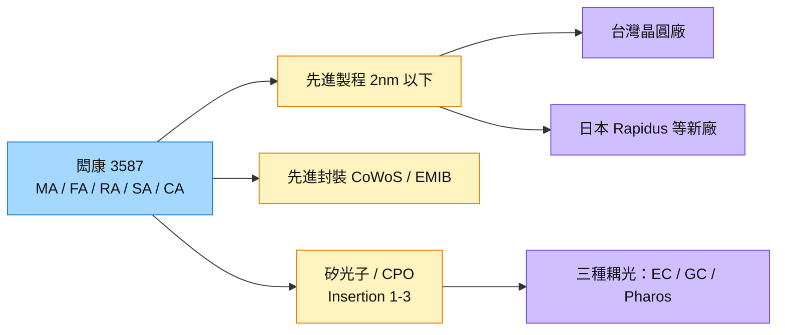

# 3587_閎康（櫃）

## 基本資料

閎康為獨立第三方半導體分析實驗室，提供 MA（材料分析）、FA（故障分析）、RA（可靠度）、SA（表面分析）、CA（化學分析）五大核心技術，具 2nm 以下製程監控與 IC 電路修補經驗。全球 16 座實驗室分布台灣、中國、日本，客戶逾 8,500 家；2025 年營收 55.45 億元，2002–2025 年營收 CAGR 35.6%。

- **營運：** 1H26 營收 30.68 億元（YoY +17.47%）、毛利 9.96 億元（YoY +46.3%）、營業利益 4.53 億元（YoY +139.8%）；1H26 提列一次性稅費 1.85 億元（中國子公司盈餘匯回）。
- **日本為主要動能：** 日本占營收 18%、美國 10%，近三年 CAGR 分別 44%、40%；日本毛利率高於整體且供不應求，單一核心客戶需求達現有產能 5 倍以上。北海道 FA 實驗室 9 月啟用（緊鄰 Rapidus），關東實驗室 2027 年初設立；閎康為 Rapidus 供應鏈中唯一非日本業者。
- **中國處分：** 上海（含蘇州、廈門、深圳）80% 股權處分給地方夥伴、保留 20%，預計年底前交割，資金自籌投入擴產。
- **矽光子／CPO 檢測：** 公司稱為唯一能提供 CPO Insertion 1／2／3 測試的獨立實驗室，已建置邊緣耦光、光柵耦光、FormFactor Pharos coupling 三種耦光方法。

資料來源：[[活動_閎康3587_元大論壇Memo_20260909]]（元大投資論壇，2026-09-09）

## 核心技術／競爭優勢

- **五大分析技術整合：** CPO 異質整合 3D 結構的故障分析需同時用到可靠度、光電測試、3D X-ray、InGaAs、SEM、FIB、TEM。
- **矽光子測試門檻：** 產品無統一規格、沿用老舊可靠度規範；單片 wafer 測試由 IC 的 10 分鐘至數小時，拉長到矽光子 16 小時以上，需 OFA＋EFA＋PFA＋MA 整體方案，設備單價高。
- **地緣布局：** 退出中國多數股權，資源轉向台灣與日本，切入日本先進製程新廠。
- **折舊高峰已過：** 今年折舊增幅低（個位數或持平），公司嚴控折舊增幅低於營收增幅。

## 產品與應用

| 產品 / 服務 | 應用 | 相關客戶 / 下游 |
|-------------|------|-----------------|
| 材料分析（MA）、TEM／SEM | 2nm 以下製程監控、先進封裝 | 晶圓廠、[[2330_台積電（市）]] 生態系 |
| 故障分析（FA）、IC 電路修補 | AI／HPC 晶片、CoWoS、EMIB | IC 設計、晶圓廠、OSAT |
| 矽光子／CPO Insertion 1–3 測試 | PIC、EIC、光引擎驗證 | 矽光子客戶 |
| 可靠度（RA） | 車用、先進封裝 | 車用與 AI 晶片客戶 |

## 圖片 / 架構圖

圖說：閎康成長由先進製程、先進封裝與矽光子三種分析需求驅動，地理上由中國轉向日本與美國。

## 時間軸

| 時間 | 事件 | 類型 | 重要性 | 備註 |
|------|------|------|--------|------|
| 2026-09 | 北海道 FA 實驗室啟用（緊鄰 Rapidus） | 擴點 | ⭐⭐ | [[活動_閎康3587_元大論壇Memo_20260909]] |
| 2026 年底 | 中國子公司 80% 股權處分交割 | 重組 | ⭐⭐ | 一次性稅費已提列 |
| 2027 年初 | 關東實驗室設立 | 擴點 | ⭐⭐ | 不排除東北再增設 |
| 2027 | 公布美國布局方案 | 擴點 | ⭐ | 公司預告 |

→ 跨公司時程詳見 [[時程_2026-2027高速互連與分散式算力]]

## 供應鏈位置

- 角色：晶圓廠、IC 設計與 OSAT 的外包分析實驗室
- 所屬供應鏈：[[供應鏈_光測試設備]]（矽光子 Insertion 測試）、[[供應鏈_半導體測試設備]]
- 技術背景：[[技術_CPO]]、[[技術_矽光子（SiPh）]]

## 相關公司

| 公司 | 關係 | 說明 |
|------|------|------|
| [[2330_台積電（市）]] | 生態系客戶 | 先進製程材料分析需求來源（台灣主要晶圓廠） |

## 風險與注意事項

> [!warning] 風險與注意事項
> - **中國退出的獲利缺口：** 公司預期日本 1–2 年內填補，若日本客戶擴產延遲則有落差。
> - **一次性稅費：** 1H26 稅後受 1.85 億元稅費影響，需區分本業與一次性項目。
> - **矽光子規格未定：** 測試標準不一，需求量化困難。

## 來源

- [[活動_閎康3587_元大論壇Memo_20260909]] — 元大投資論壇即時 Memo，2026-09-09

## 相關頁面

- [[供應鏈_CPO]]
- [[分析_2026Q3法說季_AI供應鏈瓶頸與擴產節奏_LINE彙整]]
