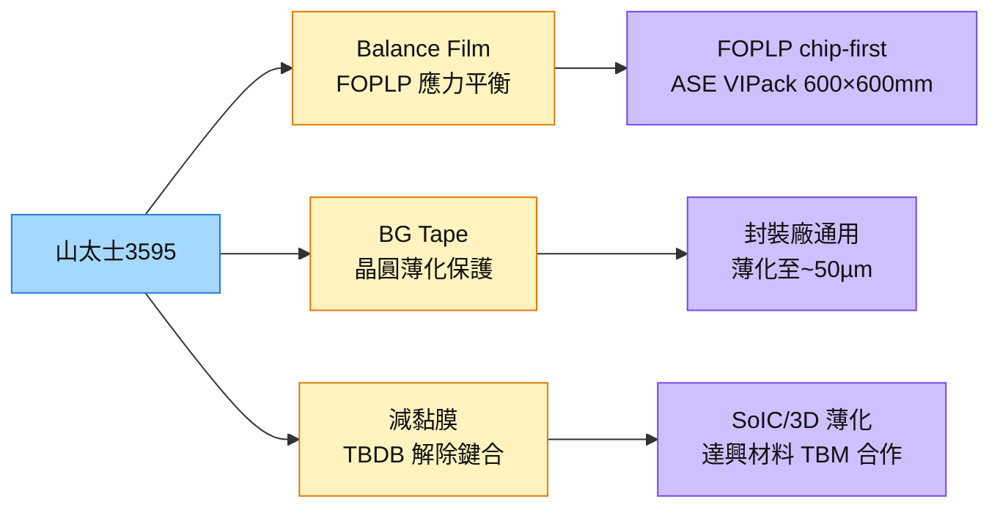

# 3595_山太士（市）

## 基本資料

山太士（3595 TT）是台灣半導體材料廠，主要產品為：
- **Balance Film（平衡膜）：** FOPLP 面板級封裝中用於應力平衡、抑制翹曲的薄膜材料
- **BG Tape（背磨膠帶）：** 晶圓薄化（Back-Grinding）過程中保護晶圓正面的膠帶
- **減黏膜：** TBDB（臨時鍵合/解除鍵合）製程中使用的材料

在 FOPLP 面板化製程中，**Balance Film 是良率雙核心之一**（另一是 Adaptive Patterning LDI）：chip-first 流程晶片置入後翹曲嚴重，Balance Film 透過應力補償穩定面板形狀，且每片面板都要消耗，配方需與客戶 recipe 深度綁定，形成**類獨佔**地位。

資料來源：[[報告_先進封裝技術發展方向_20260722]]（定錨產業筆記，2026-07-22）

## 核心技術／競爭優勢

- **Balance Film 類獨佔：** 配方與 FOPLP 客戶（ASE VIPack/力成）的製程 recipe 深度綁定，切換成本極高，具備類獨佔地位。
- **每片消耗高汰換率：** Balance Film 和 BG Tape 都是耗材（consumable），每片面板/晶圓都需要，量産放大後收入隨片數線性成長。
- **FOPLP 設備生態合作：** 與辛耘（3583）、新群設備組成 FOPLP 設備材料同盟，在面板級先進封裝形成生態位。

## 產品與應用

| 產品 / 服務 | 應用 | 相關客戶 / 下游 |
|-------------|------|-----------------|
| Balance Film 平衡膜 | FOPLP chip-first 翹曲控制 | [[3711_日月光投控（市）]]（ASE VIPack）、力成 |
| BG Tape 背磨膠帶 | 晶圓薄化保護 | 封裝廠通用 |
| 減黏膜 | TBDB 製程解除鍵合 | SoIC/3D 堆疊薄化段 |

## 圖片 / 架構圖

圖說：山太士三條線中 Balance Film 最具護城河（配方客製綁定），BG Tape 量大，減黏膜受益 3D 堆疊放量。

## 時間軸

| 時間 | 事件 | 類型 | 重要性 | 備註 |
|------|------|------|--------|------|
| 2026 | ASE VIPack FOPLP 600×600mm 投産 | 放量 | ⭐⭐⭐ | Balance Film 用量起步 |
| 2026-2027 | AMD Medusa 傳轉 chip-last FOPLP | 催化劑 | ⭐⭐ | 若成立，FOPLP 片數大幅提升 |
| 2028+ | CoPoS 量産 | 長線 | ⭐⭐ | 面板化翹曲控制需求持續 |

## 供應鏈位置

- 材料供應：FOPLP（ASE VIPack）、OSAT 薄化製程
- 聯盟：辛耘（3583）、新群設備——FOPLP 材料+設備生態

## 相關公司

| 公司 | 關係 | 說明 |
|------|------|------|
| [[3711_日月光投控（市）]] | 客戶 | ASE VIPack FOPLP Balance Film 主要用戶 |
| [[3583_辛耘（市）]] | 設備聯盟夥伴 | FOPLP 設備材料合作 |
| [[5234_達興材料（市）]] | 材料上下游 | TBDB 膠/減黏膜相近製程段 |

> [!warning] 風險與注意事項
> - **FOPLP 高階量産時程不確定：** 低 I/O PMIC 已量産，但高階 AI FOPLP 仍在 2027 試産階段，若延期則 Balance Film 用量遞延。
> - **AMD Medusa 傳聞未確認：** chip-last FOPLP 若未落實，催化劑遞延。
> - **面板翹曲工程難題：** 即便 Balance Film 有解，面板蝕刻均勻性等其他難題可能拖慢量産。

## 來源

- [[報告_先進封裝技術發展方向_20260722]] — 定錨產業筆記講座，2026-07-22

## 相關頁面

- [[分析_晶片尺寸擴大與面板級封裝2026]]
- [[技術_CoWoS與先進封裝]]
