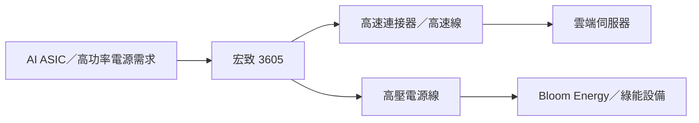

# 3605_宏致（市）

## 基本資料

宏致電子（3605.TW）由筆電微型連接器起家，已延伸至 AI 伺服器高速連接器、機內高速傳輸線、高功率高壓電源線、工業控制與車用電子。公司具金屬沖壓、塑膠射出、電鍍與自動化組裝的垂直整合能力，生產基地涵蓋台灣、中國、菲律賓、越南等地。

## 產品與應用

| 產品 | 應用 | 來源觀察 |
|---|---|---|
| MCIO／高速連接器 | AWS、Meta ASIC AI 伺服器 | 2Q26 開始放量；7 月產能約 400 萬顆，2026 年底目標 500 萬顆（公司展望） |
| 機內高速傳輸線 | AI 伺服器與網通 | 3Q26 起大量出貨（法說摘要） |
| 高功率高壓電源線 | AI 電源、綠能 | Bloom Energy 為主要客戶，2H26 出貨預期較 1H26 翻倍 |

## 圖片 / 架構圖

## 券商觀點與催化劑

- 中信投顧 2026-07-24 將高速連接器、機內高速線與高壓電源線列為 AI 成長引擎；AWS／Meta 客戶關係為報告揭露，未延伸為新增訂單承諾。
- 2026Q3 高速線大量出貨、2026 年底高速連接器產能達 500 萬顆，屬公司展望，信心：中。

## 風險與注意事項

1. ASIC 客戶平台導入與產能爬坡延遲。
2. 高速連接器良率、認證週期與客戶集中度。
3. 高壓電源線需求雖有能見度，仍需追蹤 Bloom Energy 實際拉貨。

## 來源

- [[宏致(3605,Note)-CTBC260724]]（中信投顧，2026-07-24）

## 相關頁面

- [[分析_2026H2 PCB缺料與AI供應鏈]]
- [[時程_2026Q3Q4_AI網通與硬體催化劑]]
