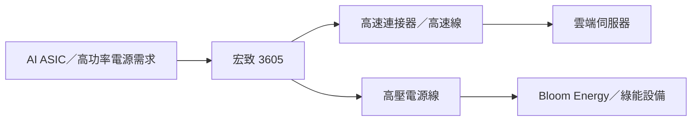

# 3605_宏致（市）

## 基本資料

宏致電子（3605.TW）由筆電微型連接器起家，已延伸至 AI 伺服器高速連接器、機內高速傳輸線、高功率高壓電源線、工業控制與車用電子。公司具金屬沖壓、塑膠射出、電鍍與自動化組裝的垂直整合能力，生產基地涵蓋台灣、中國、菲律賓、越南等地。

## 產品與應用

| 產品 | 應用 | 來源觀察 |
|---|---|---|
| MCIO／高速連接器 | AWS、Meta ASIC AI 伺服器 | 2Q26 開始放量；7 月產能約 400 萬顆，2026 年底目標 500 萬顆（公司展望） |
| 機內高速傳輸線 | AI 伺服器與網通 | 3Q26 起大量出貨（法說摘要） |
| 高功率高壓電源線 | AI 電源、綠能 | Bloom Energy 為主要客戶，2H26 出貨預期較 1H26 翻倍 |

## 圖片 / 架構圖

```mermaid
flowchart LR
  A[AI ASIC／高功率電源需求] --> B[宏致 3605]
  B --> C[高速連接器／高速線]
  B --> D[高壓電源線]
  C --> E[雲端伺服器]
  D --> F[Bloom Energy／綠能設備]
```

## 券商觀點與催化劑

- 中信投顧 2026-07-24 將高速連接器、機內高速線與高壓電源線列為 AI 成長引擎；AWS／Meta 客戶關係為報告揭露，未延伸為新增訂單承諾。
- 2026Q3 高速線大量出貨、2026 年底高速連接器產能達 500 萬顆，屬公司展望，信心：中。

## 2026-09-17 國泰 Call Memo 補充

- **2Q26：** 營收 33.50 億元（QoQ +19%、YoY +20%）、毛利率 25.6%、營業利益 2.46 億元（YoY +26%）、EPS 1.22 元（1Q26 0.67 元）；1H26 EPS 1.89 元。產品組合：筆電與消費 40%、工業 21%、AI 20%（QoQ +70%）、網通 15%、車用 4%。
- **AI 運算：** 由周邊板卡延伸至 CSP ASIC 主板，高速連接器單機用量由平均約 10 顆增至 25–30 顆；MCIO 高速線材 2Q26 量產（單條 2 顆、部分 3–4 顆連接器）；PCIe Gen6 隨 CSP ASIC 平台導入，2027 年成為主流、價值較 Gen5 高 10–15%，並開發 MCIO Gen7 與 112G／224G 背板方案。
- **能源：** 供應 Bloom Energy SOFC 系統高溫線材、PCS 內部與系統電力線材，1H26 出貨約 2 億元，2H26 相關出貨占總營收逾 10%，部分訂單能見度至 2027 年 6–8 月，配合 Bloom 2027 年 3.5GW 以上目標。
- **展望：** AI 運算＋能源占比由 2Q26 20% 升至 4Q26 30%；3Q／4Q26 毛利率續改善（AI 毛利率高於平均；能源線材毛利率較低但費用低、營益率仍高於公司平均），筆電與消費展望審慎。
- 來源：[[活動_宏致3605_CallMemo_20260917]]（國泰證期，2026-09-17），公司說法，信心中高。

## 風險與注意事項

1. ASIC 客戶平台導入與產能爬坡延遲。
2. 高速連接器良率、認證週期與客戶集中度。
3. 高壓電源線需求雖有能見度，仍需追蹤 Bloom Energy 實際拉貨。

## 來源

- [[宏致(3605,Note)-CTBC260724]]（中信投顧，2026-07-24）
- [[活動_宏致3605_CallMemo_20260917]]（國泰證期 Call Memo，2026-09-17）

## 相關公司

| 公司 | 關係 | 說明 |
|---|---|---|
| [[META.US(meta)]] | 終端客戶 | ASIC AI 伺服器高速連接器（中信報告揭露） |
| [[BE.US(bloom_energy)]] | 客戶 | SOFC 系統高溫線材、PCS 與系統電力線材；2H26 出貨占宏致營收逾 10% |

## 相關頁面

- [[分析_2026H2 PCB缺料與AI供應鏈]]
- [[時程_2026Q3Q4_AI網通與硬體催化劑]]
