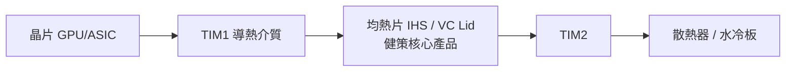

# 3653_健策（市）

## 基本資料

健策精密工業（3653 TT）成立於 1987 年，總部位於桃園，是全球均熱片（Heat Spreader / IHS）與散熱解決方案的領導供應商。核心產品為夾在晶片與散熱器之間的均熱片，兼具保護晶片與導熱功能。產品結構（3Q25）：Thermal Solutions 73%、Lead Frame 9%、Electronic Components 7%、Others 11%。

成長驅動：AI GPU（NVIDIA、ASIC）均熱片 ASP 每代升級約 50–100%，配合 CSP 資本支出持續擴大，2025/2026/2027 EPS 預估持續創高。

客戶：NVIDIA（GPU/ASIC 均熱片主要供應商）、AMD、Intel；下游涵蓋 AI 伺服器與半導體封裝廠。

資料來源：[[報告_國泰_健策3653_20260206]]（2026-02-06，國泰證期）

## 核心技術／競爭優勢

- **均熱片技術壁壘**：精密沖壓加工＋嚴苛平整度控制，競爭對手難以切入；半導體封裝廠切換成本高
- **逐代 ASP 升級路徑清晰**：GB300 均熱片平整性升級 → ASP +50%；VR（Vera Rubin）改兩件式＋銦材料導熱介質＋鍍金 → Rubin／Rubin Ultra 均熱片 ASP 估達 US$100／US$200，但 MCL 導入延至 Feynman 世代的機率提高
- **ASIC 雙引擎**：AWS Trainium、Google TPU 等 CSP 自研 ASIC 均熱片已量產，提供額外成長動能
- **Micro-Channel Lid（MCL）**：整合水冷板與均熱片，可對應 5,000W+ 功耗；美林 2026-07-28 的供應鏈調查認為量產較可能落在 2028H2 Feynman，主因供應鏈準備度與良率，健策仍被視為首批供應商候選
- **Kyber MCL 驗證進度**：富邦 2026-07-21 指 MCL 側面水路可把 blade 壓縮至 0.5U、解熱能力達 3,000W 以上；單體性能測試已過，但灌水測試標準、設備、機構與系統整合仍是量產瓶頸，屬 channel check、信心中
- **高壁壘認證地位**：連續受 TSMC 供應鏈管理論壇頒發「生產支援卓越獎」

## 產品與應用

| 產品 / 服務 | 應用 | 相關客戶 / 下游 |
|-------------|------|-----------------|
| GPU 均熱片（Blackwell GB300、Vera Rubin） | AI GPU 散熱封裝 | [[NVDA.US(nvidia)]] |
| ASIC 均熱片 | CSP 自研晶片散熱 | AWS Trainium、Google TPU |
| VC Lid（散熱腔體蓋） | 中高功耗晶片 | 各半導體封裝廠 |
| Micro-Channel Lid（MCL） | 5,000W+ 超高功耗散熱（開發中） | [[NVDA.US(nvidia)]]（Rubin Ultra / Feynman） |
| Lead Frame | 傳統半導體封裝、LED | 廣泛 IC 封裝 |
| 電子零件 | 通訊、工業 | — |

## 圖片 / 架構圖

![[報告_美林_健策MCL時程更新_20260728_004.png]]

> 美林的健策股價與目標價歷史圖；來源報告沒有均熱片或 MCL 結構圖，因此技術位置仍以上方 Mermaid 表達，產品來源圖維持待補。

> 均熱片夾在 TIM1 與 TIM2 之間，保護晶片並傳導熱能；VR 世代導入銦片 TIM1 → 衍生鍍金需求。

![[報告_富邦_Kyber機櫃延後_20260721_006.png]]

圖說：健策 MCL 將微流道、manifold cap 與晶片蓋板整合；富邦認為 0.5U Kyber blade 的空間與熱通量要求使 MCL 具優勢，但系統級測試仍未完成。（來源：富邦投顧，2026-07-21）

## EPS 記錄

| 季度 | EPS (元) | YoY | 備註 |
|------|---------|-----|------|
| 3Q25 | 9.49 | +20.9% | AI 均熱片比重提升 |
| 4Q25(E) | 9.69 | +2.1% | GB300 設計變更帶動 |
| 1Q26(E) | 11.18 | +15.3% | VR 小量出貨開始 |
| 2Q26(E) | 14.52 | +30.0% | VR 出貨量提升 |

## EPS 預估

| 年度 | 國泰證期 EPS（報告日：2026-02-06） | 美林 EPS（報告日：2026-07-28） | 備註 |
|------|-----------------------------------|--------------------------------|------|
| 2025E | 36.62 | 36.75A | 美林欄為實際值 |
| 2026E | 61.16 | 61.62 | 美林上修 7% |
| 2027E | 126.46 | 119.96 | 美林大致維持 |
| 2028E | — | 212.59 | 美林因 MCL 延後下修 20% |

## 目標價與評等

| 券商 | 報告發布日 | 評等 | 目標價 | 評價基礎 | 來源 |
|------|------------|------|--------|----------|------|
| 國泰證期 | 2026-02-06 | 買進 | 3,850 元 | 31x FY27(F) PER | [[報告_國泰_健策3653_20260206]] |
| 凱基投顧 | 2026-06-16 | 增加持股 | 4,840 元 | — | [[凱基-電子硬體產業-20260616]] |
| 美林證券 | 2026-07-28 | Buy | 4,000 元（原 4,655 元） | 25x 2H27–1H28E EPS | [[報告_美林_健策MCL時程更新_20260728]] |

凱基 2026F EPS：53.96 元（YoY +46.8%）；2027F EPS：112.49 元（YoY N.M.）

## 時間軸

| 時間 | 事件 | 類型 | 重要性 | 備註 |
|------|------|------|--------|------|
| 2025Q4 | GB300 均熱片設計變更（平整性升級），ASP +50% | 產品升級 | ⭐⭐⭐ | 已完成 |
| 2026Q1 | VR（Vera Rubin）均熱片小量出貨開始 | 放量 | ⭐⭐⭐ | ASP +100% vs GB300 |
| 2026Q2 | VR200 機櫃出貨量顯著提升 | 放量 | ⭐⭐⭐ | 逐季替代 GB300 |
| 2026Q4 | AMD Helios 機櫃量產；健策均熱片同步出貨（[[6669_緯穎（市）]]為主要 ODM） | 放量 | ⭐⭐⭐ | 嘉澤插槽 + 健策均熱片 + 緯穎機櫃三位一體 |
| 2026-06（Computex） | **MCL 首次公開展示**：健策首次參展展示均熱片與 MCL（微流道蓋板），以因應未來攀升晶片功耗 | 里程碑 | ⭐⭐⭐ | MCL 較傳統水冷板有更低熱阻 |
| 2027 | Rubin Ultra：Removable Lid 均熱片持續使用，ASP 估 US$200 | 規格升級 | ⭐⭐⭐ | 美林供應鏈調查；MCL 不再是基準假設 |
| 2028H2 | Feynman（TDP 5,000W+）MCL 可能導入 | 技術升級 | ⭐⭐⭐ | estimate；供應鏈準備度與良率為門檻 |

> [!warning] 資訊衝突
> - [[報告_國泰_健策3653_20260206]]（報告日：2026-02-06）：MCL 最快於 Rubin Ultra（2027）或 Feynman（2028）導入。
> - [[報告_美林_健策MCL時程更新_20260728]]（報告日：2026-07-28）：Rubin Ultra 仍採可拆式均熱片，MCL 較可能延至 2028H2 Feynman。
> - 狀態：券商供應鏈預估並存；較新美林報告為目前基準，但尚非公司公告，信心中。

→ 跨公司比較詳見 [[時程_2026記憶體與AI催化劑]]。

## 供應鏈位置

- 上游材料：銅片、銦片（TIM1 材料）、鍍金製程
- 下游客戶：[[NVDA.US(nvidia)]]（GPU/ASIC）、AWS（Trainium）、Google（TPU）
- 封裝夥伴：[[3711_日月光投控（市）]]（均熱片驗證合作）
- 所屬供應鏈：[[供應鏈_AI伺服器散熱]]

## 相關公司

| 公司 | 關係 | 說明 |
|------|------|------|
| [[NVDA.US(nvidia)]] | 主要客戶 | GPU/ASIC 均熱片最大需求來源 |
| [[3711_日月光投控（市）]] | 封裝驗證夥伴 | 均熱片技術驗證（MCL 等）|

> [!warning] 風險與注意事項
> - **MCL 時程不確定**：健策進入封裝廠驗證但尚未定案，若 Rubin Ultra 不導入 MCL 則市場期待落空
> - **客戶高集中**：NVIDIA GPU/ASIC 佔均熱片大宗，景氣或需求轉弱直接衝擊
> - **匯率風險**：台幣升值壓縮以美元計價的均熱片獲利
> - **材料供應**：銦片（Vera Rubin TIM1）為新材料，供應鏈能否順利建立有待觀察

## 來源

- [[報告_國泰_健策3653_20260206]]（2026-02-06，國泰證期，呂牧洹）
- [[凱基-電子硬體產業-20260616]]（2026-06-16，凱基投顧；Computex 2026 MCL 展示報導）
- [[報告_美林_健策MCL時程更新_20260728]]（2026-07-28，美林證券；Rubin／Rubin Ultra 均熱片 ASP、MCL 延至 Feynman、EPS 與目標價）
- [[報告_富邦_Kyber機櫃延後_20260721]]（2026-07-21，富邦投顧；Kyber MCL 結構、3,000W+ 解熱能力與測試瓶頸）

## 相關頁面

- [[3017_奇鋐（市）]]
- [[7751_竑騰（市）]]
- [[分析_MS_AI供應鏈_HBM降規與Kyber延遲_20260810]]

### 2026-08 更新

- 2026-07 營收 NT$3,213m，月增 21.3%、年增 91.0%，7M26 年增 36.0%；其中均熱片占 79.0%，年增 112.0%，大和歸因於 Rubin 均熱片需求。資料來源：[[260808_daiwa_Jentech]]（大和，2026-08-08；estimate／公司公告整理）。
- 6 月稅後淨利 NT$946m、EPS NT$6.45，2Q26 法說前表現優於大和與市場估計；大和維持 Buy、12 個月目標價 NT$6,770，屬券商 estimate。
