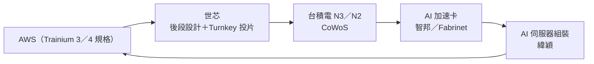

# 3661_世芯-KY（市）

## 基本資料

世芯電子（3661 TT，Alchip Technologies，-KY 代表開曼群島設立）是台灣最重要的 ASIC 設計服務公司之一，目前最大驅動力為 Amazon Trainium 3（Trn3）AI 訓練芯片的設計與量產，下一世代 Trainium 4（Trn4）亦已在規畫中。

成長驅動：Amazon Trainium 3 進入大量出貨（2026E 180 萬套、2027E 280 萬套），CoWoS 封裝需求快速拉升；AI 雲端基礎架構廠商（Hyperscaler）偏向自研 ASIC 以降低依賴 Nvidia 高成本 GPU 的結構性趨勢。

FY2026E EPS 約 NT$154（+123% YoY）；FY2027E 約 NT$212（+38%）。（依 UBS P/E 倒推，UBS 未提供明確 EPS 數字）

資料來源：[[報告_UBS_雲端AI_20260701]]（2026-07-01，UBS，Sunny Lin / Randy Abrams）

## 核心技術／競爭優勢

- **ASIC 設計服務龍頭**：深度整合 TSMC N3 製程，具備超大尺寸 die（1,600mm²）設計能力
- **Amazon 深度合作**：Trainium 1/2 已量產，Trn3 進入 N3 量產，Trn4 接續規畫
- **CoWoS 封裝深度配合**：Trn3 採 CoWoS 封裝，世芯直接受惠 TSMC CoWoS 擴產
- **競爭壁壘**：Amazon 自研 ASIC 長期合作模式，切換成本高，一旦進入量產週期盈利能見度高

## AI ASIC 供應鏈數據

### CoWoS 需求（Amazon Trainium via Alchip）

| 年度 | CoWoS 封裝需求（k wafers） | YoY |
|------|--------------------------|-----|
| 2024 | 26 | — |
| 2025 | 5 | -81%（Trn2 換代空窗） |
| 2026E | 72 | +1,340% |
| 2027E | 132 | +83% |

### Chip 出貨單位

| 年度 | Amazon Trainium-Alchip 出貨（k chips） |
|------|--------------------------------------|
| 2024 | 1,000 |
| 2025 | 176 |
| 2026E | 1,800 |
| 2027E | 3,100（UBS 由 2,300 上調） |

## 圖片 / 架構圖

![[報告_Macquarie_世芯_20260918_002.png]]

圖說：麥格理整理的世芯營收應用別結構。HPC（含 CPU 與 AI）在 2022–2024 年多數季度占營收八成以上，2025 年 Trainium 換代空窗後降至約五到六成，網通與消費性比重上升；3nm AI ASIC 自 2026 年 6 月出貨後，HPC 占比能否回升，是判斷營收成長是否來自主力 CSP 專案的直接指標。（來源：[[報告_Macquarie_世芯_20260918]]，2026-09-18）

圖說：依麥格理 Figure 3 AI ASIC 專案表整理，世芯在 AWS Trainium 3（3nm）與 Trainium 4（2nm，估 2027 量產）負責後段設計；加速卡由智邦／Fabrinet、伺服器由緯穎組裝。後續世代分工仍屬券商整理，信心中。

## EPS 預估

| 年度 | EPS（NT$，估算） | P/E | 評等 |
|------|---------------|-----|------|
| 2026E | ~154 | 27.1x | Buy |
| 2027E | ~212 | 19.7x | Buy |

（基準股價 NT$4,180，2026-06-30；P/E 倒推計算）

## 目標價與評等

| 券商 | 報告日 | 評等 | 目標價 | 評價基礎 | 來源 |
|------|-------|------|--------|----------|------|
| UBS | 2026-07-01 | Buy | NT$6,000 | — | [[報告_UBS_雲端AI_20260701]] |
| 麥格理 | 2026-09-18 | Outperform | NT$6,784（前次 NT$6,542） | 26x 2028E PER（前次 30x） | [[報告_Macquarie_世芯_20260918]] |

（基準股價 NT$4,180，2026-06-30；市值 USD 10,670m；上漲空間 +43.5%）

### 目標價歷史

| 日期 | 評等 | TP |
|------|------|-----|
| 2026-07-01 | Buy | NT$6,000 |
| 2026-09-18 | Outperform（麥格理） | NT$6,784 |

## 供應鏈位置

- **設計製程**：[[2330_台積電（市）]] N3（die 1,600mm²）
- **封裝**：[[2330_台積電（市）]] CoWoS（主）、[[3711_日月光投控（市）]]（增量）
- **終端客戶**：Amazon（Trainium 3 / 4 AI 訓練芯片）
- **競爭對手**：Marvell（Amazon Trainium 2.5 → 逐漸淡出）

> [!warning] 風險
> - Amazon Trainium 需求低於預期（2025 出貨僅 176k 大幅低於 2024 年 1,000k，顯示換代空窗風險）
> - 客戶集中度高（Amazon 佔絕大部分收入）
> - TSMC N3 / CoWoS 供給制約
> - 地緣政治風險（美中科技出口管制）

## 時間軸

| 日期 | 事件 |
|------|------|
| 2025 | Trainium 2.5 → 3 換代，出貨量大幅下滑（176k chips） |
| 2026Q2 | Trn3 量產開始（TSMC N3，CoWoS 封裝） |
| 2026E | Trn3 出貨 1,800k chips；CoWoS 需求 72k wafers |
| 2027E | Trn3 出貨擴大至 3,100k chips；Trn4 規畫明朗化 |
| 2026 年底前 | 主力客戶下一世代 AI ASIC tape-out（公司表示有信心年底前完成；麥格理 2026-09-18） |
| 2027 | Trainium 4（2nm）估量產；網通相關 ASIC 專案開始貢獻（麥格理 estimate） |

## 來源

- [[20260623_1351_GREATER_20260622_1746]]（2026-06-22）
- [[260813_ms_alchip]]（2026-08-13）
- [[260824_3443_3661_2454_ms_AI-supply-chain]]（2026-08-24）
- [[世芯-KY(3661,B_買進)-CTBC260817]]（2026-08-17）
- [[報告_BofA_世芯-KY_20260814]]（2026-08-14）
- [[報告_Citi_世芯-KY_20260814]]（2026-08-14）
- [[報告_MorganStanley_世芯-KY_20260814]]（2026-08-14）
- [[報告_UBS_雲端AI_20260701]]（2026-07-01）
- [[月營收評析-ASIC與PMIC產業-CTBC260914]]（2026-09-14）
- [[報告_Macquarie_世芯_20260918]]（2026-09-18，麥格理；3nm ramp、下一世代 tape-out、TP NT$6,784）

## 本次 ingest 更新（2026-08-14 報告）

- Citi 維持 Buy，目標價由 NT$6,200 上調至 NT$6,800；Citi 估 3nm AI 加速器 2H26 持續放量，2nm 後繼產品預計 2027 年底前後生產，屬券商 estimate／公司展望。
- BofA 維持 Buy、PO NT$6,100，估 Trainium3 2026／2027 年對世芯營收約 US$1.3bn／US$2.2bn；Trainium4 2nm 目標 4Q26 tape-out、4Q27 生產，屬券商 estimate。
- Morgan Stanley 維持 Overweight；2nm TAM 與大客戶 allocation 仍在研究，報告明確指出未獲公司確認，不能視為已確認訂單。

新增來源：[[報告_Citi_世芯-KY_20260814]]、[[報告_BofA_世芯-KY_20260814]]、[[報告_MorganStanley_世芯-KY_20260814]]。

## Morgan Stanley 2026-08-13 更新

- MS 維持目標價 NT$5,088，2026E／2027E／2028E EPS 為 NT$162.51／181.22／218.27，屬券商 estimate。
- 3nm 出貨於 2026 年 6–7 月加速，ADAS 晶片已向理想汽車出貨；Amazon 與另一家美系 AI 公司擴大合作為報告轉述，信心中。
- 主要驗證點為 N3 量產爬坡、超大尺寸 ASIC 良率與雲端客戶拉貨節奏。

來源：[[260813_ms_alchip]]（Morgan Stanley，2026-08-13）。

- [[報告_UBS_雲端AI_20260701]]（2026-07-01，UBS，Sunny Lin / Randy Abrams）

## 相關頁面

- [[分析_2026-08_AI網通與硬體報告更新]]
- [[時程_2026Q3Q4_AI網通與硬體催化劑]]
- [[時程_2026記憶體與AI催化劑]]
- [[分析_聯發科AI_ASIC]]
- [[3443_創意電子（市）]]
- [[2454_聯發科（市）]]

## 本次 ingest 更新（2026-08-17）

- 中信報告指出 Trainium3 已於 2026 年 5 月底開始量產，後續季度逐步放量；Trainium4 按原計畫推進，屬券商 estimate／公司展望，信心中。
- 2026Q2 營收季增 82.6%，報告給予目標價 NT$5,640，較前次 NT$7,000 下修；下修反映評價與獲利假設變化，與既有 Citi、BofA、MS 估計並列，不抹平差異。
- 相關來源：[[世芯-KY(3661,B_買進)-CTBC260817]]。

## 麥格理 2026-09-18 更新

- 麥格理維持 Outperform，目標價由 NT$6,542 上調至 NT$6,784；評價倍數由 30x 降至 26x 2028E PER，理由是回到歷史平均並反映客戶集中度（基準股價 NT$3,540，2026-09-18）。
- 2026E／2027E／2028E EPS 上調 9%／27%／20% 至 NT$141.6／209.9／260.9；營收估 NT$668 億／1,260 億／1,570 億（2026E +116%、2027E +89%），2027–28E 毛利率假設降至 20%，反映 Turnkey 投片占比提高。均屬券商 estimate，信心中。
- 季度模型：3Q26E 營收 NT$250 億（QoQ +227%）、4Q26E NT$300 億；1Q27E 起維持每季約 NT$300–330 億平台，EPS 3Q26E NT$47.03、4Q26E NT$56.99。
- 公司於 2Q26 法說重申營收成長「至少與 AI ASIC 產業同步至 2029 年」，並有信心年底前完成下一世代 AI ASIC tape-out；另「高度有信心」再取得一家大型 CSP 客戶，但麥格理未納入預估（公司展望，信心中低）。
- 其他成長來源：網通相關 ASIC 專案支撐 2027 年後成長，首個大型 ADAS 專案已於 1Q26 放量。麥格理不擔心主力客戶與其他半導體同業簽約，並指出最大客戶曾兩度入股世芯。
- 風險：專案放量延遲、主要客戶砍單（含美國半導體管制影響）、未取得下一世代專案。

> [!warning] 券商估值口徑差異
> 麥格理 2026E EPS NT$141.6 低於 Morgan Stanley 2026-08-13 的 NT$162.51；目標價 NT$6,784 介於中信 NT$5,640 與 Citi NT$6,800 之間。各券商對 Turnkey 營收占比與毛利率稀釋假設不同，並列保留。

來源：[[報告_Macquarie_世芯_20260918]]（麥格理，2026-09-18）。
