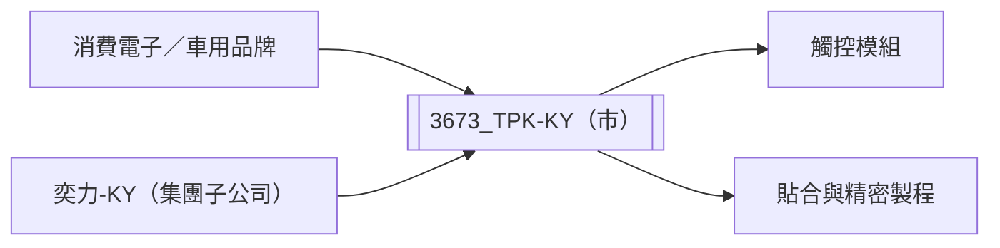

# 3673_TPK-KY（市）

## 基本資料

TPK-KY（宸鴻）提供觸控面板、貼合與精密製程整合，服務平板、筆電、車用、穿戴與新型顯示應用。2Q26 合併營收約 NT$192.4 億元、季增 7.6%，單季 EPS 約 2.0 元，1H26 EPS 3.33 元；子公司奕力-KY為重要營收與獲利來源之一。

## 核心技術／競爭優勢

- 從產品設計、研發到量產的一站式觸控整合。
- 大尺寸、小尺寸與不同貼合製程的彈性產能。
- 跨區域製造布局，支援客戶供應鏈區域化與韌性需求。

## 產品與應用

| 產品 | 應用 | 觀察點 |
|---|---|---|
| 觸控模組與貼合 | 平板、筆電、手機 | 尺寸組合與客戶拉貨 |
| 車用觸控 | 車載顯示器 | 新客戶導入與量產 |
| TGV／新製程 | 玻璃基板與新型應用 | 商品化與量產時程仍待驗證 |

## 圖片 / 架構圖

圖說：TPK-KY以觸控設計、貼合與量產整合承接終端顯示需求，奕力-KY為集團重要子公司。

## EPS 記錄

| 季度／期間 | EPS（元） | 備註 |
|---|---:|---|
| 2026Q2 | 2.00 | 合併稅後獲利約 NT$8.1 億元 |
| 2026H1 | 3.33 | 已超過 2025 全年 EPS |

## 目標價與評等

| 券商 | 報告發布日 | 評等 | 目標價 | 評價基礎 | 來源 |
|---|---|---|---:|---|---|
| 華南投顧 | 2026-08-26 | 區間持有 | NT$71 | 2026E 13–14x PER | [[3673 TPK-KY｜20260826｜華南]] |

## 時間軸

| 時間 | 事件 | 類型 | 重要性 | 備註 |
|---|---|---|---|---|
| 2026H2 | 傳統旺季與泰國新廠試運轉 | 放量／擴產 | ⭐⭐⭐ | 2027 年初正式量產目標，待驗證 |

## 供應鏈位置

- 上游：玻璃基板、IC、光學與貼合材料供應商。
- 下游：平板、筆電、車用與消費電子品牌。
- 所屬主題：[[供應鏈_觸控顯示]]。
- 相關公司：奕力-KY（集團子公司）。

## 相關公司

| 公司 | 關係 | 說明 |
|---|---|---|
| 奕力-KY | 集團子公司 | 2Q26 營收成長對合併表現有貢獻；本批未建立獨立公司頁。 |

> [!warning] 風險與注意事項
> - 消費電子需求、產品組合與子公司波動會影響合併毛利率。
> - TGV 與新廠量產仍屬公司／券商展望，需追蹤驗證、試運轉與實際出貨。

## 來源

- [[3673 TPK-KY｜20260826｜華南]]（華南投顧，2026-08-26）
