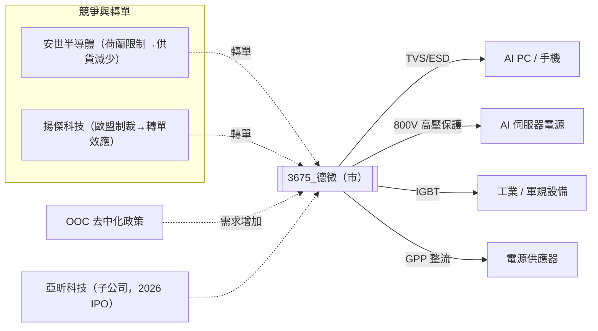

# 3675_德微（市）

## 基本資料

德微（3675）是台灣功率半導體 IDM（Integrated Device Manufacturer）廠商，自行設計、製造、銷售功率保護元件（TVS/ESD）為核心業務，並積極向 IGBT、高壓直流（800V）等高毛利、高成長產品延伸。公司具備完整 IDM 垂直整合能力，在 OOC（Out of China，去中化）政策加速、競爭對手受地緣政治限制（安世半導體受荷蘭政府限制、揚傑科技受歐盟制裁）的雙重利好下，進入快速成長週期。

**主力產品**：
- **TVS（Transient Voltage Suppressors，暫態電壓抑制器）** / **ESD 保護元件**：主力，廣泛用於手機、AI PC、工業設備、車用電子的靜電/突波保護
- **GPP（General Purpose Rectifier）**：通用整流二極體，low VF（正向電壓降）版本為技術差異化方向
- **IGBT（Insulated Gate Bipolar Transistor）**：小型 IGBT，軍規與工業應用，高毛利新品
- **高壓直流 800V 產品**：AI 應用電源保護，佔比高且毛利率高
- **Local ESD 保護元件**：毛利率超過 60%，為最高毛利產品線之一

**子公司**：
- **亞昕科技**：毛利率 ~50.5%，2024 年營收 ~NT$2 億，2026 年預計 NT$5-6 億，預計 2026 年 10 月獨立 IPO，三年內目標突破 NT$10 億
- 其他：過去兩三年陸續收購對岸科技、喜特斯

**財務表現**（資料來源：2026-05-28 法說）：
- 2025 年 EPS：~2 元（近年低點，受 2022-2025 景氣低迷影響）
- 2026 年 4 月毛利率：突破 40%，管理層認為 40% 將成為常態，且持續上升
- 部分新產品毛利率：Local ESD >60%、AI GPS 相關約 50%、亞昕科技 ~50.5%
- 營收趨勢：2024 年 1 月為全年最低，之後每月回升，2026 年 5 月較 4 月大幅成長，6 月預期再成長
- 訂單能見度：幾乎滿單，部分產品訂單年金可持續至 2027 年底

**供應鏈位置**：IDM 廠商，同時涵蓋設計、製造、封裝、銷售，終端客戶遍及手機、工業、汽車、AI 應用；在 OOC 政策和同業受制裁情況下，處於缺貨受益方。

**資料來源**：[[活動_德微法說_20260528]]（2026-05-28，董事長張恩傑）

---

## 核心技術／競爭優勢

1. **OOC 受益者與競爭對手受限的雙重利多**：安世半導體（Nexperia，荷蘭政府限制供貨，2024 年 3-4 月起供貨量大幅減少）與揚傑科技（歐盟 2025 年 4 月制裁令，9 個月緩衝後新機種停用）同時受到地緣政治壓制，市場缺口直接轉向德微及達爾科技母公司體系。

2. **高毛利策略紀律**：公司明確不殺價，OOC 政策推動下議價空間提升，持續調漲並維持高毛利策略；2024 年 4、6、7 月多次漲價。管理層以 40% 毛利率設為常態目標，並強調以技術差異化（Local ESD 毛利 60%+）向上突破。

3. **AI edge 與 AI PC 驅動的保護元件倍增需求**：傳統 desktop/notebook 轉型為 AI PC，每台 AI PC 的保護元件（TVS、ESD）需求量是傳統 PC 的 4-16 倍；AI 邊緣推論設備普及帶來結構性需求成長，預期未來 2-5 年為主要成長動能。

4. **快速擴產能力（回收期短）**：單一型號產能計劃從 300 萬顆/月提升至 3,000 萬顆/月（分階段：2026 年 5、7、9 月及 2027 年 1-2 月），擴產回收期約一年內，IDM 模式下內部協調效率高。

5. **亞昕科技高毛利子公司 IPO 選擇權**：亞昕科技毛利率 50.5%，2026 年 10 月預計獨立 IPO，三年內目標 NT$10 億+，為德微創造隱形資產价值重估機會，亦有助集團整體品牌拉升。

---

## 產品與應用

| 產品 / 服務 | 應用 | 相關客戶 / 下游 |
|-------------|------|-----------------|
| TVS / ESD 保護元件 | 手機、AI PC、工業設備靜電防護 | 手機品牌代工鏈、工業電子廠 |
| Local ESD（高毛利版） | AI edge 設備、高密度 PCB 保護 | AI 設備製造商 |
| 高壓直流 800V 產品 | AI 伺服器電源保護、新能源車充電 | AI 伺服器廠、電動車充電設備商 |
| GPP（super low VF） | 整流器、電源供應器 | 電源管理設備廠 |
| 小型 IGBT | 工業驅動、軍規電子 | 工業設備廠、軍用電子廠 |
| AI GPS 保護元件（高毛利） | 車用 GPS、AI 定位模組 | 車用電子模組廠 |
| 亞昕科技產品 | 功率半導體特殊應用（毛利率 50%+） | 多元下游 |

---

## 圖片 / 架構圖

> 德微在安世半導體與揚傑科技同時受到地緣政治壓制的背景下，是 OOC 功率保護元件轉單的最直接受益方之一。

---

## EPS 記錄

| 年度 | EPS（元） | 備註 |
|------|----------|------|
| 2025 | ~2 元 | 近年低點，產業 2022-2025 年持續低迷 |
| 2026 | 回升中 | 4 月毛利率突破 40%，管理層樂觀；全年 EPS 待財報揭露 |

> 季度 EPS 詳細數字待公開財報補充。

---

## 時間軸

| 時間 | 事件 | 類型 | 重要性 | 備註 |
|------|------|------|--------|------|
| 2026-05-07 | 歐盟對揚傑科技制裁令緩衝期屆滿（推算 2026 年 1 月生效計算 9 個月）| 轉單催化 | ⭐⭐⭐ | 新機種不採揚傑產品，轉單效應陸續顯現 |
| 2026Q2 前 | 單一型號產能：300 萬→3,000 萬顆/月（5、7、9 月+明年 1-2 月分階段） | 產能擴張 | ⭐⭐⭐ | 回收期約一年 |
| 2026-10 | 亞昕科技預計獨立 IPO | 子公司事件 | ⭐⭐ | 2024 年營收 NT$2 億，目前目標 NT$5-6 億 |
| 2026 全年 | 每月營收持續成長，毛利率常態化 40%+ | 業績催化 | ⭐⭐⭐ | 缺貨效應+轉單+AI 需求，實質需求非 double booking |
| 2027-2028 | 亞昕科技目標突破 NT$10 億 | 子公司成長 | ⭐⭐ | 集團三公司（德微、亞昕、品牌公司）良性循環 |
| 持續 | AI edge / AI PC 保護元件需求增長 4-16 倍 | 長期趨勢 | ⭐⭐⭐ | 未來 2-5 年為主要成長動能 |

---

## 供應鏈位置

- **上游**：矽晶圓（8 吋）、特殊化學品、封裝材料（自有 IDM 製程）
- **下游 / 終端市場**：
  - 手機（主要出貨渠道）
  - 公共事業設備（約 25-30% 營收）
  - 汽車 / 車輪相關（約 30% 營收）
  - AI 伺服器 / AI edge 設備（800V、AI GPS、Local ESD）
- **競爭同業**：安世半導體（Nexperia，受荷蘭政府限制）、揚傑科技（受歐盟制裁）、強茂（台灣）、達爾科技（母公司旗下其他品牌）
- **所屬供應鏈**：無對應供應鏈頁

> `# 待建供應鏈頁_功率半導體`（功率半導體保護元件供應鏈目前無對應頁面）

---

## 相關公司

| 公司 | 關係 | 說明 |
|------|------|------|
| 亞昕科技 | 子公司 / 集團成員 | 毛利率 50.5%，預計 2026-10 獨立 IPO，三年內目標 NT$10 億+ |
| 安世半導體（Nexperia） | 競爭同業 | 荷蘭政府 2023-10 限制，2024Q1 起供貨量大幅減少，轉單效應正面 |
| 揚傑科技 | 競爭同業 | 歐盟 2025-04 制裁令，9 個月緩衝後新機種停用，轉單效應正面 |
| 強茂 | 競爭同業 | 台灣功率半導體 IDM |

---

> [!warning] 風險與注意事項
> - **景氣循環風險**：德微 2022-2025 年深受庫存調整之苦，EPS 從高點跌至 2 元；此波復甦若與 AI 週期錯位，毛利率快速回落的風險仍存在，且 IDM 模式固定成本高，景氣下行時衝擊更直接
> - **轉單效應持續性存疑**：安世半導體與揚傑科技的供應缺口是「地緣政治強制」性缺貨，一旦政策鬆動或找到替代方，轉單訂單可能逆轉；揚傑 9 個月緩衝期後的「新機種」不採用，但舊機種仍有一段時間繼續
> - **單一大客戶的 PWF 依賴（亞昕）**：亞昕科技 IPO 計畫若延誤或估值不理想，集團整體市值重估動能受壓
> - **產能擴張節奏**：分階段擴產（300 萬→3,000 萬顆/月）集中在 2026-2027 年，若需求在擴產完成前已轉弱，會出現產能過剩與折舊上升的雙重壓力
> - **中國供應鏈競爭**：雖 OOC 政策對德微有利，但中國低成本功率半導體廠商（如揚傑制裁前）仍在第三方市場壓低价格，長期品牌滲透率擴張需靠技術差異化

---

## 來源

- [[活動_德微法說_20260528]]（2026-05-28，來源類型：法說/法人說明會，信心水準：高）
