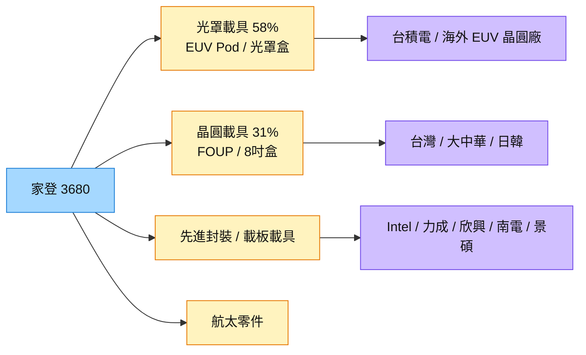

# 3680_家登（櫃）

## 基本資料

家登精密提供光罩與晶圓保護載具：通過 ASML 認證的 EUV 光罩盒（EUV Pod）、一般黃光光罩盒、12 吋 FOUP 與 8 吋晶圓盒，並延伸至先進封裝載具、載板載具與航太精密零件。子公司家碩提供光罩清洗、交換機與自動化設備。

- **營運：** 2Q26 營收 41.80 億元（YoY +22%）、毛利率 43%、EPS 8.09 元；2026 年 1–7 月集團營收 50.5 億元（YoY +29%），產能持續滿載。2Q26 產品組合：光罩載具 58%、晶圓載具 31%、其他 11%；大中華營收占比 29%。
- **EUV Pod：** 管理層稱市場近乎獨占、約領先競爭對手 1–1.5 個世代；1–7 月 EUV Pod 營收已達 2025 全年 82%（海外達 150%），2026 年 EUV Pod YoY +50% 以上可期。
- **先進封裝載具：** 1–7 月營收已達 2025 全年 244%；600×600mm 面板級封裝載具已有客戶使用，510×515mm 載具已交貨 Intel、力成；與欣興、南電、景碩開發高潔淨度載板載具。2H26 小量出貨，2027 年為較明確量產時點。
- **航太：** 過去兩年約以 60% 速度成長；美國亞利桑那州零件加工廠 2026 年 9 月開始產地驗證、4Q26 pilot run。

資料來源：[[活動_家登3680_法說與SEMICON_Memo_20260827]]（法說 Callmemo 2026-08-27；國泰 SEMICON Memo 2026-09-03）

## 核心技術／競爭優勢

- **EUV Pod 近乎獨占：** 主要對手為國外廠商；家登以在地交期、服務速度與和大客戶共同開發次世代產品取勝。
- **驗證門檻高：** 載具須與晶圓廠上千台設備的機械手臂、取放高度相容，並長期確認不釋出影響製程的氣體；驗證期 1–5 年，進入後不易被替換。
- **耗材屬性：** 載具依使用年限與開關次數汰換，提供持續續單；製程每推進一個世代，光罩需求量約增一倍（產品需求邏輯，非財測）。
- **材料與射出能力：** 50–3,000 噸射出成型設備、數百項專利，低釋氣、低微粒、靜電消散設計。

## 產品與應用

| 產品 / 服務 | 應用 | 相關客戶 / 下游 |
|-------------|------|-----------------|
| EUV Pod（pellicle／non-pellicle） | 先進製程 EUV 曝光 | [[2330_台積電（市）]]、海外晶圓廠；[[ASML.NL(asml)]] 認證 |
| 12 吋 FOUP、8 吋晶圓盒 | 成熟／先進製程晶圓傳送 | 台灣、大中華、日韓晶圓廠 |
| 先進封裝載具（510×515、600×600 面板級） | FOPLP、CoPoS、OSAT | [[INTC.US(intel)]]、[[6239_力成（市）]] |
| 載板高潔淨度載具 | ABF／玻璃／CCL 新世代材料 | [[3037_欣興（市）]]、南電、景碩 |
| 光罩清洗／交換機（子公司家碩） | 光罩廠、晶圓廠 | 晶圓廠 |
| 航太精密零件 | 液壓、飛控、引擎、燃油系統 | 美國航太客戶 |

## 圖片 / 架構圖

圖說：家登營收以 EUV Pod 為核心獲利來源，先進封裝與面板級載具是 2027 年後的第二成長曲線。

## EPS 記錄

| 季度 | EPS (元) | 備註 |
|------|---------|------|
| 2Q26 | 8.09 | 毛利率 43%，業外金融評價與匯兌利益挹注 |

## 時間軸

| 時間 | 事件 | 類型 | 重要性 | 備註 |
|------|------|------|--------|------|
| 2026-09 | 亞利桑那州航太零件廠產地驗證 | 擴產 | ⭐ | 4Q26 pilot run |
| 2H26 | 先進封裝載具小量出貨；日韓 FOUP 小量出貨 | 放量 | ⭐⭐ | 日韓 FOUP 最快下一季 |
| 2026 全年 | EUV Pod YoY +50% 以上 | 放量 | ⭐⭐⭐ | 管理層「應該可以期待」 |
| 2027 | 先進封裝／面板級載具較明確量產 | 放量 | ⭐⭐⭐ | [[活動_家登3680_法說與SEMICON_Memo_20260827]] |

→ 跨公司時程詳見 [[時程_2026-2027高速互連與分散式算力]]

## 供應鏈位置

- 下游：晶圓廠（EUV／黃光製程）、OSAT 與面板級封裝、載板廠
- 平行：子公司家碩（光罩清洗設備）、德鑫半導體聯盟（自動搬運、倉儲整合方案）
- 所屬供應鏈：[[供應鏈_先進封裝載板]]（載板與面板級載具）
- 技術背景：[[技術_FOPLP]]

## 相關公司

| 公司 | 關係 | 說明 |
|------|------|------|
| [[2330_台積電（市）]] | 客戶 | EUV Pod 與 FOUP 主要客戶 |
| [[ASML.NL(asml)]] | 設備認證 | EUV Pod 須通過 ASML 曝光機介面認證 |
| [[INTC.US(intel)]] | 客戶 | 510×515mm 先進封裝載具已交貨 |
| [[6239_力成（市）]] | 客戶 | 510×515mm 面板級封裝載具 |
| [[3037_欣興（市）]] | 共同開發 | 高潔淨度載板載具 |

## 風險與注意事項

> [!warning] 風險與注意事項
> - **費用上升：** 新廠折舊、海外人事、FOUP 驗證與先進封裝送樣費用增加。
> - **FOUP 驗證漫長：** 日韓 FOUP 仍在擴大 burn-in 階段，量產時點受客戶機台相容性驗證影響。
> - **先進封裝載具量能小：** 目前占營收比重仍小，2027 年量產時程取決於客戶面板級封裝進度。
> - **業外波動：** 2Q26 獲利含金融資產評價與匯兌利益。

## 來源

- [[活動_家登3680_法說與SEMICON_Memo_20260827]] — 法說 Callmemo（2026-08-27）、國泰 SEMICON Memo（2026-09-03）
