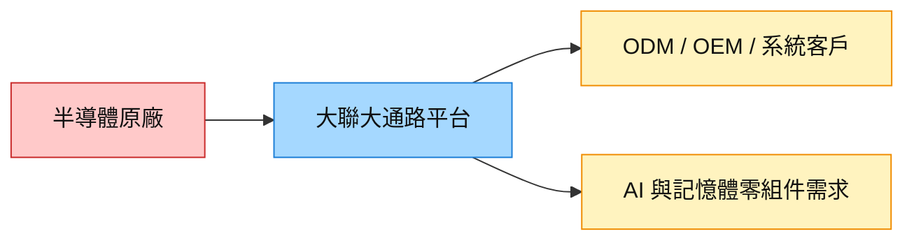

# 3702_大聯大（市）

## 基本資料

大聯大是台灣半導體與電子零組件通路商，透過代理、庫存與技術支援連接原廠與下游客戶。WPG 2026-08-18 報告重點為記憶體需求、AI 相關零組件與通路營運彈性；具體客戶與供應商關係仍以公司公告為準。

## 圖片 / 架構圖

圖說：大聯大位於原廠與電子製造／系統客戶之間，透過庫存與物流承接終端需求波動。

## 供應鏈位置

- 上游：多家半導體與電子零組件原廠。
- 下游：ODM、OEM、工控、網通與 AI 伺服器相關客戶；本批來源未提供可公開核實的單一客戶關係。

## Morgan Stanley 2026-08-18 更新

- 2Q26 獲利受記憶體營收成長與 AI 需求支撐，但 3Q 展望含拉貨提前與記憶體業務季節性放緩因素。
- EPS、評價與庫存週轉均屬券商 estimate；來源：[[260818_ms_wpg]]（Morgan Stanley，2026-08-18），信心水準：中。

## 來源

- [[260818_ms_wpg]] — Morgan Stanley，2026-08-18

## 相關頁面

- [[供應鏈_AI光互聯]]
