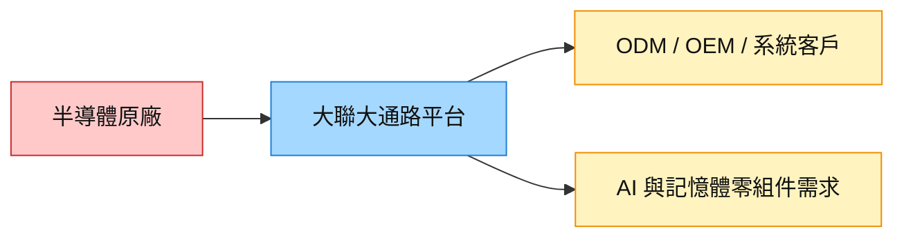

# 3702_大聯大（市）

## 基本資料

大聯大是台灣半導體與電子零組件通路商，透過代理、庫存與技術支援連接原廠與下游客戶。WPG 2026-08-18 報告重點為記憶體需求、AI 相關零組件與通路營運彈性；具體客戶與供應商關係仍以公司公告為準。

## 圖片 / 架構圖

```mermaid
flowchart LR
    V[半導體原廠] --> W[大聯大通路平台]
    W --> C[ODM / OEM / 系統客戶]
    W --> S[AI 與記憶體零組件需求]
    classDef upstream fill:#ffc9c9,stroke:#c92a2a,color:#111;
    classDef core fill:#a5d8ff,stroke:#1c7ed6,color:#111;
    classDef downstream fill:#fff3bf,stroke:#f08c00,color:#111;
    class V upstream; class W core; class C,S downstream;
```
圖說：大聯大位於原廠與電子製造／系統客戶之間，透過庫存與物流承接終端需求波動。

## 供應鏈位置

- 上游：多家半導體與電子零組件原廠。
- 下游：ODM、OEM、工控、網通與 AI 伺服器相關客戶；本批來源未提供可公開核實的單一客戶關係。

## Morgan Stanley 2026-08-18 更新

- 2Q26 獲利受記憶體營收成長與 AI 需求支撐，但 3Q 展望含拉貨提前與記憶體業務季節性放緩因素。
- EPS、評價與庫存週轉均屬券商 estimate；來源：[[260818_ms_wpg]]（Morgan Stanley，2026-08-18），信心水準：中。

## 2026-08-18 法說補充（國泰 Call Memo）

- **2Q26：** 營收 4,562.11 億元（QoQ +44.1%、YoY +82.2%）、毛利率 4.43%、營業利益率 2.62%、稅後淨利 86.20 億元、EPS 5.12 元，營收與獲利超越財測並創高；1H26 EPS 8.42 元、年化 ROE 38.5%。
- **組合：** 元件中記憶體占比由 23% 升至 46%、核心元件降至 18%；應用以運算含伺服器 45%、通訊 15%、汽車 8%（車用 QoQ +53.3%）；交貨地中國大陸及香港由 70% 降至 63%、東南亞升至 19%；外商客戶占比由 13% 升至 23%。
- **3Q26 財測：** 營收 4,600–5,000 億元、毛利率 4.35–4.55%、EPS 5.45–6.15 元（匯率 32.2）；2Q 因客戶預期漲價與缺貨提前拉貨，3Q 僅個位數季增，但 2H 仍高於 1H。
- **產業看法：** AI 資料中心排擠功率元件、MOSFET、IGBT、SiC、GaN 等成熟製程產能；先進製程、先進封裝與記憶體擴產至 2027 年仍恐難完全滿足需求，記憶體需求強勢延續至 1H27；記憶體透過原廠 allocation 分配、公司稱不存在重複下單；伺服器量預估年增 8.8%。
- **資金：** 董事會決議發行上限 150 億元 CB4 支應營運資金；LaaS 約占集團 GMV 3.7%、每年雙位數成長。
- 來源：[[活動_大聯大3702_CallMemo_20260818]]（國泰證期，2026-08-18），公司財測與說法，信心中高。

## 來源

- [[260818_ms_wpg]] — Morgan Stanley，2026-08-18
- [[活動_大聯大3702_CallMemo_20260818]] — 國泰證期法說 Call Memo，2026-08-18

## 相關頁面

- [[供應鏈_AI光互聯]]
