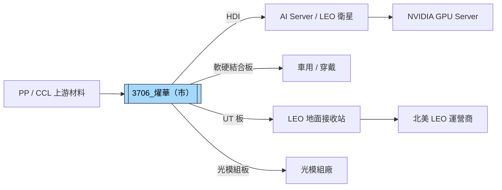

# 3706_燿華（市）

## 基本資料

燿華電子，台灣 PCB 製造廠，主力產品為 HDI（55%）、軟硬結合板（23%）、傳統板（13%）及高頻板（7%），並有少量 NVIDIA 相關配版（2%）。應用端以汽車（35%）為最大宗，其次為 IT 產品（31%）、低軌衛星（LEO，20%）、穿戴裝置（5%）及手機（1%）。近年積極布局低軌衛星地面設備板（UT 板）及光模組，同時跨入 AI Server 配版。

生產基地：台灣土城/宜蘭（4 廠，~130 萬呎/月）、江蘇南通（~80 萬呎，V棟擴建中）、泰國紅統（新廠，2026Q3 正式投產，目標 Q1 2027 達 20 萬呎）。

**1Q26 財務**：
- 合併營收：38.98 億元（1Q25 約 43 億，1Q24 約 41.63 億，小幅下滑，主因消費產品供料不順）
- 1Q26 毛利率：5.77%（偏低，漲價效果 Q2-Q3 才顯現）
- 1Q26 稼動率：<80%（南通及泰國廠尚未完全投產）
- 展望：2Q/3Q 逐季成長，泰國廠 Q3 投產 + 南通 V 棟產能 Q4-2027Q1 陸續開出

主要資料來源：[[活動_燿華法說_20260626]]（中國信託主辦，2026-06-26）。

## 核心技術／競爭優勢

- **低軌衛星 UT 板領先地位**：北美兩大客戶供應，LEO 產品占比目標今年超 20-30%（下半年比重達 30%）；客戶（已掛牌）明確要求非中國、非台灣產能，泰國廠 2H26 切入
- **HDI + 軟硬結合板雙引擎**：HDI 55% 為公司技術核心，過去能做 14-16 層 Any-layer，22 層設計亦可應對；HDI 更新已涵蓋 AI 應用（Training → Inference）
- **AI 配版（AI配板）切入**：GPU Server 配版，最新已將 GPU 整合進 CPU Board，打樣中；良率提升是大板面積主要挑戰，需時間調整
- **光模組新業務布局**：南通廠投入光模組產線，2027Q2 目標月營收 1 億人民幣，毛利率雙位數以上（優於汽車產品）
- **泰國廠分散地緣風險**：LEO 客戶要求非中/台產能，泰國廠成為不可或缺的供應節點

## 產品與應用

| 產品 / 服務 | 技術等級 | 應用 | 相關客戶 / 下游 |
|-------------|---------|------|-----------------|
| HDI 板 | Any-layer 14-22 層 | AI Server 配版、LEO 衛星設備、車用 | NVIDIA、低軌衛星客戶 |
| 軟硬結合板（Rigid-flex）| — | 穿戴裝置、手機、車用 | 品牌消費電子 |
| UT 板（地面接收板）| 高頻 | 低軌衛星地面站 | 北美兩大 LEO 客戶 |
| 高頻板 | — | 通訊基站、衛星設備 | 電信設備商 |
| AI 配版（GPU Server 配板）| — | AI Server | NVIDIA GPU 廠鏈 |
| 光模組板 | 高精度 | 光模組封裝 | 光模組廠 |

## 圖片 / 架構圖

> 燿華在 LEO 衛星地面板（UT 板）具領先地位；泰國廠為客戶非中/台產能需求的關鍵供應節點。光模組為 2027 年新增業務。

## EPS 記錄

| 期間 | 指標 | 數值 | 備註 |
|------|------|------|------|
| 1Q26 合併營收 | 季度 | 38.98 億元 | -9.3% YoY（1Q25 43 億）；消費性供料不順 |
| 1Q26 毛利率 | GM | 5.77% | 漲價效果 Q2-Q3 才顯現 |
| 1Q26 稼動率 | 利用率 | <80% | 南通/泰國廠未完全投產 |
| 2Q26E → 3Q26E | GM 趨勢 | 逐季提升 | 漲幅 5-20%，Q3 效果更明顯 |

## 時間軸

| 時間 | 事件 | 類型 | 重要性 | 備註 |
|------|------|------|--------|------|
| 2026-Q1 | 燿華 1Q26 業績低於過往水準，消費端供料不順，稼動率 <80% | 財務 | ⭐⭐ | 短暫低潮 |
| 2026-Q1/Q2 | 向客戶要求調漲售價 5-20%，Q3 效果更明顯 | 漲價 | ⭐⭐ | — |
| 2026-Q3 | 泰國紅統廠正式投產；LEO UT 板放量 | 擴產 | ⭐⭐⭐ | LEO 客戶要求非中/台產能 |
| 2026-Q3/Q4 | 台灣 AI Server 設備及客戶引進，AI 配版放量 | 出貨 | ⭐⭐ | — |
| 2026 下半年 | 南通 V 棟新產能陸續投產（光模組設備進駐中）| 擴產 | ⭐⭐ | — |
| 2027-Q1 | 泰國廠達 20 萬呎/月 | 里程碑 | ⭐⭐⭐ | 非中/台 LEO 產能到位 |
| 2027-Q2 | 南通廠 20 萬呎/月；光模組月營收目標 1 億人民幣 | 里程碑 | ⭐⭐⭐ | 光模組業務啟動 |
| 2027 | LEO 產品營收比重目標 30%+；光模組貢獻 3-5% | 放量 | ⭐⭐⭐ | — |

## 供應鏈位置

- **上游材料**：PP（Prepreg）、CCL（緊缺，AI 排擠消費端供應）；明年 Q1 台灣供應緩解，泰國廠材料來源以當地台商或大陸取得
- **下游 LEO**：北美兩大低軌衛星客戶（已掛牌，要求非中/台生產）
- **下游 AI Server**：NVIDIA GPU Server 配版鏈
- **下游光模組**：光模組製造廠（南通廠光模組板）
- **同業競爭（UT 板）**：華通、宏碁（Acer？）分市佔
- **所屬供應鏈**：[[供應鏈_AI伺服器PCB]]

## 相關公司

| 公司 | 關係 | 說明 |
|------|------|------|
| 華通（未建頁） | 競爭者（UT 板）| 低軌衛星地面接收板市場競爭 |

> [!warning] 風險與注意事項
> - **消費端與汽車需求疲弱**：1Q26 汽車市場尚未明顯好轉，消費電子原料缺料壓縮出貨；短期業績受壓
> - **毛利率偏低（5.77%）轉型期脆弱**：泰國廠及南通廠新產能爬坡中，若良率不佳或客戶訂單延後，獲利能力恢復時程將拉長
> - **LEO 業務高度集中**：北美兩大客戶佔 LEO 業務主力，客戶訂單取消或延後影響顯著；LEO 市場競爭者（華通等）持續追趕
> - **光模組業務仍在初始階段**：2027 年才貢獻實質營收，前期設備投入與認證耗時，執行風險不低

## 來源

- [[活動_燿華法說_20260626]]（中國信託主辦，2026-06-26；1Q26 業績、LEO 業務、泰國廠投產、光模組規劃、AI 配版）
