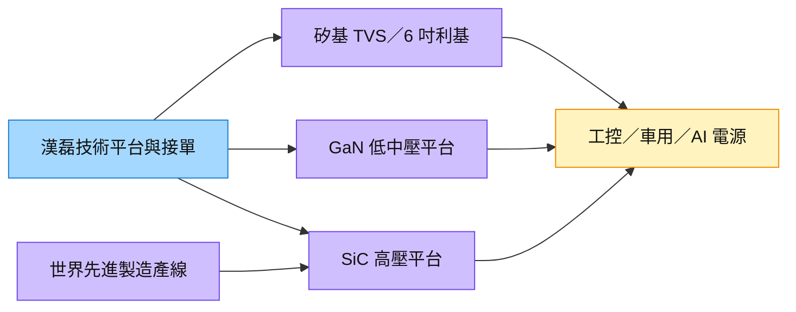

# 3707_漢磊（櫃）

## 基本資料

漢磊的重點為矽基 TVS、GaN 與 SiC 功率半導體平台，將資源集中於 6／8 吋產線。[[活動_華南投顧_漢磊3707_20261007]] 描述公司與 [[5347_世界先進（市）]] 合作 8 吋 SiC 試產線，由世界先進提供製造產線、漢磊提供技術平台並接單。

應用包括 AI 資料中心電源、工控、車用、太陽能與儲能。來源也將 [[3016_嘉晶（市）]] 的表現與集團合併營運連結，但不同段落的母子公司／產品線口徑不清；財務與利用率不可跨口徑套用。掛牌別依 [櫃買中心公告](https://dsp.tpex.org.tw/web/announcement/announcement_detail.php?content_file=MTE0MDMwMjAzODEuaHRtbA%3D%3D&content_number=MTE0MDMwMjAzODE%3D) 確認為上櫃。

## 核心技術／競爭優勢

- **三平台資源配置**：TVS 提供少量多樣的保護元件代工，GaN 與 SiC 對應不同耐壓及效率需求，降低單一終端依賴。
- **6／8 吋共存**：6 吋承接利基多樣產品；8 吋合作產線提供規模化選項，實際成本優勢仍需稼動率與良率驗證。
- **技術與接單分工**：與世界先進合作，可將技術平台及客戶經營與產線資本分攤；不推定其利潤分成比例。

## 產品與應用

| 平台 | 應用 | 客戶／合作方 |
|---|---|---|
| Bipolar TVS／TDS | AI、車用及靜電／突波保護 | 未具名少量多樣客戶 |
| GaN | 資料中心電源、人形機器人、無人機等中低壓應用 | 第七代技術與主要客戶共同開發，客戶未具名 |
| SiC MOSFET | EV 主驅／OBC／DC-DC、高功率電源及儲能 | [[5347_世界先進（市）]] 為 8 吋製造合作方 |

來源以 650V 上下區隔 SiC／GaN 是公司產品策略，不當作全產業固定物理界線；技術背景見 [[技術_功率MOSFET]]。

## 圖片 / 架構圖

圖說：華南 2026-10-07 轉述的三平台及 8 吋分工；圖中不表示已量化的終端客戶份額。來源圖皆為裝飾，故以 Mermaid 補位。

## EPS 記錄

| 期間 | EPS（元） | YoY | 備註 |
|---|---:|---|---|
| 2026Q2 | -0.22 | 未提供 | 營收 17.95 億元、毛利率 11.3%、營益率 1.1%；來源財務轉述 fact／中 |
| 2026H1 | -0.57 | 未提供 | 營收 33.29 億元、毛利率 8.42%；來源內部毛利金額衝突，見下方 |

## 時間軸

| 時間 | 事件 | 類型 | 重要性 | 備註 |
|---|---|---|---|---|
| 2026-11（預估） | 4／5 吋停產設備及人員移轉完成 | 整併 | ⭐⭐ | 2026-08 停產；estimate／中 |
| 2026Q4（預估） | TVS 擴產逐步開出、8 吋 SiC 推進市場 | 放量／驗證 | ⭐⭐⭐ | 尚待出貨及產品口徑確認，來源未量化訂單 |
| 2026Q4–2027Q1（預估） | 第七代 GaN 技術開發完成 | 驗證 | ⭐⭐⭐ | 不等同量產／營收；estimate／中 |
| 2027（規劃） | 8 吋月產能由 1,500 增至 3,000 片 | 擴產 | ⭐⭐⭐ | 來源稱明年重心，未提供確切完工日；estimate／中低 |

跨公司時程：[[時程_2026-2028華南六家公司商業化節點]]。

## 供應鏈位置

製程及材料比較見 [[技術_功率MOSFET]]；GaN 與 SiC 的應用策略、試產及量產讀值須分開。

位於磊晶材料與終端功率系統之間的製程平台／晶圓代工環節；工控終端延伸見 [[供應鏈_工業自動化]]，不表示與其中所有設備商有交易。[[3016_嘉晶（市）]] 為來源所述集團／子公司關係，持股及合併範圍待核對。

## 相關公司

| 公司 | 關係 | 說明 |
|---|---|---|
| [[5347_世界先進（市）]] | 製造合作方 | 提供 8 吋 SiC 產線，漢磊提供平台及接單；華南轉述／中信心 |
| [[3016_嘉晶（市）]] | 集團／子公司關係待核對 | memo 稱其為子公司且支持合併表現；不由此判定兩家數據的合併範圍 |

## 風險與注意事項

> [!warning] 同份來源的營運口徑衝突
> [[活動_華南投顧_漢磊3707_20261007]]（2026-10-07）同時記錄：2026H1 營收年增 25.07% 與「上半年年減 41%」；2H26 較 H1 增長約 120% 與持平／微增 3–5%；另稱單看 6 吋成長 40%。可能涉及集團、子公司或產品線，原文未明確區分，不選單一數值作公司財測。H1 營收 33.29 億元 × 毛利率 8.42% 約 2.80 億元，與另一段「毛利 2,800 萬元」不合，亦待確認。

> [!warning] 擴產與技術 claim 邊界
> - 8 吋試產良率逾 95%、新 SiC MOSFET 的 RMSP 改善 12% 為 memo 轉述；測試基準、產品與量產良率未揭露，不推為整體良率或市占。
> - 現金流轉正、利用率 Q3 約 60%／Q4 80%、AI 占比 2H26 ≥10%／2027 10–20% 均須核對業務主體；信心中低。
> - 整併、材料漲價與新增折舊可能抵銷稼動率改善，部分 LTA 不代表全部產能已保障。

## 來源

- [[活動_華南投顧_漢磊3707_20261007]] — 華南投顧，2026-10-07；財務轉述 fact／中，開發及產能 estimate／中低，內部衝突數值低信心。
- [櫃買中心漢磊公告](https://dsp.tpex.org.tw/web/announcement/announcement_detail.php?content_file=MTE0MDMwMjAzODEuaHRtbA%3D%3D&content_number=MTE0MDMwMjAzODE%3D) — 上櫃身分核對，2026-10-08 查閱。

## 相關頁面

- [[分析_華南六家公司成長動能與商業化驗證_20261008]]
