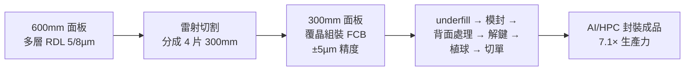

# 3711_日月光投控（市）

## 基本資料

ASE Technology Holding（日月光投控，NYSE: ASX；TSE: 3711）是全球最大獨立封測服務商（OSAT），旗下整合日月光半導體（ASE）與矽品精密（SPIL）。業務涵蓋傳統封裝、先進封裝（FC-BGA、SiP）、面板級扇出封裝（FOPLP）、混合鍵合（CoW HB），以及測試服務。

在 AI 時代，ASE 切入 CPO 與 3D IC 封裝需求，ECTC 2026 同時發表兩篇重要研究：FOPLP 600mm 混合流程（7.1×生產力）、CoW 混合鍵合良率突破（2.8%→99%）。

資料來源：[[research_simpletechtrend_CPO矽光子ECTC2026_20260629]]（2026-06-29）

## 核心技術 / 競爭優勢

### FOPLP 600mm 面板級扇出封裝（ECTC 2026）

ASE 提出「RDL 在 600mm 面板做、組裝切成 300mm」的混合流程：
- **7.1× 生產力**（vs 300mm = 1.0×，全 600mm = 8.0× 但翻曲風險高）
- RDL 3 層 5/8 µm、狹縫塗佈解決大面板塗膠不均
- 組裝精度 ±5 µm、TTV <10 µm
- 通過 T0、MR3x、MR6x 可靠度測試

### CoW 混合鍵合良率突破（ECTC 2026）

揭示 CoW 介面氣泡根本解法——**調整初始鍵合波前角度**：
- 角度 D：8×12×0.05mm TEOS 晶片良率從 **2.8% 暴衝到 99%**
- 0.03mm 超薄晶片（翹曲 102.4 µm）、6 µm 細間距、organic-on-TEOS 良率 95–99%
- 只調機構旋鈕（現有鍵合機台），不需新材料
- 詳見 [[技術_混合鍵合]]

## 圖片 / 架構圖

`[待補來源圖]` 需官方 IR 扇出型封裝或先進封裝剖面圖佐證；上方為自製封裝流程示意圖。

## 產品與應用

| 產品 / 服務 | 應用 | 相關客戶 / 下游 |
|-------------|------|-----------------|
| FOPLP 面板級扇出封裝 | AI/HPC 大尺寸 chiplet 封裝 | NVIDIA、AMD、Intel 等 |
| CoW 混合鍵合 | 3D IC、HBM、CPO PIC+EIC | NVIDIA（COUPE 上游）|
| FC-BGA / SiP | 一般 IC 封裝 | 廣泛半導體 |
| 測試服務 | 功能 / 可靠度測試 | — |

## 供應鏈位置

- 製造夥伴：[[2330_台積電（市）]]（COUPE 下游封測）
- 競爭對手：[[AMKR.US(amkor)]]（全球第二大 OSAT）
- 所屬供應鏈：→ [[供應鏈_CPO]]

## 相關公司

| 公司 | 關係 | 說明 |
|------|------|------|
| [[2330_台積電（市）]] | 製造夥伴 / 客戶 | TSMC COUPE 下游封測 |
| [[NVDA.US(nvidia)]] | 客戶 | AI GPU 封裝 |
| [[AVGO.US(broadcom)]] | 客戶 | ASIC 封裝 |
| [[AMKR.US(amkor)]] | 競爭對手 | 全球 OSAT 第二 |
| [[imec（未）]] | 研究合作 | W2W 混合鍵合技術參考 |

## 時間軸

| 時間 | 事件 | 類型 | 備註 |
|------|------|------|------|
| 2026（ECTC 76th）| CoW HB 良率 2.8%→99% 方法論發表 | 技術驗證 | 角度 D 解法，機台可調 |
| 2026（ECTC 76th）| FOPLP 600mm 混合流程 7.1× 生產力 | 技術驗證 | RDL 600mm + 組裝 300mm |

→ 跨公司比較詳見 [[時程_2026_AI算力]]

## 來源

- [[research_simpletechtrend_CPO矽光子ECTC2026_20260629]]（ECTC 2026 兩篇 ASE 研究，2026-06-29）
- [[報告_中信_日月光投控3711_20260205]]（中信投顧，2026-02-05）
- [[報告_Snapshot_半導體設備封測展望2026_20251124]]（Snapshot Research，封測展望，2025-11-24）

## 相關頁面

- [[3167_大量科技（市）]]
- [[技術_聚合物波導]]
