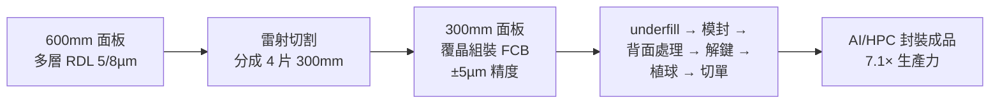

# 3711_日月光投控（市）

## 基本資料

ASE Technology Holding（日月光投控，NYSE: ASX；TSE: 3711）是全球最大獨立封測服務商（OSAT），旗下整合日月光半導體（ASE）與矽品精密（SPIL）。業務涵蓋傳統封裝、先進封裝（FC-BGA、SiP）、面板級扇出封裝（FOPLP）、混合鍵合（CoW HB），以及測試服務。

在 AI 時代，ASE 切入 CPO 與 3D IC 封裝需求，ECTC 2026 同時發表兩篇重要研究：FOPLP 600mm 混合流程（7.1×生產力）、CoW 混合鍵合良率突破（2.8%→99%）。

資料來源：[[research_simpletechtrend_CPO矽光子ECTC2026_20260629]]（2026-06-29）

## 券商觀點

### Nomura — Buy，TP NT$730（2026-06-30）

調升 TP NT$575→**NT$730**（+15.5% upside，基準收盤 NT$632），維持 **Buy**。

**三大驅動力**：

1. **TSMC CoWoS oS 外包擴大**：TSMC 已將大部分 oS 業務委外給 ASE，ASE 直接受益於 TSMC 最新 CoWoS 擴產計畫。oS 預計佔 LEAP 封裝收入 FY26F 59%、FY27F 51%。
2. **AMD Venice CPU → FOCoS-B Full Process**：AMD Venice 架構 CPU 預計大量採用 ASE FOCoS-B 技術，Full process 佔 LEAP 比重 FY26F 10%→FY27F 20%。
3. **TSMC 測試外包**：ASE 是 TSMC CP 測試外包核心受益者，同時提供部分 ASIC FT 服務。

**LEAP 收入預估（Nomura）**：

| 項目 | FY25A | FY26F | FY27F |
|------|-------|-------|-------|
| Total LEAP（USDmn） | 1,600 | 3,500 | 6,857 |
| YoY | — | +119% | +96% |
| 佔 IC ATM 比重 | — | 33% | 41% |
| oS（CoWoS） | 61% of LEAP | 59% | 51% |
| Full process（AMD Venice） | 7% | 10% | 20% |
| FOWLP | 13% | 6% | 3% |
| CP Testing | 18% | 19% | 19% |
| FT Testing | 1% | 6% | 6% |

**財務預估（Nomura）**：

| 指標 | FY25A | FY26F | FY27F | FY28F |
|------|-------|-------|-------|-------|
| Revenue（TWDmn） | 645,388 | 810,252 | 962,066 | 1,104,144 |
| YoY | +8% | **+26%** | +19% | +15% |
| EPS（TWD） | 9.37 | **17.65** | **25.69** | 32.55 |
| 毛利率 | 17.7% | 21.1% | 23.5% | 25.1% |
| 營益率 | 7.9% | 11.7% | 14.5% | 16.1% |
| ROE | 11.3% | 19.7% | 25.6% | 28.6% |

估值方法：25x FY2027-28F 平均 EPS（P/E 維持歷史高端）。

來源：[[報告_Nomura_日月光投控3711_20260630]]

### UBS — Buy，TP NT$835（2026-07-01）

調升 TP NT$660→**NT$835**（+22.8%，基準收盤 NT$680，2026-06-30），維持 **Buy**。

**核心論點**：

1. **CoWoS 產能大幅擴產**：UBS 上修 ASE CoWoS 產能預估，從年底 20kwpm → 年底 2027 達 50kwpm（前估 35–40kwpm），主要支撐 AMD Venice Server CPU 強勁需求與 AI accelerator 上行空間。
2. **Full process CoWoS 收入快速成長**：FY26E US$0.3bn → FY27E US$2.0bn（+567%），成為新成長動能。
3. **Final Test 擴大**：Amazon Trainium 3 與 MediaTek TPU v8t 均在 2027 年大幅出貨，帶動 FT 測試收入。
4. **Capex 更新**：管理層在 AGM 暗示 2026 capex 有上行空間（US$8.5bn 為起點），UBS 上修至 US$9.0bn/10.0bn（FY26/27E）。

**LEAP 收入預估（UBS）**：

| 項目 | FY26E | FY27E |
|------|-------|-------|
| Total LEAP（USDbn） | 3.6 | 6.7 |
| YoY | — | +86% |

**財務預估（UBS）**：

| 指標 | FY25A | FY26E | FY27E | FY28E |
|------|-------|-------|-------|-------|
| Revenue（TWDmn） | 645,388 | 782,430 | 964,726 | 1,156,462 |
| YoY | +8% | **+21%** | +23% | +20% |
| EPS（TWD） | 9.20 | **17.13** | **28.53** | 36.64 |
| IC ATM 毛利率 | — | 27.9% | 32.8% | 33.7% |

估值方法：25x FY2027–28E 平均 PE（長期 EPS CAGR 26% 支撐高估值）。

來源：[[報告_UBS_日月光投控3711_20260701]]

## 核心技術 / 競爭優勢

### FOCoS-B Full Process（AMD Venice CPU）

ASE 的 FOCoS-B（Fan-Out Chip-on-Substrate B）是面向高階 CPU 的全製程方案。Nomura 預計 AMD Venice CPU 是採用 FOCoS-B 的主要產品，帶動 Full process 業務從 FY25 的 7% LEAP 比重快速拉升至 FY27F 20%（收入貢獻 USD1.4bn）。

### FOPLP 600mm 面板級扇出封裝（ECTC 2026）

ASE 提出「RDL 在 600mm 面板做、組裝切成 300mm」的混合流程：
- **7.1× 生產力**（vs 300mm = 1.0×，全 600mm = 8.0× 但翻曲風險高）
- RDL 3 層 5/8 µm、狹縫塗佈解決大面板塗膠不均
- 組裝精度 ±5 µm、TTV <10 µm
- 通過 T0、MR3x、MR6x 可靠度測試

### CoW 混合鍵合良率突破（ECTC 2026）

揭示 CoW 介面氣泡根本解法——**調整初始鍵合波前角度**：
- 角度 D：8×12×0.05mm TEOS 晶片良率從 **2.8% 暴衝到 99%**
- 0.03mm 超薄晶片（翹曲 102.4 µm）、6 µm 細間距、organic-on-TEOS 良率 95–99%
- 只調機構旋鈕（現有鍵合機台），不需新材料
- 詳見 [[技術_混合鍵合]]

## 圖片 / 架構圖

`[待補來源圖]` 需官方 IR 扇出型封裝或先進封裝剖面圖佐證；上方為自製封裝流程示意圖。

## 產品與應用

| 產品 / 服務 | 應用 | 相關客戶 / 下游 |
|-------------|------|-----------------|
| FOPLP 面板級扇出封裝 | AI/HPC 大尺寸 chiplet 封裝 | NVIDIA、AMD、Intel 等 |
| CoW 混合鍵合 | 3D IC、HBM、CPO PIC+EIC | NVIDIA（COUPE 上游）|
| FC-BGA / SiP | 一般 IC 封裝 | 廣泛半導體 |
| 測試服務 | 功能 / 可靠度測試 | — |

## 供應鏈位置

- 製造夥伴：[[2330_台積電（市）]]（COUPE 下游封測）
- 競爭對手：[[AMKR.US(amkor)]]（全球第二大 OSAT）
- 所屬供應鏈：→ [[供應鏈_CPO]]

## 相關公司

| 公司 | 關係 | 說明 |
|------|------|------|
| [[2330_台積電（市）]] | 製造夥伴 / 客戶 | TSMC COUPE 下游封測 |
| [[NVDA.US(nvidia)]] | 客戶 | AI GPU 封裝 |
| [[AVGO.US(broadcom)]] | 客戶 | ASIC 封裝 |
| [[AMKR.US(amkor)]] | 競爭對手 | 全球 OSAT 第二 |
| [[AMD.US(amd)]] | 客戶 | Venice CPU 採用 FOCoS-B Full Process |
| [[imec（未）]] | 研究合作 | W2W 混合鍵合技術參考 |

## 時間軸

| 時間 | 事件 | 類型 | 備註 |
|------|------|------|------|
| 2025-10 | Nomura 從 Neutral 升評至 Buy（TP NT$260） | 評等調整 | 引述 TSMC oS 外包、產品組合改善 |
| 2026（ECTC 76th）| CoW HB 良率 2.8%→99% 方法論發表 | 技術驗證 | 角度 D 解法，機台可調 |
| 2026（ECTC 76th）| FOPLP 600mm 混合流程 7.1× 生產力 | 技術驗證 | RDL 600mm + 組裝 300mm |
| 2026-06-30 | Nomura 調升 TP NT$575→NT$730，Buy | 評等調整 | TSMC CoWoS 擴產 + AMD Venice FOCoS-B 驅動 |
| 2026-07-01 | UBS 調升 TP NT$660→NT$835，Buy | 評等調整 | CoWoS 50kwpm（end-2027）、FP CoWoS 收入翻倍、Capex 上修至 US$9bn |

→ 跨公司比較詳見 [[時程_2026_AI算力]]

## 來源

- [[報告_UBS_日月光投控3711_20260701]]（UBS，TP NT$835 Buy，CoWoS 50kwpm/LEAP US$6.7bn，2026-07-01）
- [[報告_Nomura_日月光投控3711_20260630]]（Nomura，TP NT$730 Buy，LEAP 模型，2026-06-30）
- [[research_simpletechtrend_CPO矽光子ECTC2026_20260629]]（ECTC 2026 兩篇 ASE 研究，2026-06-29）
- [[報告_中信_日月光投控3711_20260205]]（中信投顧，2026-02-05）
- [[報告_Snapshot_半導體設備封測展望2026_20251124]]（Snapshot Research，封測展望，2025-11-24）

## 相關頁面

- [[3167_大量科技（市）]]
- [[技術_聚合物波導]]
