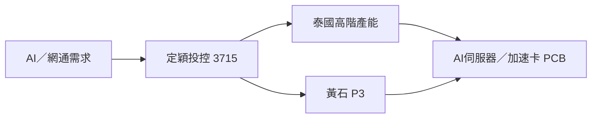

# 3715_定穎投控（市）

## 基本資料

定穎投控（Dynamic Holding，3715.TW）為 PCB 製造商，產品涵蓋車用、儲存、網通、伺服器與高階 AI 伺服器板。BofA 2026-08-11 指出，CCL 成本上升壓抑 2Q26 毛利率，但泰國廠與高階 AI 產能將是 2027–2028 年主要成長來源。

## 產品與產能

| 方向 | 應用 | 觀察 |
|---|---|---|
| 高階 PCB | AI 伺服器、加速卡、網通 | AI 相關營收預估 2027 年約 40%（公司／券商展望） |
| 泰國廠 | 高階 AI PCB | 利用率約 60%，預期 1Q27 滿載；2028 年泰國營收目標約 NT$42bn（estimate） |
| 黃石 P3 | PCB 擴產 | 2026 capex 上調至 NT$38.3bn，產出預計 3Q27 起逐步增加 |

## 圖片 / 架構圖

## 券商觀點與財務

- BofA 2026-08-11 維持 Buy，目標價由 NT$245 下調至 NT$200；2026E EPS 0.236 元、2027E EPS 13.32 元，屬券商 estimate，信心：中。
- 2Q26 營業利益受 CCL 成本與匯兌壓力影響，後續需觀察漲價轉嫁與泰國廠利用率同步改善。

## 風險與注意事項

1. CCL 漲價轉嫁不完整造成毛利率壓力。
2. 泰國與黃石新產能爬坡慢於預期。
3. AI 伺服器平台客戶認證與資本支出循環波動。

## 來源

- [[260811_ml_dynamic]]（BofA Securities，2026-08-11）

## 相關頁面

- [[供應鏈_AI伺服器PCB]]
