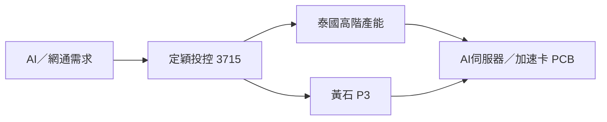

# 3715_定穎投控（市）

## 基本資料

定穎投控（Dynamic Holding，3715.TW）為 PCB 製造商，產品涵蓋車用、儲存、網通、伺服器與高階 AI 伺服器板。BofA 2026-08-11 指出，CCL 成本上升壓抑 2Q26 毛利率，但泰國廠與高階 AI 產能將是 2027–2028 年主要成長來源。

## 產品與產能

| 方向 | 應用 | 觀察 |
|---|---|---|
| 高階 PCB | AI 伺服器、加速卡、網通 | AI 相關營收預估 2027 年約 40%（公司／券商展望） |
| 泰國廠 | 高階 AI PCB | 利用率約 60%，預期 1Q27 滿載；2028 年泰國營收目標約 NT$42bn（estimate） |
| 黃石 P3 | PCB 擴產 | 2026 capex 上調至 NT$38.3bn，產出預計 3Q27 起逐步增加 |

## 圖片 / 架構圖

```mermaid
flowchart LR
  A[AI／網通需求] --> B[定穎投控 3715]
  B --> C[泰國高階產能]
  B --> D[黃石 P3]
  C --> E[AI伺服器／加速卡 PCB]
  D --> E
```

## 券商觀點與財務

- BofA 2026-08-11 維持 Buy，目標價由 NT$245 下調至 NT$200；2026E EPS 0.236 元、2027E EPS 13.32 元，屬券商 estimate，信心：中。
- 2Q26 營業利益受 CCL 成本與匯兌壓力影響，後續需觀察漲價轉嫁與泰國廠利用率同步改善。

## 風險與注意事項

1. CCL 漲價轉嫁不完整造成毛利率壓力。
2. 泰國與黃石新產能爬坡慢於預期。
3. AI 伺服器平台客戶認證與資本支出循環波動。

## 來源

- [[260811_ml_dynamic]]（BofA Securities，2026-08-11）
- [[活動_富邦投顧_定穎投控法說_20260828]]（富邦投顧，2026-08-28；2Q26 財務、泰國／黃石擴產與 AI PCB 時程）
- [[活動_定穎投控3715_元大論壇Memo_20260909]]（元大投資論壇即時 Memo，2026-09-09）

## 2026-08-28 法說更新

| 項目 | 法說揭露 | 類型／信心 |
|------|----------|------------|
| 2Q26 營收／EPS | NT$68.7 億、-NT$0.81 | fact／中 |
| 泰國 AI 產品 | 4Q26 起量產，目標 1Q27 滿載 | management outlook／中低 |
| 泰國新增產能 | 4Q27 起開出，2028 年年產值目標約 NT$120 億 | estimate／低 |
| 黃石 P3 | 3Q27 起開出，滿產年產值約 NT$100 億 | estimate／低 |

> [!warning] 資訊衝突
> 本次法說同時出現「4Q26 開始量產」與「4Q27 起新增產能開出」兩個泰國時點；前者應是既有 AI 產品量產，後者為新增擴產，仍須以後續月營收與稼動率驗證。

## 2026-09-09 元大投資論壇補充

- **時點釐清：** 泰國廠自 3Q24 已在生產，3Q–4Q26 為新增設備裝機；新增 CapEx 80.5 億元（P5、P5A、D1 長交期設備）的產能自 4Q27 開出、2028 年新增年產值 120 億元，與 4Q26 AI 產品量產屬不同事件，可化解上方時點衝突。
- **AI 認證進度：** 美系 GPU 客戶多層板與高階 HDI 已送量產版本樣品，目標 12M26 量產（因客戶多次改版延後）；ASIC 一款 20 層以上 AI 機櫃主板已通過驗證、9M26 轉量產、12M26 出貨，另一款 30 層以上已送量產版本、12M26 量產（lead time 6–8 週，營收約自 2M27 反映）；黃石 3Q26 起生產美系 GPU 客戶 20 層高階 HDI AI 加速卡。泰國廠 80–90% 產能配置 AI Server（GPU、ASIC、Switch），1M27 月產值目標 25 億元（滿載），目前利用率約 60%、月營收由年初約 2 億元增至 8 月 4.3–4.5 億元。
- **價格：** 2Q26 毛利率 14.0% 的季減全來自原物料；4M26 首次漲價不足，6–7M26 再漲且客戶接受度佳，已協商下一輪；M6 以下 CCL 漲價與交期拉長，訂單下單期間由約 2 個月延長至 3–6 個月；AI 用 CCL 由終端客戶指定並協助 booking。
- **產能與資本支出：** 2026 年 CapEx 約 383 億元（泰國 238 億、中國 145 億）；泰國年產值 2027 年 300 億元→2028 年 420 億元（P6 規劃中未決議）；黃石 P3 投資 99.2 億元、3Q27 起開出、滿載年產值約 100 億元（儲存、高階車用）；DDR5 PCB 由 8–10 層升級至 12–16 層 HDI，記憶體客戶已開始 booking 2027 年產能；2026 年折舊約 24–26 億元；4Q26 營收預期 QoQ 雙位數成長。
- 來源：[[活動_定穎投控3715_元大論壇Memo_20260909]]（元大投顧，2026-09-09），公司說法，信心中高。

## 相關頁面

- [[分析_2026Q3_NAND與高階PCB供需_20260828]]
- [[時程_2026Q3Q4_AI網通與硬體催化劑]]
- [[供應鏈_AI伺服器PCB]]
