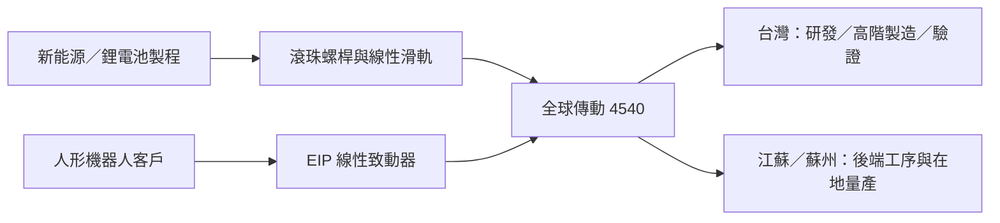

# 4540_全球傳動（市）

## 基本資料

全球傳動（4540.TW）供應滾珠螺桿、線性滑軌、滾珠花鍵與線性致動器，客戶涵蓋新能源、鋰電池、工具機、自動化與機器人應用。2026H1 營收年增 45%，但台灣樹林廠受缺工限制，滑軌稼動率約 82%。

## 核心技術／競爭優勢

- 研磨級滾珠螺桿與高階線性滑軌具精密定位能力，新能源與鋰電池製程需求強勁。
- EIP 系列線性致動器整合螺桿、馬達、驅動與機構模組，並已完成 IP08、IP15 與三自由度靈巧手原型。
- 台灣保留研發、設計、測試與驗證，江蘇／蘇州廠承接高人工比例的後端工序，形成台灣高階、海外量產的分工。

## 產品與應用

| 產品 | 應用 | 供應鏈位置 |
|---|---|---|
| 研磨級滾珠螺桿 | 鋰電池、新能源、精密定位 | 精密傳動元件 |
| 線性滑軌 | 工具機、3C、自動化 | 精密傳動元件 |
| EIP 線性致動器 | 人形機器人手臂、小腿與大腿 | 機電整合模組 |

## 圖片 / 架構圖

圖說：全球傳動以精密傳動元件切入新能源製程，並將 EIP 致動器延伸至人形機器人；台灣保留高技術活動，海外廠承接量產與人工密集工序。

## EPS 記錄

| 期間 | 數據 | 備註 |
|---|---|---|
| 2026Q2 | 營收 8.30 億元、毛利率 20.79%、稅後淨利 5,068 萬元 | 法說 memo |

## 時間軸

| 時間 | 事件 | 類型 | 重要性 | 備註 |
|---|---|---|---|---|
| 2026Q3–Q4 | 新移工培訓完成、台灣產能逐步釋放 | 放量 | ⭐⭐⭐ | 公司預期 2H26 緩步提升 |
| 2026-08 | EIP 致動器與靈巧手原型展出 | 展示 | ⭐⭐ | 人形機器人驗證年 |
| 2026年底 | 江蘇新廠完工 | 擴產 | ⭐⭐⭐ | 2027 年開始量產 |
| 2027H2 | 人形機器人業務最快開始貢獻營收 | 放量 | ⭐⭐⭐ | 仍取決於客戶 Design-in 與驗證 |

## 供應鏈位置

- 上游：鋼材、鎢刀、工業油品與精密加工設備。
- 中游：滾珠螺桿、線性滑軌、線性致動器。
- 下游：新能源、鋰電池、工具機、自動化與人形機器人。

## 相關公司

來源未具名揭露直接客戶與競爭對手，`related_companies` 暫留空；後續以公司公告或可驗證資料補齊。

> [!warning] 風險與注意事項
> - 中國新能源車與鋰電池供應鏈競爭激烈，低階線性滑軌毛利率承壓。
> - 台灣缺工限制產能，江蘇新廠與移工培訓是短期供給瓶頸。
> - 人形機器人最快 2027H2 才有營收貢獻，屬驗證與 Design-in 題材，非已確認訂單。

## 來源

- [[活動_全球傳動法說_20260814]] — 統一投顧法說會 memo，2026-08-14

## 相關頁面

- [[時程_2026工業自動化與人形機器人]]
