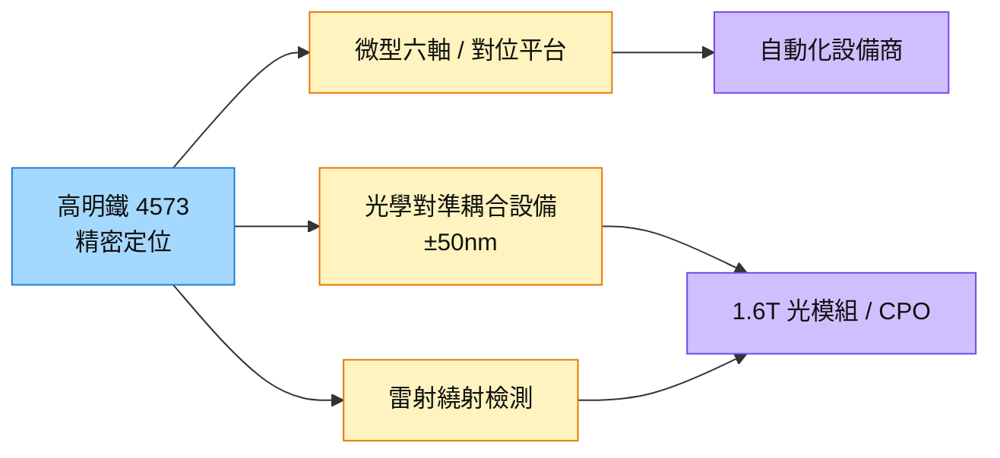

# 4573_高明鐵（櫃）

## 基本資料

高明鐵為精密定位平台、微型多軸位移平台與自動化次系統廠，近年將精密對位能力延伸至光通訊與 CPO 的光學對準、耦合與檢測設備。

- **群益投顧導覽／技術交流（2026-09-03）：** 展示一套光學對準與檢測設備，定位具 1.6T 等級能力、雙透鏡結構，光學耦合精度要求最高，整體精度可達約 ±50 奈米量級；操作為半自動（人工上料、系統自動對位，再依客戶參數做 UV 固化與封裝確認），並以雷射繞射／結構光檢測晶圓、光柵或光學結構，系統輸出分數或以指定波長檢查。設備方責任在確保雷射光源輸出符合標準，資料判讀由客戶決定。（導覽紀錄為口述整理，部分術語不清，信心中低）
- **產品延伸（群友轉述）：** 由零組件供應往上延伸至次系統模組與對位平台，微型六軸產品出貨產業多元，部分案件受保密協議限制。

資料來源：[[活動_高明鐵4573_導覽Memo_20260903]]（群益投顧導覽 Call memo，2026-09-03）

- **Goldman Sachs SEMICON 攤位參訪（2026-09-08）：** 高明鐵（GMT）展示四套已上市系統，涵蓋晶圓級光學檢測與測試，以及 1.6T 光模組光引擎主動對準；其中 Dual FA 主動對準設備可同時完成 Tx 與 Rx 耦合，較傳統設備節省約 50% 耦合時間。高盛將耦合自動化列為高速光連接的必要趨勢。（公司展示說法，中）來源：[[報告_GoldmanSachs_SEMICON台灣光子測試_20260908]]。

## 核心技術／競爭優勢

- **奈米級精密定位：** 對位與重對位可精準回到指定位置，支援光纖陣列與光學元件的主動對位。
- **次系統化：** 提供對位平台與次系統，讓設備商直接整合，提高單機價值。
- **光通訊延伸：** 速率提升要求設備更精密，CPO 與 1.6T 以上光模組的耦合需求為切入點。

## 產品與應用

| 產品 / 服務 | 應用 | 相關客戶 / 下游 |
|-------------|------|-----------------|
| 光學對準與耦合設備（1.6T 等級） | 光模組、CPO 光引擎 FAU 對位與固化 | 光通訊客戶（未揭露） |
| 雷射繞射／結構光檢測 | 晶圓、光柵與光學結構檢測 | 客戶指定波長 |
| 精密定位平台、微型六軸 | 自動化設備、半導體設備次系統 | 國內外自動化設備商 |

## 圖片 / 架構圖

圖說：高明鐵以精密定位為核心，往光模組與 CPO 的光學對位耦合設備延伸；2026–2028 年 CPO 仍以主動對位為主，對位設備被視為可能的瓶頸環節。

## 時間軸

| 時間 | 事件 | 類型 | 重要性 | 備註 |
|------|------|------|--------|------|
| 2026-09-03 | 群益投顧導覽展示 1.6T 等級光學對準設備 | 技術展示 | ⭐ | [[活動_高明鐵4573_導覽Memo_20260903]] |
| 2026–2028 | CPO／NPO 以主動對位為主，對位設備需求延續 | 產業趨勢 | ⭐⭐ | 見 [[技術_CPO]] |

→ 跨公司時程詳見 [[時程_2026-2027高速互連與分散式算力]]

## 供應鏈位置

- 下游：光模組與 CPO 封裝廠、自動化設備商
- 所屬供應鏈：[[供應鏈_光測試設備]]、[[供應鏈_工業自動化]]
- 技術背景：[[技術_CPO]]、[[技術_FAU]]

## 相關公司

尚無公開揭露之客戶名稱，`related_companies` 暫留空。

## 風險與注意事項

> [!warning] 風險與注意事項
> - **資訊稀薄：** 導覽紀錄為口述整理，未揭露營收貢獻、客戶與訂單。
> - **被動對位替代：** Glass Bridge 等被動對位方案若在 2029–2030 年滲透，主動對位設備需求可能轉弱。
> - **競爭：** 國際光學對位設備廠（如 ficonTEC）擴產積極。

## 來源

- [[活動_高明鐵4573_導覽Memo_20260903]] — 群益投顧導覽 Call memo，2026-09-03
- [[報告_GoldmanSachs_SEMICON台灣光子測試_20260908]] — Goldman Sachs，2026-09-08（GS 未評等，SEMICON 攤位參訪）

## 相關頁面

- [[供應鏈_CPO]]
- [[分析_2026Q3法說季_AI供應鏈瓶頸與擴產節奏_LINE彙整]]
