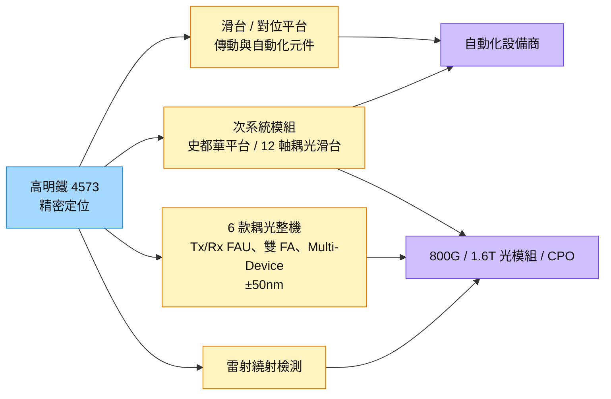

# 4573_高明鐵（櫃）

## 基本資料

高明鐵為精密定位平台、微型多軸位移平台與自動化次系統廠，近年將精密對位能力延伸至光通訊與 CPO 的光學對準、耦合與檢測設備。

- **群益投顧導覽／技術交流（2026-09-03）：** 展示一套光學對準與檢測設備，定位具 1.6T 等級能力、雙透鏡結構，光學耦合精度要求最高，整體精度可達約 ±50 奈米量級；操作為半自動（人工上料、系統自動對位，再依客戶參數做 UV 固化與封裝確認），並以雷射繞射／結構光檢測晶圓、光柵或光學結構，系統輸出分數或以指定波長檢查。設備方責任在確保雷射光源輸出符合標準，資料判讀由客戶決定。（導覽紀錄為口述整理，部分術語不清，信心中低）
- **產品延伸（群友轉述）：** 由零組件供應往上延伸至次系統模組與對位平台，微型六軸產品出貨產業多元，部分案件受保密協議限制。

資料來源：[[活動_高明鐵4573_導覽Memo_20260903]]（群益投顧導覽 Call memo，2026-09-03）

- **Goldman Sachs SEMICON 攤位參訪（2026-09-08）：** 高明鐵（GMT）展示四套已上市系統，涵蓋晶圓級光學檢測與測試，以及 1.6T 光模組光引擎主動對準；其中 Dual FA 主動對準設備可同時完成 Tx 與 Rx 耦合，較傳統設備節省約 50% 耦合時間。高盛將耦合自動化列為高速光連接的必要趨勢。（公司展示說法，中）來源：[[報告_GoldmanSachs_SEMICON台灣光子測試_20260908]]。
- **官網公司沿革（2026-11-24 擷取，fact／高）：** 1995 年登記成立（前身為 1994 年彰化「盛鐵模具機械五金行」），原做精密沖床模座、沖模零配件與導柱、導套；2005 年轉入線性傳動元件，2006 年成立線性傳動事業部並自創 GMT 品牌，2010 年起生產滑台關鍵零組件，2014 年投入電動滑台設備與數位平台。2016 年在德國設子公司，2017 年設立 PROMOTE CO., LTD. 併購東莞晶全智能自動化科技，並取得德國 GMT Europe GmbH 股權（2025-06 德國子公司遷新址，面積擴增 3 倍）。2019 年彰化埔心全球營運總部落成並設台中驅動器研發中心，整合機構、驅動器與控制器；2025-01 成為 SEMI 矽光子產業聯盟 SIG2 成員；2025-06 現增後實收資本額 4.17 億元（[[research_高明鐵官網產品與設備規格_20261124]]）。
- **轉型脈絡（媒體整理，fact／中）：** 2010 年代打進 iPhone 供應鏈供應電動滑台模組，之後取得華為訂單，2018 年營收 7.6 億元；2019-05 華為被列入實體清單後大客戶斷單，2019 年營收降至 5.28 億元、EPS −3.26 元，之後轉向光通訊耦光設備；2019–2025 年 7 個年度中有 5 年虧損（[[web_數位時代_高明鐵CPO耦光設備轉型_20260820]]）。

## 核心技術／競爭優勢

- **奈米級精密定位：** 對位與重對位可精準回到指定位置，支援光纖陣列與光學元件的主動對位。
- **次系統化：** 提供對位平台與次系統，讓設備商直接整合，提高單機價值。
- **光通訊延伸：** 速率提升要求設備更精密，CPO 與 1.6T 以上光模組的耦合需求為切入點。
- **閉迴路耦光演算法（2026-10-21 公司說法）：** 一般做法是 spiral 掃描、找不到光再縮小步距重跑；公司另有「直接搜尋法」專利，以閉迴路直接找光源縮短 cycle time，並稱客戶自寫演算法多為開迴路。耦光快的話約 5 秒，關鍵在初始定位（[[活動_高明鐵4573_技術論壇Memo_20261021]]）。

## 產品與應用

| 產品 / 服務 | 應用 | 相關客戶 / 下游 |
|-------------|------|-----------------|
| 光學對準與耦合設備（1.6T 等級） | 光模組、CPO 光引擎 FAU 對位與固化 | 光通訊客戶（未揭露） |
| 雷射繞射／結構光檢測 | 晶圓、光柵與光學結構檢測 | 客戶指定波長 |
| 精密定位平台、微型六軸 | 自動化設備、半導體設備次系統 | 國內外自動化設備商 |
| 次系統模組：GSS-100-D／DH 史都華平台＋GSC-PR6 控制器、多軸精密耦合電動滑台、12 軸自動／手動耦光滑台 | SiPh、FAU 主動對位、影像伺服、精密組裝；賣給設備商自行整合 | 設備商、研發實驗室 |
| Detachable RCP 貼片設備（2026-12 出成品，公司說法） | CPO Insertion 3 前段：切割後將 receptacle 主動對位貼到 OE 晶片，FAU 可拆換 | OSAT（NVIDIA CPO 鏈），客戶要求 UPH 120–130 |
| FAU 組裝設備／整線規劃（MT fiber、8 channel FAU、FAU-prism、MLA、carrier、lid） | FAU 製造：剝纖、清潔、組纖到 prism／MLA 組裝 | 光模組前十大、FAU 廠 |
| 並聯式六軸（Hexapod）、piezo wafer-level testing 平台（精度 5 nm） | 對標德商 PI 的高階對位平台；Insertion 1 晶圓級測試 | 設備商、晶圓廠、工研院計畫 |
| 光學繞射檢查設備（2026-09 SEMICON 推出） | 整片掃描 DFB 晶圓 grating structure，帶光阻、不切片即可量 | 目標客戶：[[3105_穩懋（櫃）]]、[[2455_全新（市）]]、[[3081_LandMark光電（市）]] 等磊晶／雷射廠 |
| 傳統產品線（官網型錄分類）：電動／手動滑台、精密對位平台、直驅與壓電模組、自動化模組（電缸、電動夾爪等）、光纖／光學平台、馬達／驅動器、感應刀桿燒結機、沖床模具零件 | 半導體、3C、工具機、自動化產線 | 自動化設備商 |

> [!note] 營收結構
> 官網與新聞皆未揭露產品別營收比重；光通訊設備與傳統傳動／自動化產品的營收占比仍待年報或公司揭露。

## 圖片 / 架構圖

![[報告_CPO耦光對位設備三強比較_萬潤高明鐵惠特_20260902_001.png]]
*圖（2026-09-02 三強比較報告，p4）：高明鐵在矽光子與 CPO 產線上的守備範圍集中於「晶圓級耦光量測」與「FAU／光引擎耦合」，與惠特（元件測試）及萬潤（封裝整線＋耦合）僅在耦合站點重疊。*

![[報告_CPO耦光對位設備三強比較_萬潤高明鐵惠特_20260902_002.png]]
*圖（2026-09-02 三強比較報告，p10）：高明鐵與萬潤耦光機的自製深度比較——高明鐵自製視覺定位與六軸對位核心，點膠（武藏）、固化（HOYA）與光學量測（Santec／Keysight）採業界標準件整合；萬潤則自取放、點膠、補償固化到插損驗證全自製。*

![[報告_CPO耦光對位設備三強比較_萬潤高明鐵惠特_20260902_003.png]]
*圖（2026-09-02 三強比較報告，p12）：依高明鐵官網週期時間換算之單機 24 小時理論日產出（未計換料與停機）——雙 FA 耦合機約 480 顆／日、多器件耦合機約 432 通道／日、Tx FAU Aligner 約 278 顆／日。*

![[活動_高明鐵4573_參訪電訪SEMICON閉門Memo_20260915_002.png]]
*圖（經濟日報整理，收錄於 2026-09 參訪 memo p3）：「機械四雄」CPO 布局比較。高明鐵是四家中唯一做到光耦合整機與製程整合者，[[2049_上銀（市）]] 偏精密傳動元件、[[1597_直得（櫃）]] 偏直驅馬達與運動控制、[[4576_大銀微系統（市）]] 偏奈米級定位平台；可看出高明鐵已從零組件層級往設備整機層級上移。*

![[活動_高明鐵4573_參訪電訪SEMICON閉門Memo_20260915_003.png]]
*圖（2026-09 參訪 memo p7，公司產品圖）：高明鐵 6 款光通耦光整機，由左上起為 Tx FAU Bonder、Dual LD Lens Active Aligner、Rx FAU Aligner，下排為 Tx FAU Aligner、Multi-Device Active Aligner 與全自動雙 FA 耦合機（HVM 量產線方案）；前五款為單站機，最後一款加入自動上下料與 MPO 插拔清潔，是量產線主力機種。*

![[活動_高明鐵4573_參訪電訪SEMICON閉門Memo_20260915_011.png]]
*圖（2026-09-02 SEMICON 攤位照片）：六軸並聯史都華平台。六根可伸縮支柱同時控制 X/Y/Z 與三個轉角，是高明鐵把光纖陣列對到 PIC 光點、做奈米級主動耦光的核心模組，也是公司稱的供貨瓶頸（「對位平台」）。*

```mermaid
flowchart LR
    GM[高明鐵 4573<br/>精密定位] --> A[滑台 / 對位平台<br/>傳動與自動化元件]
    GM --> S[次系統模組<br/>史都華平台 / 12 軸耦光滑台]
    GM --> B[6 款耦光整機<br/>Tx/Rx FAU、雙 FA、Multi-Device<br/>±50nm]
    GM --> C[雷射繞射檢測]
    A --> D[自動化設備商]
    S --> D
    S --> E
    B --> E[800G / 1.6T 光模組 / CPO]
    C --> E

    classDef co fill:#a5d8ff,stroke:#1c7ed6,color:#111
    classDef prod fill:#fff3bf,stroke:#e67700,color:#111
    classDef app fill:#d0bfff,stroke:#7048e8,color:#111
    class GM co
    class A,S,B,C prod
    class D,E app
```

圖說：高明鐵以精密定位為核心，往光模組與 CPO 的光學對位耦合設備延伸；2026–2028 年 CPO 仍以主動對位為主，對位設備被視為可能的瓶頸環節。

## 2026-08～09 參訪、電訪、SEMICON 與國票閉門法說

來源：[[活動_高明鐵4573_參訪電訪SEMICON閉門Memo_20260915]]（研究員彙整：2026-08-26 公司參訪〔陳志鑫董事長、陳淑玲特助、蘇仲鵬研發長〕、08-27 電訪、09-02 SEMICON 攤位詢問、09-15 國票閉門法說）。公司口述 fact／中；memo 作者自估數字另標 estimate。

**財務轉型（fact／高：公開財報與月營收）**

| 項目 | 2023 | 2024 | 2025 | 2026H1 |
|---|---|---|---|---|
| 營收（億元） | 4.08 | 6.23 | 6.03 | 7.03 |
| 毛利率 | 14.82% | 31.66% | 24.40% | 40% |
| 營益率 | −31.94% | −0.97% | −18.94% | 16% |
| 淨利率 | −23.97% | 0.08% | −19.32% | 18% |
| EPS（元） | −2.67 | 0.01 | −2.96 | 2.90 |

- 2026 年月營收逐月走高：1 月 0.79 億、3 月 1.08 億、5 月 1.54 億、6 月 1.63 億、7 月 2.00 億元（YoY +298.5%），前 7 月累計 9.03 億元（YoY +168.2%）。截至 7 月營收主力仍是「定位模組」（單價萬元級），主動耦光設備（單價百萬元級）自 3Q26 起陸續出貨。
- 光通＋半導體營收占比由 2025 年 29% 升到 2026H1 79%、3Q26 >80%；2025 年產品別仍是自動化模組及零組件 89.66%、精密模具 10.16%。公司稱下半年為傳統旺季、營收季季高。
- memo 作者估 2026 EPS 15 元、2027 EPS 35 元以上（estimate／中低，未揭露假設）。
- 股權：創始經營團隊及家族合計約 29.12%，前十大股東合計 37.13%（含中鋼旗下中盈投資 1.95%）。

**2027 產品組合與單機經濟（公司說法／中）**

| 產品 | 2027 占比 | ASP | 毛利率 | 現有產能 | 交期 | 認列 |
|---|---|---|---|---|---|---|
| 光通設備（耦光設備、Insertion 1／3 測試機） | 20–30% | 約 700 萬元 | 60–70% | 30–50 台／年 | 3 個月 | 驗收後 1 個月 |
| 定位模組（六軸主動對位平台） | 70–80% | 萬元級 | 40%+ | 8,000–9,000 台／月 | 4–6 個月 | 出貨認列 |

- 整體 2027 毛利率目標 44–50%。耦光整機基礎款 700 萬元、客製化最高約 1,400 萬元（新聞稱「標準機單價逾 700 萬元」，特助以此口徑確認）。
- 耦光設備 2026 年出貨約 10 台；2027 年因缺工保守抓 50 台，正與 2 家協力廠談外包，談成可到 70–80 台（公司說法，不確定）。
- 模組產能至 2027 年底至少翻倍，擴產效果要等進口工具機到位、2026Q4 才明顯。

**市占與客戶（公司說法／中）**

- 稱為第一家量產耦光設備的台廠，是 [[LITE.US(lumentum)]] 與 [[COHR.US(coherent)]] 的主要供應商；全球前十大光通訊品牌模組廠除一家外都採用其對位模組，中國前五大光通訊設備商的設備內部全面採用其模組。
- 中國 400G／800G 對位模組市占約 30%；目標 2027 年 800G／1.6T 對位模組全球市占 40%。
- 客戶以封裝廠（OSAT、光通封裝廠）為主，非中國客戶約占一半。台灣客戶含 [[3008_大立光（市）]]（大客戶兼合作夥伴）、[[7769_鴻勁精密（市）]]、[[2360_致茂（市）]]，以及磊晶廠 [[3105_穩懋（櫃）]]、[[3081_LandMark光電（市）]]、[[2455_全新（市）]]；ELS 模組客戶為 [[4908_前鼎（櫃）]]、[[3450_聯鈞（市）]]。[[3363_上詮（櫃）]] 先前有合作，但近期已無合作。
- 品牌模組廠採購模式有三種：完全外購設備；自製設備不夠時才買；自製設備但買高明鐵模組。目前模組缺貨，公司採「設備綁模組」——買整套設備者優先配模組。高階對位設備屬賣方市場，含中國客戶都要先付預付款／訂金才排產。

**CPO 測試站點 roadmap（公司說法／中）**

| 站點 | 產品 | 進度 | 競爭對手 |
|---|---|---|---|
| Insertion 0（國票段落寫作 Insertion 1） | PGIS 非破壞式光柵檢測：以繞射法整片 mapping，取代破壞式刮片抽檢，先用於 DFB 雷射，下一代為 panel-level | 2026Q4 出貨；穩懋、聯亞、全新已過認證；中國源杰科技（688498.SH，未建頁；非台灣 7907 源傑）需求大，約 2028 年再推 | 市場尚無同類產品，自有專利；單價 1,700–2,200 萬元，約一般機台 2 倍 |
| Insertion 1 | 晶圓探針台 | 預計 2026-09 推出；RD 稱精度已與 FormFactor 相當 | FormFactor |
| Insertion 2 | 不切入 | 方案已固定（如 [[6187_萬潤（市）]] 搭 [[6857.JP(advantest)]]） | — |
| Insertion 3 | 光引擎主動耦合組裝／測試，支援 RCP（金屬基座）貼合；另有 die-level 雙面晶圓測試機 | RCP 貼合機 2026-12 進 [[2330_台積電（市）]] 量產線做機台計算與測試，公司稱 2027 年會有相當不錯的 CPO 營收 | 萬潤（RCP）；ficonTEC（漢測代理）、致茂（die-level） |
| Insertion 4 | 對位模組 | 供應給鴻勁、致茂（致茂多軌採購日、德與高明鐵；鴻勁正搭載測試） | — |

- **RCP 貼合速度（公司說法）：** 點膠＋固化 10 秒、測試 20 秒，合計 30 秒，即每小時 120 顆；同業韓廠一代機 10 顆／時、二代機 40 顆／時，其他台廠一代機 60 顆／時。
- **對位精度門檻：** 400G 容許誤差約 500 nm、800G 約 300 nm、1.6T 須 100–150 nm；外商客戶損耗達 3% 即判不良，部分客戶可接受十幾 %，檢驗仍高度依賴人工。RD 稱耦光就是「找光」，本質上等同測試，所以進入 Insertion 1／3 檢測不是問題；並稱「可以用精度換取速度」。
- **NPO／CPO 量產時點：** 公司判斷約 2027Q3–Q4 之後才真正放量，NPO 基本由 3.2T 起跳；CPO 看台積電能量、NPO 看系統廠測試進度，兩者時間點差不多，台灣也有好幾家系統廠在做 NPO。2027 年設備出貨最大量會在 OEM／光引擎組裝廠（台系組裝廠接到大筆 NPO 案），其次為光模組客戶。CPO 設備分三階段交付，目前先由設備出貨。
- **美系合作：** 美系大廠主動找公司合作 CPO 與玻璃基板主動對位（基板先拉伸再精密對位）。

**產能、瓶頸與廠區（公司說法／中）**

- 彰化總部 400 多坪做 400G／800G 設備與模組（>50 套／月）；台中廠 600 坪做 1.6T／CPO 設備與模組（100 套／月）；另有新竹工研院標準實驗室、花蓮東華研發中心（視覺、奈米對位、掃描演算法）、台北營運中心（籌備中）、德國子公司；東莞子公司（常瑞智能）2025 年底設立，承接 400G／800G，但目前生產主力仍在台灣。
- 台灣廠稼動率約 60–70%，受限於關鍵零組件——極精密感測器與感測桿件；機台內採德國高階鏡頭，屬精密系統校準而非單純組裝，就算全開也只是做庫存。
- 國外設備交期至少 6–7 個月（德國 8–9 個月以上），高明鐵台灣製造 2–3 個月。最大瓶頸在對位平台本身。
- 2026-08-12 公告投資 7,000 萬元取得台中一家光學暨醫療廠約 60% 股權（為客戶、類似協力廠）。台灣擴線只需加設備，會比客戶提早約半年準備。
- 新聞稱東莞子公司擴廠、規劃泰國組裝廠，特助表示兩項皆非事實。

**同業比較（memo 整理，競爭對手數字為攤位詢問或官網，信心中低）**

| 公司 | 產品 | 精度 | 耦光時間 | 交期 | 單價 |
|---|---|---|---|---|---|
| 高明鐵 | 全自動雙 FA 對位機、專用六軸主動耦光機 | 重複定位 50–100 nm | 8–9 秒 | 3 個月 | 700 萬～1,400 萬元 |
| 日商（神津精機、中央精機、駿河精機，皆未上市） | 自動主動耦光機、FAU／PIC 多通道對準系統 | 重複定位 10–50 nm | 30–60 秒 | 6–8 個月 | 未提供 |
| 韓商 ADST（港建 3093 代理） | 透鏡／光纖陣列主動耦合貼裝設備 | 攤位稱 0.3 µm | 90–180 秒 | 待確認 | 800 萬元以上，比高明鐵高約 20% |
| [[6187_萬潤（市）]] | 六軸平台＋PA／AA 雙模，視覺定位到 UV 固化與光學驗證整線 | 微米級 2.5 µm | 未提供 | 6–12 個月 | 未提供 |
| [[4576_大銀微系統（市）]]（潛在） | CPO 設備主要用於後段測試與 SLT，結構與演算法不同於耦光 | 定位平台 1.6 nm | — | — | — |

- 公司稱用日商設備的客戶較不會換，因此主要對手是韓商 ADST。港建業務稱 ADST 只有台灣代理權（自動續約），目標客戶為封裝廠（日月光）與光通封裝廠（聯鈞、華星光）；SEMICON 現場高明鐵攤位人潮明顯多於港建。
- 對萬潤：萬潤 2018 年起步、強在貼合，高明鐵強在對位並跨足 ELS 與 PGIS，路線不同。中國同業的耦光設備多為半自動、需人力，高明鐵為全自動。
- 對致茂、鴻勁：定位為「你做設備、我提供模組」的合作者；高明鐵稱為台灣首家做出一體化對位模組的廠商（2023 研發、2024 推出）。
- 規劃 2027Q2 送件申請由興櫃轉上櫃。

> [!warning] 資訊衝突：毛利率口徑
> - 2026-09 參訪／閉門（[[活動_高明鐵4573_參訪電訪SEMICON閉門Memo_20260915]]）：2026H1 毛利率 40%，2027 年目標 44–50%（設備 60–70%、模組 40%+）。
> - 2026-10-21 技術論壇（[[活動_高明鐵4573_技術論壇Memo_20261021]]）：毛利率希望每季 50% 以上、目前「50 出頭」，目標 55–58%。
> - 兩者相隔一個月、口徑相差約 6–10 個百分點；可能是 3Q26 設備占比提高後上修，或論壇口述指設備毛利。待 3Q26 財報核對，暫並列。

> [!warning] 資訊衝突：2027 年「40%」指的是什麼
> - 9 月 memo：2027 年 800G／1.6T 對位模組**全球市占**可達 40%。
> - 10-21 論壇：2027 年 **1.6T 可占成長約 40%**。
> - 兩份皆為口述轉寫，可能是同一句話的不同理解，暫並列。

> [!note] 站點編號與時程口徑
> - 同一份 memo 中，PGIS 在產品 roadmap 標為 Insertion 0、在國票閉門段落標為 Insertion 1；10-21 論壇則把 Insertion 1 定義為 PIC wafer-level testing（對標 FormFactor）。本頁依 roadmap 表，PGIS 列 Insertion 0、晶圓探針台列 Insertion 1。
> - RCP 貼合機：9 月口徑為「2026-12 進台積電量產線測試」，10-21 論壇為「2026-12 出成品」，客戶目標 UPH 120–130；兩者一致指向 2026-12 節點，但是否已在台積電廠區量產驗證仍待確認。
> - 重複定位精度：memo 寫 50–100 nm，官網標 ±50 nm（[[research_高明鐵官網產品與設備規格_20261124]]）。

> [!warning] 上市別待確認
> 本頁檔名與 frontmatter 標為上櫃（TPEX），但 2026-09 memo 稱公司為興櫃、規劃 2027Q2 申請轉上櫃；2026-09 網路資料也顯示仍在興櫃交易（2018-07 登錄興櫃）。依 schema 應為 `4573_高明鐵（興）`，更名涉及全庫 wikilink，待使用者確認後處理。

## 2026-09～10 設備比較、公開財務與市場觀點更新

- **產品定位（「對光的人」與機台型錄，fact／高）**：由滾珠螺桿、滑軌與電動缸等精密傳動零組件廠升級為光學對位工站整機商，官網列出 6 款整機——Tx FAU Bonder（被動）、Tx FAU Aligner（主動，<310 秒／顆含固化）、Rx FAU Aligner、Dual LD Lens Active Aligner、Multi-Device Active Aligner（雙 6 軸，<200 秒／通道）、全自動雙 FA 耦合機（雙 6 軸、6 支相機、自動插拔清潔多芯連接器，<180 秒／顆不含固化），另供應史都華平台與 12 軸耦光次系統模組（[[報告_CPO耦光對位設備三強比較_萬潤高明鐵惠特_20260902]]）。
- **規格定義與自製深度（fact／高）**：官網標示 X/Y/Z 軸解析度 10 nm、重複定位精度 ±50 nm（機構重現性，**不可**直接與 [[6187_萬潤（市）]] 端到端對位能力 ±2.5 µm 相除比較）；點膠採武藏（Musashi）、固化採 HOYA EXECURE-4000D（365 nm LED）、光源／光功率計採 Santec TSL-570A-P／MPM-220 與 Keysight E3646A、控制軟體為 LabVIEW。採用標準件有助加速驗收、降低開發風險，但固化後光軸偏移調校空間與大規模量產軟體框架可能受限。
- **單機產能推估與專利盤點（estimate／中；專利 fact）**：三家中唯一公開週期時間，依官網數字推算 24 小時理論日產出約 278–480 顆（實際稼動須打折）。Google Patents（2026-09-02）檢索約 187 件專利集中於滑軌、編碼器與步進馬達，尚未查見已公開光耦合專利（須留意 18 個月公開遞延）。
- **財務與區域結構（fact／高）**：機台主要裝設於光模組廠（800G／1.6T 產線）與矽光子封裝廠，對外稱客戶區域為中國大陸約 50%、美系約 40%、台灣約 10%。FY25 營收 6.03 億元、稅後淨損 1.17 億元、EPS −2.96 元；2026 年 7 月營收 2.00 億元（YoY +298.5%）、前 7 月累計 9.03 億元（YoY +168.2%），2026 年由虧轉盈；2026-06-25 完成現增 400 萬股、每股 NT$325，募資 13.0 億元（[[報告_CPO耦光對位設備三強比較_萬潤高明鐵惠特_20260902]]）。
- **智璞 CPO 測試版圖補充（2026-09-21）**：[[報告_永豐_智璞專家分享會_矽光子與CPO趨勢_20260921]]（p49）將高明鐵列入 Insertion 1 晶圓探針台，以及 Insertion 3 耦合設備與單顆雙面 CPO 測試機供應商版圖（產業整理／中）。
- **客戶結構觀點（2026-10-09，thesis／低信心）**：[[研究_大立光3008_上詮3363_FAU觀點_珩石Jason_20261009]] 稱 [[3363_上詮（櫃）]] 曾為高明鐵最大客戶之一，而 2026 年起高明鐵其他客戶已開始貢獻營收；屬單一買方觀點，客戶營收比重仍待公司揭露驗證。

## 2026-11 官網機台規格與新聞更新

官網設備總覽頁（2026-11-24 擷取）列出 6 款整機，與三強比較報告的機台清單一致；英文選單只列 3 款，不能據此判斷其餘機台下架（[[research_高明鐵官網產品與設備規格_20261124]]，fact／高）。

| 機台 | 製程功能 | 軸數／相機 | 官網 CT | 重量 | 頁面更新 |
|---|---|---|---|---|---|
| Tx FAU Bonder（被動貼合） | CCD 視覺做 XYZ 平面對位後 UV 貼合，貼片精度 ±5 µm、角度 ±0.1°@3σ，壓力感測器監控 5 gF | 龍門 4 軸（XY 直線馬達）／CCD | < 130 秒／個（原文寫「顯示UV光固化時間」，推測含固化，未確認） | 850–950 kg | 2025-04-08 |
| Tx FAU Aligner | 傳送端 FA 對光晶片主動耦合 + UV 固定 | 單 6 軸／1 台 | < 310 秒／顆（含 UV） | 850–950 kg | 2025-04-08 |
| Rx FAU Aligner | 接收端 FA 對光偵測器主動耦合 + UV 固定 | 單 6 軸／2 台 | < 180 秒／顆（不含 UV） | 850–950 kg | 2025-04-08 |
| Dual LD Lens Active Aligner | 雙透鏡對 PIC 主動耦合，可同步耦合兩顆透鏡 | 雙 6 軸／2 台 | < 200 秒／通道 | 1,100–1,250 kg | 2025-04-08 |
| Multi-Device Active Aligner | 一台完成雙透鏡、FA 收發端耦合與隔離器貼裝 | 雙 6 軸／3 台 | < 200 秒／通道 | 1,300–1,500 kg | 2026-01-28 |
| 全自動雙 FA 耦合機（HVM 量產線方案） | 雙 FA 接收端耦合、料籠自動上下料、自動插拔／檢查／清潔 MPO 連接器、自動點膠與 UV | 雙 6 軸／6 台 | < 180 秒／顆（不含 UV） | 1,400–1,600 kg | 2026-01-28 |

- **共通規格（fact／高）**：主動耦合機台 X/Y/Z 解析度 10 nm、重複定位精度 ±50 nm、單軸 ±0.05 µm（步進馬達＋螺桿）、θY/θZ ±0.001°，耦合穩定性 <±5%；點膠為武藏、UV 為 HOYA 365 nm LED、源表 Keysight E3646A、光源 Santec TSL-570A-P、光功率計 Santec MPM-220，控制軟體 LabVIEW，Class 100k 無塵室。官網註明源表、光源與光功率計「型號將依最後產品規格做調整」。
- **量產機重心（推論／中）**：2026-01-28 更新的兩款（Multi-Device、全自動雙 FA）都是雙 6 軸、多相機與自動上下料設計，顯示產品線由單站半自動往 HVM 量產整線延伸；TechNews 配圖即為全自動雙 FA 耦合設備。
- **單機理論產能補充（estimate／中）**：依官網 CT 以 24 小時連續運轉換算，Rx FAU Aligner 約 480 顆／日（不含 UV）、Tx FAU Bonder 約 660 個／日；與三強比較報告的 278–480 顆／日同為未計換料與停機的上限值。
- **史都華平台（fact／高）**：GSS-100-D／DH 為六自由度並聯平台，行程 X/Y ±16 mm、Z ±6.5 mm，角度 ±10°／±20°，編碼器解析 <28 nm，重複定位精度（RMS）X/Y ±0.5 µm（DH 版 ±0.3 µm），水平負載 2.5 kg（DH 版 5 kg），EtherCAT 全閉環；GSC-PR6-B 控制器內建最大光量搜尋與影像伺服。2026-11-06 新聞稿稱「高精度小型史都華平台 GSS-100-S-D」獲 2027 台灣精品獎，產品頁型號則為 GSS-100-D／DH，兩者是否為同一款待確認。
- **800G／1.6T 訂單與測試站點（公司新聞稿，fact／中）**：2026-07-23 公司稱已通過全球前十大光通訊品牌廠認證（未具名），取得 800G 與 1.6T 光模組耦光對位訂單，並切入 CPO 封裝測試與 FAU＋MLA 精密組裝；於 Insertion 1 解決主動對準耗時瓶頸、主攻 Insertion 3 光引擎耦合組裝與測試，支援 RCP／COUPE，客戶由晶圓廠延伸到 OSAT（[[web_鉅亨網_高明鐵H1業績與800G1.6T耦光訂單_20260723]]、[[web_TechNews_高明鐵13億現增與耦光訂單_20260723]]）。
- **GC／EC 雙架構（公司觀點，thesis／中）**：公司認為光柵耦合（GC，適合晶圓級測試與標準化量產）與邊緣耦合（EC，用於 Glass Bridge 等新型光連接）將並行發展，兩者量產都需要高精度定位、主動耦光與光學量測；此說法把被動對位替代風險（見下方風險段）定調為設備需求轉移，而非消失，仍待客戶導入驗證。
- **股價區間（fact／高）**：興櫃以來最低 11.1 元（2023-11-24），最高 682 元（2026-04-21 盤中）；2026 年最低 65.7 元（2026-01-27）（[[web_數位時代_高明鐵CPO耦光設備轉型_20260820]]）。

## 2026-10-21 技術論壇：RCP 瓶頸、FAU 整線與毛利率目標

以下皆為公司於技術論壇的口述，未經財報或客戶證實；客戶與競爭對手資訊信心中低（[[活動_高明鐵4573_技術論壇Memo_20261021]]）。

**營運與財務（公司指引／中）**
- 毛利率希望每季維持 50% 以上，目前「50 出頭」，目標 55–58%，視產品組合而定。
- 2027 年模組產出規劃比 2026 年倍增，整棟廠房依此設計；模組與設備都在成長，主軸是六軸，之後也都是六軸。
- 組織：台灣總部負責對位平台與設備的組裝、開發與製造；德國子公司做工程服務；中國子公司「鼎器」賣對位平台（光模組前十大很多經此出貨），另一家專賣中國市場設備。研發在台中、新竹、彰化，花蓮另有演算法團隊。
- 客戶從過去賣給設備廠，轉為直接與光模組前十大談規格。台灣鏡頭廠做 FA／FAU 也多是客戶（主要買六軸對位模組），但中部光學廠為競爭多自建設備團隊，點名 [[3406_玉晶光（市）]]、先進光。
- SENKO、Coherent、Corning 都有自有 CPO FAU；公司稱 Corning「還在談」，「那兩個 C」確定是客戶（原文用語不清，推定指 SENKO 與 [[COHR.US(coherent)]]）。[[GLW.US(corning)]] 尚非確定客戶。

**光通技術路線（thesis／中）**
- 台積架構下 GC／EC 並存，公司判斷 GC 仍是主流（與 2026-07 新聞稿「GC／EC 並行」口徑一致，只是更偏 GC）。
- OE 相關產品：1.6T／3.2T 的 PLC base；CPO 的 ELS 與 OE module；12.8T CPO 的 FAU。2027 年 1.6T 可占成長約 40%，800G 2026 年已放量。
- 1.6T 是設備世代分界：400G 機台改機最多做到 800G，1.6T 規格往上可到 3.2T、往下可做 800G，因此 1.6T 放量會帶動一波模組／設備換機。對位精度要求由早期約 300 nm、1.6T 約 100 nm，到 3.2T 可能 50 nm；FAU 直接對晶片、中間沒有透鏡做光學補償，精度要求持續提高。
- 第二階段開發為多通道耦合與製程整合（清潔、plasma 等前後段），長期以 3.2T、6.4T CPO 為主；2025 年底起做 FAU-prism、MLA 組裝設備並往前延伸到 wafer／panel level testing，定位從「平台＋AA 設備商」轉為製造設備平台。
- 新應用：multi-mode FAU 與 Micro LED、Micro VCSEL 短距光源貼合，國內面板廠積極參與。

**CPO 測試與 RCP（thesis／中低）**
- 公司重點在 Insertion 1 與 3。Insertion 1 為 PIC wafer-level testing，設備放在工研院、屬國家補助計畫第二階段（上一階段據公司了解為 [[2360_致茂（市）]]），對標 FormFactor，一片標準晶圓測試約 1 小時內。
- Insertion 3 分 RCP 與 die-level 兩條線，主力先放 RCP，die-level 剛開始。RCP 先與晶片主動對位貼好，上方 FAU 即可拆換維修（過去 FAU 直接固化在晶片上幾乎無法重工）；切割後才貼，貼完烘烤再進後段測試。凡用台積晶片又要插拔就必須做 RCP 貼片，公司稱 Apple 也想用這類晶片。
- 公司認為目前供應鏈瓶頸在 Insertion 2、3，其中 RCP 最大：設備需求量大、OSAT 蓋廠跟不上、NVIDIA 又把該段集中在一家公司，客戶因此壓 UPH。RCP 供應商目前為 ADST 與高明鐵（萬潤亦列入 Insertion 3 coupling）；ADST 一代機 10 片／時、二代機 40 片／時，高明鐵被要求 120–130 顆／時。設備未標準化、幾乎都是客製機，格局約 2027 年底才較明朗。
- 同一機台空間內，高明鐵因平台與模組自製可放 4–6 組模組（同業 2–3 組），混合 UPH 較高。
- 2026-12 RCP 設備出成品；再往上延伸到 FAU assembly（FAU、prism、MLA、carrier、lid），FAU unit＋RCP＋coupler 即一個 module。公司稱大廠過去用天孚的 FAU，近期很多改用美國公司的 FAU（rumor／低，未具名）。

**競爭與定價（公司說法／中低）**
- 對位平台過去由日本駿河、德國 PI 獨占；2026 年推出的並聯式六軸對標 PI，售價為一般六軸三倍以上、移動更快。
- 對手在德、日、韓；國外廠市占仍較高且常與 NVIDIA 綁在一起。台灣優勢在自有平台與演算法、交期（進口約 6–7 個月，高明鐵 3 個月內）與本土供應；中國以外同級產品報價約為對手的 8–9 成。
- 自製率：除視覺與測電、測光儀表外購，機構件幾乎都能自製（含 XYZ 線馬、螺桿）；模組馬達外購、螺桿與機加工自製。

> [!warning] 口徑差異：視覺系統是否自製
> - 2026-09-02 三強比較報告：高明鐵「自製視覺定位與六軸對位核心」，點膠、固化與光學量測採標準件（[[報告_CPO耦光對位設備三強比較_萬潤高明鐵惠特_20260902]]）。
> - 2026-10-21 技術論壇：公司稱「除了視覺和測電、測光外購」，機構件都能自製（[[活動_高明鐵4573_技術論壇Memo_20261021]]）。
> - 兩者可能分指視覺定位演算法（自製）與相機／鏡頭硬體（外購），未經公司確認，暫並列。

> [!note] UPH 與官網 CT 不可直接比較
> RCP 貼片 120–130 顆／時是客戶給的目標，不是已達成規格；官網既有機台 CT（<180–310 秒／顆）是 FAU 光模組耦合工站，製程與產品不同。

## 時間軸

| 時間 | 事件 | 類型 | 重要性 | 備註 |
|------|------|------|--------|------|
| 2025-01 | 成為 SEMI 矽光子產業聯盟 SIG2 成員 | 產業聯盟 | ⭐ | [[research_高明鐵官網產品與設備規格_20261124]] |
| 2026-01-28 | 官網上架 Multi-Device Active Aligner 與全自動雙 FA 耦合機（HVM 方案）規格 | 產品 | ⭐⭐ | [[research_高明鐵官網產品與設備規格_20261124]] |
| 2026-06 | 現增 400 萬股、每股 325 元，募資 13 億元到位，投入矽光子設備產能 | 擴產 | ⭐⭐ | [[web_TechNews_高明鐵13億現增與耦光訂單_20260723]] |
| 2026-07-23 | 公司宣布通過全球前十大光通訊品牌廠認證，取得 800G／1.6T 耦光對位訂單 | 訂單／驗證 | ⭐⭐⭐ | [[web_鉅亨網_高明鐵H1業績與800G1.6T耦光訂單_20260723]] |
| 2026-08-12 | 公告 7,000 萬元取得台中光學暨醫療廠約 60% 股權（客戶兼協力廠） | 併購 | ⭐ | [[活動_高明鐵4573_參訪電訪SEMICON閉門Memo_20260915]] |
| 2026Q3 | 主動耦光設備（單價百萬元級）開始陸續出貨；光通＋半導體占比 >80% | 出貨 | ⭐⭐ | [[活動_高明鐵4573_參訪電訪SEMICON閉門Memo_20260915]] |
| 2026-09-03 | 群益投顧導覽展示 1.6T 等級光學對準設備 | 技術展示 | ⭐ | [[活動_高明鐵4573_導覽Memo_20260903]] |
| 2026-09 | Insertion 1 晶圓探針台推出（公司稱精度與 FormFactor 相當） | 產品 | ⭐⭐ | [[活動_高明鐵4573_參訪電訪SEMICON閉門Memo_20260915]] |
| 2026Q4 | PGIS 非破壞式光柵檢測機出貨（穩懋、聯亞、全新已過認證）；進口工具機到位，模組擴產效果顯現 | 出貨／擴產 | ⭐⭐ | [[活動_高明鐵4573_參訪電訪SEMICON閉門Memo_20260915]] |
| 2026-12 | RCP 貼合機進台積電量產線做機台計算與測試（9 月口徑） | 驗證 | ⭐⭐⭐ | [[活動_高明鐵4573_參訪電訪SEMICON閉門Memo_20260915]] |
| 2027Q2 | 規劃送件申請由興櫃轉上櫃 | 掛牌 | ⭐⭐ | [[活動_高明鐵4573_參訪電訪SEMICON閉門Memo_20260915]] |
| 2027Q3–Q4 | 公司判斷 CPO／NPO 真正量產放量（NPO 由 3.2T 起跳） | 產業節點 | ⭐⭐⭐ | [[活動_高明鐵4573_參訪電訪SEMICON閉門Memo_20260915]] |
| 2028 | PGIS 推向中國（源杰科技 688498.SH 等 DFB／CW 雷射晶片廠） | 市場拓展 | ⭐ | [[活動_高明鐵4573_參訪電訪SEMICON閉門Memo_20260915]] |
| 2026-09 | SEMICON 推出 DFB 光學繞射檢查設備與 piezo wafer-level testing 平台（5 nm） | 產品 | ⭐⭐ | [[活動_高明鐵4573_技術論壇Memo_20261021]] |
| 2026-11-06 | 高精度小型史都華平台（GSS-100-S-D）獲 2027 台灣精品獎 | 產品／獎項 | ⭐ | [[research_高明鐵官網產品與設備規格_20261124]] |
| 2026-12 | CPO Insertion 3 detachable RCP 貼片設備出成品（公司說法） | 產品／驗證 | ⭐⭐⭐ | [[活動_高明鐵4573_技術論壇Memo_20261021]] |
| 2027 | 模組產出規劃倍增；1.6T 占成長約 40% | 產能 | ⭐⭐ | [[活動_高明鐵4573_技術論壇Memo_20261021]] |
| 2027 年底 | CPO RCP 設備供應格局預計底定（公司判斷） | 產業節點 | ⭐⭐ | [[活動_高明鐵4573_技術論壇Memo_20261021]] |
| 2026–2028 | CPO／NPO 以主動對位為主，對位設備需求延續 | 產業趨勢 | ⭐⭐ | 見 [[技術_CPO]] |

→ 跨公司時程詳見 [[時程_2026-2027高速互連與分散式算力]]

## 供應鏈位置

- 下游：光模組與 CPO 封裝廠、自動化設備商
- 所屬供應鏈：[[供應鏈_光測試設備]]、[[供應鏈_工業自動化]]
- 技術背景：[[技術_CPO]]、[[技術_FAU]]

## 相關公司

| 公司 | 關係 | 說明 |
|------|------|------|
| [[3363_上詮（櫃）]] | 客戶（市場觀點，待確認） | [[研究_大立光3008_上詮3363_FAU觀點_珩石Jason_20261009]] 稱上詮曾為高明鐵最大客戶之一，2026 年起其他客戶開始貢獻營收（低信心，未經公司揭露）；2026-09 公司參訪稱「上詮先前有合作，但近期已無合作」（[[活動_高明鐵4573_參訪電訪SEMICON閉門Memo_20260915]]） |
| [[6187_萬潤（市）]] | 直接競爭（FAU／光引擎耦合） | 兩者均切入光纖陣列主動耦合站點；高明鐵偏光模組廠＋標準件整合，萬潤偏封測廠整線＋高自製率（[[報告_CPO耦光對位設備三強比較_萬潤高明鐵惠特_20260902]]） |
| [[6706_惠特（市）]] | 部分重疊競爭 | 惠特主力為元件級光電測試與代工，但 FAS Series 耦光貼合機與高明鐵在 FAU 耦合段重疊（[[報告_CPO耦光對位設備三強比較_萬潤高明鐵惠特_20260902]]） |
| [[2360_致茂（市）]] | 同 CPO 測試鏈（部分重疊） | 論壇列致茂為 Insertion 3 die-level 與 Insertion 4 handler 供應商；Insertion 1 國家計畫上一階段據稱由致茂執行（[[活動_高明鐵4573_技術論壇Memo_20261021]]） |
| [[6223_旺矽（櫃）]] | 同 CPO 測試鏈（不同站點） | 論壇稱 Insertion 2 布局已定為 Advantest＋MPI、ficonTEC＋Teradyne（[[活動_高明鐵4573_技術論壇Memo_20261021]]） |
| [[3406_玉晶光（市）]] | 客戶／潛在自製競爭 | 台灣鏡頭廠多為六軸對位模組客戶，但玉晶光、先進光有自建設備團隊（公司說法，中低） |
| [[2330_台積電（市）]] | 平台制定者 | 台積 coupler 為標準平台，用台積晶片且需插拔就要做 RCP 貼片（公司說法） |
| [[NVDA.US(nvidia)]] | 設備選擇決策方 | 各 Insertion 用什麼設備由 NVIDIA 決定，國外設備商常與 NVIDIA 綁定（公司說法） |
| [[COHR.US(coherent)]] | 客戶（公司說法） | 「那兩個 C 確定是客戶」，推定含 Coherent；用語不清，信心中低 |
| [[GLW.US(corning)]] | 潛在客戶（洽談中） | 公司稱 Corning 有自有 CPO FAU、目前還在談 |
| [[3105_穩懋（櫃）]]、[[2455_全新（市）]]、[[3081_LandMark光電（市）]] | 客戶（PGIS 已過認證） | DFB 光學繞射檢查設備（PGIS）首波台系客戶；9 月 memo 稱三家皆已過認證、2026Q4 出貨（公司說法） |
| [[3008_大立光（市）]] | 大客戶／合作夥伴 | 9 月 memo 稱大立光為大客戶與合作夥伴（買六軸對位模組）；另見 [[報告_CPO耦光對位設備三強比較_萬潤高明鐵惠特_20260902]] 大立光自製 FAU 對位設備的替代風險 |
| [[7769_鴻勁精密（市）]] | 客戶（Insertion 4 模組） | 鴻勁設備搭載高明鐵對位模組測試中；公司定位為「你做設備、我提供模組」 |
| [[4576_大銀微系統（市）]] | 潛在競爭（不同技術） | 大銀微 CPO 設備用於後段測試與 SLT，2026-08 參訪時稱不切入耦光；定位平台精度 1.6 nm |
| [[4908_前鼎（櫃）]]、[[3450_聯鈞（市）]] | 客戶（ELS 模組） | 國票閉門法說列為 ELS 模組客戶 |
| [[LITE.US(lumentum)]] | 客戶（公司說法） | 公司稱為 Lumentum 與 Coherent 的主要耦光設備供應商 |

## 風險與注意事項

> [!warning] 風險與注意事項
> - **資訊稀薄：** 導覽紀錄為口述整理，未揭露個別客戶營收占比與在手訂單；單月營收基期低、波動大。
> - **標準件依賴與軟體框架：** 點膠（武藏）、UV 固化（HOYA）與光學量測（Santec／Keysight）仰賴外購標準件且以 LabVIEW 控制，量產放大時毛利與固化補償調校空間須追蹤。
> - **矽光子依賴度高與新進競爭：** 相較萬潤（先進封裝本業）與惠特（測試代工），高明鐵對矽光子設備依賴度最高，且東佑達（7942）等精密傳動廠相繼切入六軸對位，加上國際廠 ficonTEC 擴產與大立光等客戶自製設備，競爭壓力升溫。
> - **被動對位替代：** Glass Bridge 或微光學容差放寬方案若滲透，主動對位設備需求可能轉弱。

## 來源

- [[報告_CPO耦光對位設備三強比較_萬潤高明鐵惠特_20260902]] — 獨立設備供應鏈比較研究，2026-09-02（官網機台型錄、規格對照、專利盤點與 2025–2026 公開財務／現增資料）
- [[報告_永豐_智璞專家分享會_矽光子與CPO趨勢_20260921]] — 永豐證券／智璞產業趨勢研究所，2026-09-21（CPO 四道測試工序設備版圖，Insertion 1／3）
- [[研究_大立光3008_上詮3363_FAU觀點_珩石Jason_20261009]] — 珩石資本 Jason，2026-10-09（上詮客戶關係與其他客戶營收貢獻觀點，低信心）
- [[活動_高明鐵4573_導覽Memo_20260903]] — 群益投顧導覽 Call memo，2026-09-03
- [[活動_高明鐵4573_參訪電訪SEMICON閉門Memo_20260915]] — 研究員彙整 memo，2026-08-26 參訪／08-27 電訪／09-02 SEMICON／09-15 國票閉門法說（2023–2026H1 財務、2027 產品組合與毛利率、耦光設備出貨台數、Insertion 0–4 roadmap、RCP 120 顆／時、同業比較、產能瓶頸與轉上櫃規劃）
- [[活動_高明鐵4573_技術論壇Memo_20261021]] — 高明鐵技術論壇 memo，2026-10-21（毛利率目標 55–58%、2027 產出倍增、RCP 設備 2026-12 成品與 UPH、Insertion 1–4 供應商、FAU 整線、DFB 光學繞射檢查設備、客戶與定價）
- [[260908_gs_GMT]] — Goldman Sachs，2026-09-08（GMT 4573.TWO SEMICON 攤位專文，Not Covered）
- [[報告_GoldmanSachs_SEMICON台灣光子測試_20260908]] — Goldman Sachs，2026-09-08（GS 未評等，SEMICON 攤位參訪）

- [[報告_中信_自動化產業景氣與成長展望_20261119]]（2026-11-19）
- [[research_高明鐵官網產品與設備規格_20261124]] — 高明鐵官網 16 頁擷取，2026-11-24（6 款整機規格表、史都華平台與控制器、次系統模組、公司沿革、最新消息、型錄清單）
- [[web_鉅亨網_高明鐵H1業績與800G1.6T耦光訂單_20260723]] — 鉅亨網，2026-07-23（前十大光通訊品牌認證、800G／1.6T 訂單、Insertion 1／3、GC／EC）
- [[web_TechNews_高明鐵13億現增與耦光訂單_20260723]] — TechNews，2026-07-23（13 億元現增到位、全自動雙 FA 耦合設備配圖）
- [[web_數位時代_高明鐵CPO耦光設備轉型_20260820]] — 數位時代，2026-08-20（公司沿革、iPhone／華為客戶歷史、股價區間；文末註明初稿為 AI 編撰）

## 相關頁面

- [[供應鏈_CPO]]
- [[分析_2026Q3法說季_AI供應鏈瓶頸與擴產節奏_LINE彙整]]
- [[3711_日月光投控（市）]]
