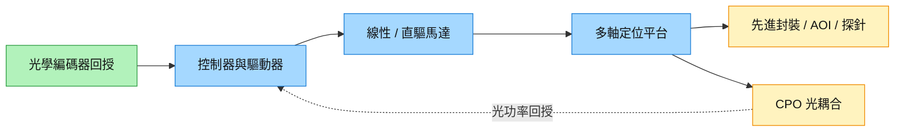

# 4576_大銀微系統（市）

## 基本資料

大銀微系統成立於 1997 年，提供馬達、驅動器及微米／奈米精密定位系統，位於運動控制零組件與半導體設備平台的交界。統一 2026-10-07 報告列 1H26 控制元件占營收 47%、微米／奈米定位系統占 52%、其他 1%；2025 年銷售地區為台灣 19%、亞洲 60%、歐洲 13%、美國 7%。成長主軸是先進封裝、檢測與 CPO 光耦合帶來的精度、軸數及力量控制升級。來源：[[報告_統一_大銀微系統精密定位_20261007]]。

證交所資料確認 2019-09-04 上市，代號 4576。報告提到台積電、日月光與京元電等資本支出，屬終端需求指標，未證明大銀直接供貨這些公司。

## 核心技術／競爭優勢

- **直接驅動減少傳動誤差**：線性馬達直接產生直線運動，直驅馬達減少減速機背隙；搭配編碼器與控制迴路，提高定位／動態穩定性。伺服馬達主要提供旋轉運動，各類型不可混為同一產品。
- **多軸平台整合**：控制器、驅動器、線性馬達、光學尺、鋁／鎳合金平台及花崗岩基座整合，可處理位置、速度與受力協同控制。
- **設備客製與製程黏著**：不同設備有各自精度、軸數、Z 軸力控與翹曲補償需求；平台須配合 AOI、探針、封裝或光學對準流程，驗證與調校是門檻。

## 產品與應用

| 產品／服務 | 應用 | 相關客戶／下游 |
|---|---|---|
| 線性／伺服／直驅馬達、驅動器 | 工具機、機械手臂、設備運動控制 | 工具機 OEM、設備零組件廠；未具名 |
| 微米／奈米定位平台 | 半導體製程、AOI、探針製造與檢測 | 半導體設備商；未具名 |
| 多軸及 Z 軸力控平台 | CoWoS、FOPLP、CoPoS 等先進封裝 | 提高貼合精度、處理翹曲；未披露訂單客戶 |
| 六軸光耦合定位 | CPO 主動對準、點膠／固化補償 | 光學封裝設備商；屬應用機會，未確認具名供貨 |

## 圖片 / 架構圖

![[報告_統一_大銀微系統精密定位_20261007_p05_stage.png]]

圖說：統一引用大銀官網的線性馬達定位平台，顯示多軸機構與平台整合形式；圖片本身未揭露特定設備客戶。（2026-10-07，p.5）

圖說：位置回授閉合運動控制迴路；光耦合另以光功率尋找最佳對準點，並需處理點膠後位移。

## EPS 記錄

| 季度 | EPS（元） | YoY | 備註 |
|---|---:|---|---|
| 1H26A | 1.92 | — | 統一 p.10，半年實際值，非單季 |

## EPS 預估

| 年度 | 統一（報告日：2026-10-07） |
|---|---:|
| 2026E | 5.32 |
| 2027E | 8.12 |

以上為券商 estimate／中信心。3Q26／4Q26 EPS 估 1.68／1.72；2026／2027 毛利率估 38.58%／39.15%。報告 p.10 與 p.11 營收模型為 43.61／56.76 億元與 43.62／56.79 億元，存在小幅口徑差異，EPS 一致，不混用數字推導精確成長率。

## 目標價與評等

| 券商 | 報告日 | 評等 | 目標價 | 評價基礎 | 來源 |
|---|---|---|---:|---|---|
| 統一 | 2026-10-07 | 買進（初次） | 285 元 | 35x 2027E EPS；estimate／中信心 | [[報告_統一_大銀微系統精密定位_20261007]] |

## 時間軸（催化劑）

| 時間 | 事件 | 類型 | 重要性 | 備註 |
|---|---|---|---|---|
| 2026Q2 | 報告稱原規劃擴產 30%，實際約 22% | 放量 | ⭐⭐⭐ | 統一轉述／中信心；執行率須分開看 |
| 2026Q3、2027Q1 | 公司原規劃各擴產 30% | 放量 | ⭐⭐⭐ | 統一模型各採 22%；不能視為已完成 |
| 2026-10 報告觀察 | BB ratio 約 1.3、滿載、交期 2–3 個月 | 供需 | ⭐⭐ | 券商查核／中信心；先前約 1 個月 |

共同追蹤：[[時程_2026-2028十月券商催化劑]]。

## 供應鏈位置

- 上游含光學編碼器／光學尺、控制電子與機構材料；馬達及驅動器部分 SMT／DIP 委外，平台整合是不同的產能瓶頸。
- 下游是工具機 OEM、設備零組件廠與各產業設備商，報告未具名直接客戶。
- 所屬供應鏈：[[供應鏈_工業自動化]]；CPO 應用邊界亦見 [[供應鏈_AI光互聯]]。

## 相關公司

| 公司 | 關係 | 說明 |
|---|---|---|
| 未具名設備商與零組件供應商 | 客戶／上游 | 本份來源沒有可確認的具名商業關係，related_companies 保留空陣列 |

## 風險與注意事項

> [!warning] 擴產與需求驗證
> - 2026Q2 實際擴產低於原計畫，後續設備、人力與組件供應可能再限制平台產量；人力或光學編碼器短缺為統一推測，尚未獲公司確認。
> - 半導體設備客製需求、驗證期與資本支出循環會影響接單，BB ratio 與滿載不保證後續季度訂單維持。
> - CPO 六軸光耦合是應用受惠邏輯，未證明個別客戶設計導入、份額或訂單金額。

## 來源

- [[報告_統一_大銀微系統精密定位_20261007]] — 統一投顧，2026-10-07；產品、商業模式、技術應用及財務模型。
- [證交所公司簡介](https://www.twse.com.tw/pdf/ch/4576_ch.pdf)／[新上市公司資料](https://www.twse.com.tw/rwd/zh/company/newlisting?response=html) — 2026-10-08 查閱；公司名稱及掛牌市場。
