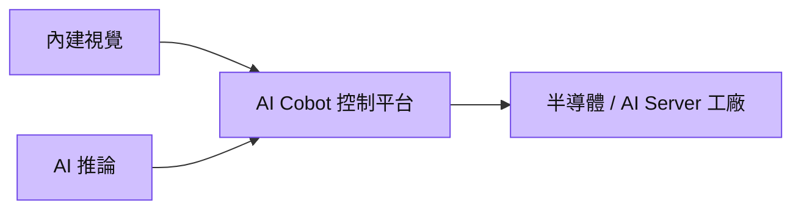

# 4585_達明（市）

## 基本資料
達明以內建視覺、AI 推論與控制平台的協作機器人為核心，服務半導體、AI Server 組裝及工業檢測場域。來源稱 1H26 營收 9.96 億元、年增 12%，並將短期重心放在可落地的 AI Cobot；人形機器人仍以訓練與客戶 POC 為主。來源：[[memo_國泰證期_達明CallMemo_20260908]]。

## 核心技術／競爭優勢
- 單一平台整合手臂、視覺與 AI，降低外掛系統的整合複雜度。
- 直接客戶與 Machine Builder 渠道提升，OMRON 通路於 1H26 約降至 18%。
- TM45S 單臂 50kg、雙臂最高 100kg，對應伺服器與半導體重載搬運 POC。

## 產品與應用
| 產品／服務 | 應用 | 下游 |
|---|---|---|
| AI Cobot | 半導體晶圓／晶圓盒搬運、伺服器組裝 | 系統整合與製造客戶 |
| 視覺檢測 | AI Server、車用與零組件檢驗 | 工業產線 |
| AMR 整合 | 物流與物料搬運 | 智慧工廠 |

## 圖片 / 架構圖

圖說：達明將感知、推論與手臂控制整合，優先導入既有工業場域。

## 時間軸（催化劑）
| 時間 | 事件 | 類型 | 重要性 | 備註 |
|---|---|---|---|---|
| 2026H2 | 中國半導體客戶建置計畫推進 | 驗證 | ⭐⭐ | 公司展望 |
| 後續 | 重載雙臂於 AI Server／半導體客戶 POC | 驗證 | ⭐⭐⭐ | 驗證不等於量產 |

## 供應鏈位置
- [[供應鏈_工業自動化]] 的協作機器人與視覺整合商；技術脈絡見 [[技術_人形機器人]]。

## 相關公司
| 公司 | 關係 | 說明 |
|---|---|---|
| — | — | 本次來源未具名揭露可連結的公司關係。 |

> [!warning] 風險與注意事項
> - 人形機器人仍為 POC，不能外推為短期營收。
> - 半導體客戶建廠、驗收及中國市場節奏均可能延後。

## 來源
- [[memo_國泰證期_達明CallMemo_20260908]] — 國泰證期研究部，2026-09-08
