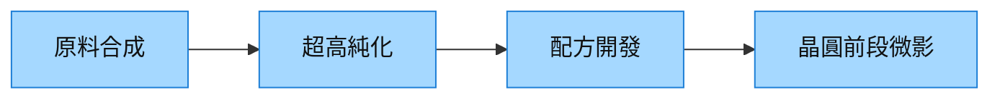

# 4749_新應材（櫃）

## 基本資料
新應材聚焦半導體特用化學材料，來源稱逾 95% 營收來自前段製程材料；從關鍵原料合成、純化到配方開發的垂直整合，是切入高階微影材料與在地化採購的基礎。資料來源：[[活動_富邦投顧_新應材SEMICON展會_20260902]]。

## 核心技術／競爭優勢
- 自製關鍵原料，串聯合成、純化與配方三個環節，降低只做配方的依賴。
- 研發資源集中於黃光微影前段材料；來源估該領域每月處理逾 150 萬片晶圓、涉及逾 80 層微影。
- 後段材料以策略合作延伸，避免在早期分散開發資源。

## 產品與應用
| 產品／服務 | 應用 | 下游 |
|---|---|---|
| 黃光微影製程材料 | 晶圓前段圖形化 | 晶圓製造客戶 |
| 特用化學材料 | 先進製程與封裝材料配方 | 半導體供應鏈 |

## 圖片 / 架構圖

圖說：來源所述競爭力在於從原料到配方的一體化，而非單一材料銷售。

## 時間軸（催化劑）
| 時間 | 事件 | 類型 | 重要性 | 備註 |
|---|---|---|---|---|
| 2026-09-02 | SEMICON 展示材料生態系策略 | 展覽 | ⭐⭐ | 來源觀點 |

## 供應鏈位置
- 位於 [[供應鏈_先進封裝載板]] 之外的半導體材料上游；本次來源主要揭露前段材料，未確認個別客戶與訂單。

## 相關公司
| 公司 | 關係 | 說明 |
|---|---|---|
| — | — | 本次來源未具名揭露可連結的公司關係。 |

> [!warning] 風險與注意事項
> - 高階材料驗證週期長，客戶導入不等於量產收入。
> - 來源的市場處理量為研究轉述，非公司營收指引。

## 來源
- [[活動_富邦投顧_新應材SEMICON展會_20260902]] — 富邦投顧，2026-09-02
