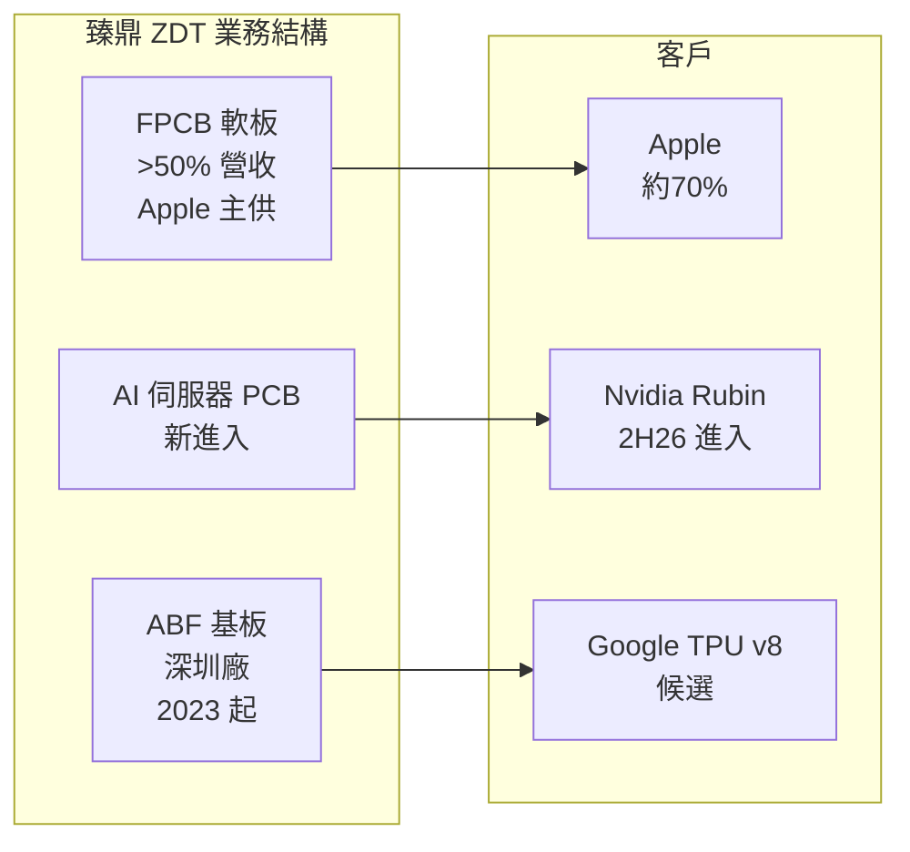

# 4958_臻鼎（市）

## 基本資料

臻鼎科技（Zhen Ding Technology，ZDT），全球 PCB 市占第一（7-10%），總部深圳，生產基地全部在中國（深圳、秦皇島、營口、淮安）。產品線橫跨 FPCB（軟板，50%+ 營收）、HDI、傳統 PCB 及 ABF 基板（2023 年起）。高消費電子曝險（Apple 約 70% 營收）是 Citi Sell 的核心論點；GS 則看好其 ABF 基板布局與 Rubin 進入時程。

主要資料來源：[[報告_Citi_PCB_CCL_20260422]]（Citi，2026-04-22）、[[報告_GS_台灣CCL_PCB_20260418]]（Goldman Sachs，2026-04-18）、[[報告_GS_CCL_PCB_20260320]]（Goldman Sachs，2026-03-20）。

## 核心技術／競爭優勢

- **全球 PCB 市占第一**：7-10% 市占，規模效益顯著
- **FPCB 技術龍頭**：Apple FPCB 長期主供，折疊機滲透率提升帶動 FPC TAM
- **ABF 基板新兵**：2023 年起於深圳建立 ABF 基板產能，GS 預估 2027E ABF 市占在中國達 40%+
- **Rubin Compute Tray 進入**：GS 預期 ZDT 從 2H26 開始供應 Rubin 計算板（10%+ 市占），是重要催化劑
- **Google TPU v8 ABF 基板候選**：GS 認為 ZDT 可能是 Google TPU v8（MediaTek 設計）的 ABF 基板主供（ZDT 為聯發科長期 BT 基板合作夥伴）

## 產品與應用

| 產品 / 服務 | 比重（2025E） | 應用 | 主要客戶 |
|-------------|-------------|------|---------|
| FPCB 軟板 | >50% | 智慧型手機、折疊機 | Apple（約 70%） |
| HDI | ~20% | 手機、消費電子 | Apple 等 |
| AI 伺服器 PCB | ~5%（2026E） | GPU/ASIC 計算板 | Nvidia（Rubin）、Google |
| ABF 基板 | 小額（2026E） | AI 晶片封裝 | Google TPU v8（候選） |
| BT 基板 | 小額 | 手機 AP | 聯發科（長期合作） |

## 圖片 / 架構圖

`[待補來源圖]` 需官方 IR FPCB 軟板或 AI 伺服器 PCB 產品實拍佐證；上方為自製業務結構示意圖。

## EPS 記錄

| 年度 | EPS (元) | YoY | 備註 |
|------|----------|-----|------|
| 2023A | NT\.52 | — | — |
| 2024A | NT\.04 | +100% | — |
| 2025E | NT\.68 | -15% | Citi 估；消費電子需求偏弱 |
| 1Q26E（Citi） | NT\.89 | +35% YoY | 季節性低點；4Q25 實績 NT\.82 |

## EPS 預估

| 年度 | Citi（2026-04-22） | GS 3/20（2026-03-20） | GS 4/18（2026-04-18） | 備註 |
|------|------------------|----------------------|----------------------|------|
| 2026E | NT\.97 | NT\.34 | NT\.45 | GS 因 ABF/PCB 漲價上修；Citi 下修（CCL 缺料風險） |
| 2027E | NT\.80 | NT\.61 | NT\.04 | 差異極大：GS 假設 ABF 基板貢獻大幅成長 |
| 2028E | NT\.98 | NT\.56 | NT\.25 | — |

> [!warning] 臻鼎評等重大衝突：Citi Sell vs GS Buy
>
> **Citi（2026-04-22）Sell，TP NT\**
> - 核心論點：消費電子曝險 80-90%（Apple）、激進資本支出（NT\/500/500 億 for 2026/27/28）、CCL 缺料風險（Tier 2 PCB 廠優先順位低）
> - ZDT ABF 基板佔比約 4-5%，不足以抵銷消費電子下行壓力
> - 高折舊負擔（2026E 折舊 NT\ 億）壓縮毛利率
> - TP NT\ = 13x 2027E EPS NT\.80
>
> **GS（2026-04-18）Buy，TP NT\**
> - 核心論點：ABF 基板上升週期；ZDT 將從 2H26 進入 Rubin 計算板供應鏈（10%+ 市占）；Google TPU v8 ABF 基板高度可能
> - 中國 ABF 基板市場 CAGR 53%（2025-27E），ZDT 市占 2024 31%→2027E 40%+
> - ABF 基板 GM/OPM 可達 50-60%/35-45%（上行週期），貢獻 2027E OPI 15-20%
> - TP NT\ = SOTP（ABF+BT 基板 2.6x P/B + AI PCB 20x P/E + 消費電子 PCB 8x P/E）
>
> **分歧根源**：對 ZDT ABF 基板規模與 Rubin 進入時程的假設差異極大。GS 2027E EPS NT\.04 是 Citi NT\.80 的 2.2 倍。

## 目標價與評等

| 券商 | 報告日 | 評等 | 目標價 | 評價基礎 | 來源 |
|------|--------|------|--------|----------|------|
| Citi | 2026-04-22 | **Sell** | NT\ | 13x 2027E EPS NT\.80（DCF based） | [[報告_Citi_PCB_CCL_20260422]] |
| Goldman Sachs | 2026-03-20 | **Buy** | NT\ | SOTP：ABF 2.6x P/B + AI PCB 20x P/E + 消費 8x P/E | [[報告_GS_CCL_PCB_20260320]] |
| Goldman Sachs | 2026-04-18 | **Buy** | NT\ | SOTP（同上，滾動期間調整+EPS 上修） | [[報告_GS_台灣CCL_PCB_20260418]] |

## 時間軸

| 時間 | 事件 | 類型 | 重要性 | 備註 |
|------|------|------|--------|------|
| 2026-03-20 | GS 上調 TP NT\→NT\ | 評等調整 | ⭐⭐ | ABF 基板利用率改善 |
| 2026-04-18 | GS 再上調 TP NT\→NT\，+30% | 大幅上調 | ⭐⭐⭐ | Rubin 計算板進入、TPU v8 候選 |
| 2026-04-22 | Citi 維持 Sell，上調 TP NT\→NT\ | 維持賣出 | ⭐⭐⭐ | 消費電子曝險+激進資本支出論點 |
| 2026-H2 | Rubin 計算板進入供應鏈（GS 預期） | 需求 | ⭐⭐⭐ | 若成真為重大 upside 催化劑 |
| 2026-H2 | ABF 基板深圳廠滿載（GS 預期） | 產能 | ⭐⭐⭐ | 首個 US 高端 ABF 基板訂單（Google TPU） |
| 2027 | ABF 基板貢獻 OPI 15-20%（GS 預期） | 獲利 | ⭐⭐⭐ | 是否實現決定 ZDT 評等走向 |

## 供應鏈位置

- **上游 CCL**：台光電（M8）、Doosan、生益科技（ZDT 為 Tier 2 PCB，CCL 優先順位低於 GCE 等 Tier 1——Citi 的 Sell 關鍵論點之一）
- **ABF 上游**：Ajinomoto ABF 膜；ZDT 深圳廠 ABF 基板，中國市場為主
- **下游客戶（PCB）**：Nvidia（Rubin，2H26 進入）、Google（TPU）、Apple（消費電子）
- **下游客戶（ABF 基板）**：Google TPU v8（候選）、中國 ASIC 廠
- **所屬供應鏈**：[[供應鏈_AI伺服器PCB]]、[[供應鏈_先進封裝載板]]

## 相關公司

| 公司 | 關係 | 說明 |
|------|------|------|
| [[2368_金像電（市）]] | 同業/競爭 | AI PCB Tier 1，Citi/GS 均 Buy；ZDT 在 AI PCB 仍是 Tier 2 |
| [[3044_健鼎（市）]]（未建頁） | 同業/競爭 | CPU/Memory PCB，Citi Buy |
| [[2383_台光電（市）]] | 上游 CCL | M8 CCL 供應商（ZDT 優先順位低於 Tier 1 PCB 廠） |
| [[NVDA.US(nvidia)]] | 潛在客戶 | Rubin 計算板，GS 預期 2H26 進入 |

## 來源

- [[報告_Citi_PCB_CCL_20260422]]（Citi，2026-04-22；Sell 論點、高消費曝險、激進資本支出）
- [[報告_GS_台灣CCL_PCB_20260418]]（Goldman Sachs，2026-04-18；Buy 論點、ABF 基板上行週期、Rubin 進入）
- [[報告_GS_CCL_PCB_20260320]]（Goldman Sachs，2026-03-20；ZDT ABF 基板 TPU v8 分析）

## 相關頁面

- [[技術_PCB]]
- [[技術_正交背板]]
