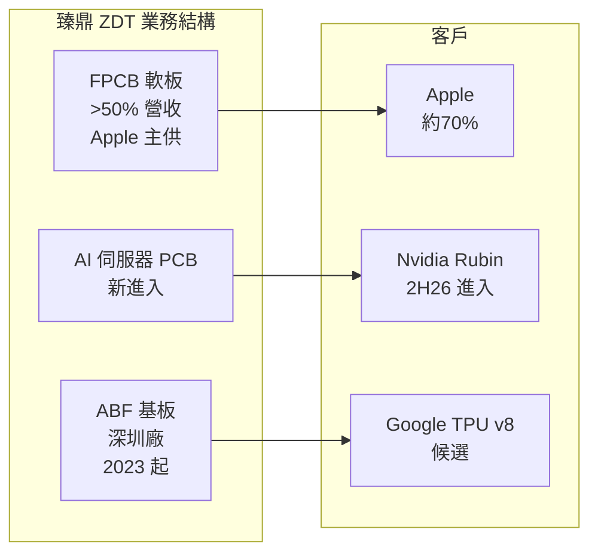

# 4958_臻鼎（市）

## 基本資料

臻鼎科技（Zhen Ding Technology，ZDT），全球 PCB 市占第一（7-10%），總部深圳，生產基地全部在中國（深圳、秦皇島、營口、淮安）。產品線橫跨 FPCB（軟板，50%+ 營收）、HDI、傳統 PCB 及 ABF 基板（2023 年起）。高消費電子曝險（Apple 約 70% 營收）是 Citi Sell 的核心論點；GS 則看好其 ABF 基板布局與 Rubin 進入時程。

主要資料來源：[[報告_Citi_PCB_CCL_20260422]]（Citi，2026-04-22）、[[報告_GS_台灣CCL_PCB_20260418]]（Goldman Sachs，2026-04-18）、[[報告_GS_CCL_PCB_20260320]]（Goldman Sachs，2026-03-20）。

## 核心技術／競爭優勢

- **全球 PCB 市占第一**：7-10% 市占，規模效益顯著
- **FPCB 技術龍頭**：Apple FPCB 長期主供，折疊機滲透率提升帶動 FPC TAM
- **ABF 基板新兵**：2023 年起於深圳建立 ABF 基板產能，GS 預估 2027E ABF 市占在中國達 40%+
- **Rubin Compute Tray 進入**：GS 預期 ZDT 從 2H26 開始供應 Rubin 計算板（10%+ 市占），是重要催化劑
- **Google TPU v8 ABF 基板候選**：GS 認為 ZDT 可能是 Google TPU v8（MediaTek 設計）的 ABF 基板主供（ZDT 為聯發科長期 BT 基板合作夥伴）

## 產品與應用

| 產品 / 服務 | 比重（2025E） | 應用 | 主要客戶 |
|-------------|-------------|------|---------|
| FPCB 軟板 | >50% | 智慧型手機、折疊機 | Apple（約 70%） |
| HDI | ~20% | 手機、消費電子 | Apple 等 |
| AI 伺服器 PCB | ~5%（2026E） | GPU/ASIC 計算板 | Nvidia（Rubin）、Google |
| ABF 基板 | 小額（2026E） | AI 晶片封裝 | Google TPU v8（候選） |
| BT 基板 | 小額 | 手機 AP | 聯發科（長期合作） |

## 圖片 / 架構圖

![[報告_國泰_臻鼎_20260924_營收與毛利.png]]
圖說：國泰 2026-09-24 的月營收與季度 EPS／毛利率圖，展示 8 月營收增長與 2026Q2 獲利改善；左圖橫軸實為月份。

```mermaid
flowchart LR
    subgraph 臻鼎 ZDT 業務結構
        FPCB[FPCB 軟板\n>50% 營收\nApple 主供]
        PCB[AI 伺服器 PCB\n新進入]
        ABF[ABF 基板\n深圳廠\n2023 起]
    end
    subgraph 客戶
        APPLE[Apple\n約70%]
        NV[Nvidia Rubin\n2H26 進入]
        GG[Google TPU v8\n候選]
    end
    FPCB --> APPLE
    PCB --> NV
    ABF --> GG
```

來源圖為營運趨勢，自製圖為業務結構示意；產品與產能實拍仍待後續來源補強。

## EPS 記錄

| 年度 | EPS (元) | YoY | 備註 |
|------|----------|-----|------|
| 2023A | NT$（原始數值待核對）.52 | — | — |
| 2024A | NT$（原始數值待核對）.04 | +100% | — |
| 2025E | NT$（原始數值待核對）.68 | -15% | Citi 估；消費電子需求偏弱 |
| 1Q26E（Citi） | NT$（原始數值待核對）.89 | +35% YoY | 季節性低點；4Q25 實績 NT$（原始數值待核對）.82 |

## EPS 預估

### 國泰兩份來源並列

| 年度 | 國泰 EPS（報告日：2026-09-22） | 國泰單頁 EPS（報告日：2026-09-24） |
|---|---:|---:|
| 2026E | 14.05 | 13.81 |
| 2027E | 23.63 | 26.16 |

> [!warning] 預估口徑並存
> [[報告_國泰_臻鼎KY_20260922]] 與 [[報告_國泰_臻鼎_20260924]] 的 EPS 不同；後者沒有完整財測模型、目標價或評等，未據此撤換前者 NT$600 目標價。兩者均為 estimate／中信心。

| 年度 | Citi（2026-04-22） | GS 3/20（2026-03-20） | GS 4/18（2026-04-18） | 備註 |
|------|------------------|----------------------|----------------------|------|
| 2026E | NT$（原始數值待核對）.97 | NT$（原始數值待核對）.34 | NT$（原始數值待核對）.45 | GS 因 ABF/PCB 漲價上修；Citi 下修（CCL 缺料風險） |
| 2027E | NT$（原始數值待核對）.80 | NT$（原始數值待核對）.61 | NT$（原始數值待核對）.04 | 差異極大：GS 假設 ABF 基板貢獻大幅成長 |
| 2028E | NT$（原始數值待核對）.98 | NT$（原始數值待核對）.56 | NT$（原始數值待核對）.25 | — |

> [!warning] 臻鼎評等重大衝突：Citi Sell vs GS Buy
>
> **Citi（2026-04-22）Sell，TP NT$（原始數值待核對）**
> - 核心論點：消費電子曝險 80-90%（Apple）、激進資本支出（NT$（原始數值待核對）/500/500 億 for 2026/27/28）、CCL 缺料風險（Tier 2 PCB 廠優先順位低）
> - ZDT ABF 基板佔比約 4-5%，不足以抵銷消費電子下行壓力
> - 高折舊負擔（2026E 折舊 NT$（原始數值待核對） 億）壓縮毛利率
> - TP NT$（原始數值待核對） = 13x 2027E EPS NT$（原始數值待核對）.80
>
> **GS（2026-04-18）Buy，TP NT$（原始數值待核對）**
> - 核心論點：ABF 基板上升週期；ZDT 將從 2H26 進入 Rubin 計算板供應鏈（10%+ 市占）；Google TPU v8 ABF 基板高度可能
> - 中國 ABF 基板市場 CAGR 53%（2025-27E），ZDT 市占 2024 31%→2027E 40%+
> - ABF 基板 GM/OPM 可達 50-60%/35-45%（上行週期），貢獻 2027E OPI 15-20%
> - TP NT$（原始數值待核對） = SOTP（ABF+BT 基板 2.6x P/B + AI PCB 20x P/E + 消費電子 PCB 8x P/E）
>
> **分歧根源**：對 ZDT ABF 基板規模與 Rubin 進入時程的假設差異極大。GS 2027E EPS NT$（原始數值待核對）.04 是 Citi NT$（原始數值待核對）.80 的 2.2 倍。

## 目標價與評等

| 券商 | 報告日 | 評等 | 目標價 | 評價基礎 | 來源 |
|------|--------|------|--------|----------|------|
| Citi | 2026-04-22 | **Sell** | NT$（原始數值待核對） | 13x 2027E EPS NT$（原始數值待核對）.80（DCF based） | [[報告_Citi_PCB_CCL_20260422]] |
| Goldman Sachs | 2026-03-20 | **Buy** | NT$（原始數值待核對） | SOTP：ABF 2.6x P/B + AI PCB 20x P/E + 消費 8x P/E | [[報告_GS_CCL_PCB_20260320]] |
| Goldman Sachs | 2026-04-18 | **Buy** | NT$（原始數值待核對） | SOTP（同上，滾動期間調整+EPS 上修） | [[報告_GS_台灣CCL_PCB_20260418]] |
| Nomura | 2026-06-30 | **Buy**（維持） | NT$720（舊 NT$510） | 新興 AI PCB/HDI 廠；Nvidia/Google/AWS 滲透加速 2H26F | [[報告_Nomura_亞洲AI半導體_20260630]] |
| 國泰證期 | 2026-09-22 | **買進**（維持） | NT$600（原 NT$750） | 25x 修正後 2027E EPS 23.63（前次 30x） | [[報告_國泰_臻鼎KY_20260922]] |

## 時間軸

| 時間 | 事件 | 類型 | 重要性 | 備註 |
|---|---|---|---|---|
| 2026H2 起（依報告） | 深圳 AI 先進封裝載板基地建設，投資不低於人民幣 120 億元 | 擴產／驗證 | ⭐⭐⭐ | FCBGA／高階 IC 載板，未揭露投產日；國泰 2026-09-24 轉述／中信心；[[時程_2026Q3Q4_AI網通與硬體催化劑]] |
| 2026H2（觀察） | 1.6T 需求提升、3.2T 產品開發與打樣 | 規格升級／驗證 | ⭐⭐⭐ | 打樣不等於量產訂單；國泰轉述，信心中 |

| 時間 | 事件 | 類型 | 重要性 | 備註 |
|------|------|------|--------|------|
| 2026-03-20 | GS 上調 TP NT$（原始數值待核對）→NT$（原始數值待核對） | 評等調整 | ⭐⭐ | ABF 基板利用率改善 |
| 2026-04-18 | GS 再上調 TP NT$（原始數值待核對）→NT$（原始數值待核對），+30% | 大幅上調 | ⭐⭐⭐ | Rubin 計算板進入、TPU v8 候選 |
| 2026-04-22 | Citi 維持 Sell，上調 TP NT$（原始數值待核對）→NT$（原始數值待核對） | 維持賣出 | ⭐⭐⭐ | 消費電子曝險+激進資本支出論點 |
| 2026-H2 | Rubin 計算板進入供應鏈（GS 預期） | 需求 | ⭐⭐⭐ | 若成真為重大 upside 催化劑 |
| 2026-H2 | ABF 基板深圳廠滿載（GS 預期） | 產能 | ⭐⭐⭐ | 首個 US 高端 ABF 基板訂單（Google TPU） |
| 2027 | ABF 基板貢獻 OPI 15-20%（GS 預期） | 獲利 | ⭐⭐⭐ | 是否實現決定 ZDT 評等走向 |
| 2026Q3 | 3Q26 營運估創歷史新高（國泰）：AI 伺服器新客戶小量試產 + 800G/1.6T 光模塊放量 | 放量 | ⭐⭐⭐ | 國泰估 3Q26 EPS 4.86、營收 679.38 億（+40.3% QoQ） |
| 2026 | ABF 稼動率升至 80%+、ABF 占載板比重估超越 BT | 產能 | ⭐⭐ | 國泰 estimate；原物料漲價轉嫁 |
| 2026–2027 | 資本支出規劃達 800 億，投入 AI 應用 PCB 產能 | 擴產 | ⭐⭐⭐ | 開啟 4–5 年高速成長周期；2H26 前期投入壓抑短期獲利 |

## 供應鏈位置

- **上游 CCL**：台光電（M8）、Doosan、生益科技（ZDT 為 Tier 2 PCB，CCL 優先順位低於 GCE 等 Tier 1——Citi 的 Sell 關鍵論點之一）
- **ABF 上游**：Ajinomoto ABF 膜；ZDT 深圳廠 ABF 基板，中國市場為主
- **下游客戶（PCB）**：Nvidia（Rubin，2H26 進入）、Google（TPU）、Apple（消費電子）
- **下游客戶（ABF 基板）**：Google TPU v8（候選）、中國 ASIC 廠
- **所屬供應鏈**：[[供應鏈_AI伺服器PCB]]、[[供應鏈_先進封裝載板]]

## 相關公司

| 公司 | 關係 | 說明 |
|------|------|------|
| [[2368_金像電（市）]] | 同業/競爭 | AI PCB Tier 1，Citi/GS 均 Buy；ZDT 在 AI PCB 仍是 Tier 2 |
| [[3044_健鼎（市）]]（未建頁） | 同業/競爭 | CPU/Memory PCB，Citi Buy |
| [[2383_台光電（市）]] | 上游 CCL | M8 CCL 供應商（ZDT 優先順位低於 Tier 1 PCB 廠） |
| [[NVDA.US(nvidia)]] | 潛在客戶 | Rubin 計算板，GS 預期 2H26 進入 |

## 近期營運與研究更新

### 2026-09-24 國泰：高階載板與光模組板

報告轉述 2Q26 營收 484.31 億、毛利率 23.1%、歸母淨利 23.92 億、EPS 2.19，與 9 月 22 日來源一致；上半年伺服器／光模組／IC 載板營收年增 113%，8 月營收 206.66 億、年增 41.1%。深圳新基地投資不低於人民幣 120 億，聚焦 FCBGA 與高階載板；1.6T 需求與 3.2T 打樣為規格升級觀察。歷史數字為 fact 的券商轉述／中信心，擴產與未來貢獻為展望，未揭露新增客戶名單。

### 2026-09-15 UBS 台灣高峰會更新

- 光學／伺服器／IC 載板占比由 2025 年約 12% 持續提高，UBS 估 2026 年約 20% 以上、2030 年約 45%–50%；光學模組今年出貨逾 1 億、明年可能倍增，均屬券商 estimate。
- AI 伺服器板最高可達 28 層，材料由 M6 轉向 M8／M9、PKP／PTFE，並可能需要 2–3 次電鍍；泰國 K01 預計 1Q27 認證／量產，2026 年資本支出約 NT$800 億。

來源：[[報告_UBS_台灣高峰會Day1科技硬體_20260915]]（UBS，2026-09-15）。

### 2026-09-22 國泰：小遇逆風，行穩致臻

- 國泰維持買進、目標價由 NT$750 下調至 NT$600（25x 修正後 2027E EPS，本益比由 30x 降至近三年均值 25x），因 2H26 大規模擴產前期投入資金成本較高，短期獲利成長幅度受限。
- **2Q26 實績**：營收 484.31 億元（+18.9% QoQ）、毛利率 23.1%（優於原估 22.4%）、稅後淨利 23.92 億元（+67.8% QoQ）、EPS 2.19 元，同期新高；BT 稼動率維持 90%+、ABF 前季轉盈後升至 80%+。
- **展望（國泰 estimate）**：3Q26 EPS 4.86、營收 679.38 億元（+40.3% QoQ），受惠 AI 伺服器新客戶小量試產與 800G/1.6T 光模塊放量；2026/2027E EPS 14.05／23.63 元（+128.2%／+69.1% YoY），26/27 年載板 + 伺服器/光通訊兩大高階業務占比將突破 3 成。
- 資本支出規劃達 800 億元，主要投入 AI 應用 PCB 產能，開啟未來 4–5 年高速成長周期。來源：[[報告_國泰_臻鼎KY_20260922]]（國泰證期，2026-09-22；信心中）。

## 2026-08-28 TPU 載板渠道補充

興森匿名訪談將臻鼎／ZDT 列在 Google TPU v8 載板供應名單，屬 rumor／中低信心；延續候選／渠道觀察，不升級為正式認證或已取得訂單。原文對 ZDT 與鵬鼎隸屬有混用，不據此更新股權或公司關係。

來源：[[memo_AceCamp_興森ABF與BT載板_20260828_70566407]]（2026-08-28）；訂單階段與反證見 [[分析_20260828-29專家紀要公司辨識與供給瓶頸]]。

## 來源

- [[報告_國泰_臻鼎_20260924]] — 國泰證期研究部，2026-09-24；營運、EPS 與載板建廠轉述。

- [[memo_AceCamp_興森ABF與BT載板_20260828_70566407]] — AceCamp Tech，2026-08-28，匿名專家紀要。

- [[報告_Citi_PCB_CCL_20260422]]（Citi，2026-04-22；Sell 論點、高消費曝險、激進資本支出）
- [[報告_GS_台灣CCL_PCB_20260418]]（Goldman Sachs，2026-04-18；Buy 論點、ABF 基板上行週期、Rubin 進入）
- [[報告_GS_CCL_PCB_20260320]]（Goldman Sachs，2026-03-20；ZDT ABF 基板 TPU v8 分析）

- [[1307387]]（2026-06-30）
- [[260812_gs_ZDT]]（2026-08-12）
- [[凱基-電子硬體產業-20260616]]（2026-06-16）
- [[報告_Nomura_亞洲AI半導體_20260630]]（2026-06-30）
- [[報告_UBS_台灣高峰會Day1科技硬體_20260915]]（2026-09-15）
- [[報告_呂紹旭_玻璃載板FOPLP_20260508]]（2026-05-08）
- [[報告_富邦_AIPCB鑽孔瓶頸_20260701]]（2026-07-01）
- [[報告_國泰_臻鼎KY_20260922]]（國泰證期，2026-09-22；2Q26 實績、3Q26/2026/2027 展望、目標價下調至 600）
- [[報告_福邦_2026Q4_PCB產業_20260921]]（福邦投顧，2026-09-21；PCB 產業首選關注個股之一，ABF 載板供不應求）

## 相關頁面

- [[8021_尖點（市）]]
- [[時程_2026Q3Q4_AI網通與硬體催化劑]]
- [[技術_PCB]]
- [[技術_正交背板]]
- [[技術_mSAP]]（2026-09-30 匿名 PCB 訪談把鵬鼎列為同時具 mSAP 與 SAP 能力、可受惠 CPO 轉向 ABF 載板的廠商；渠道觀點，低信心）

### 2026-08-23 AI PCB 更新

- [[260812_gs_ZDT]]：AI HDI／多層 PCB 由 2H26 起放量，主流 AI PCB 層數約 20–30 層，新案可能提升至 30–50／70–80 層；泰國與淮安廠良率屬公司揭露，仍需持續驗證。
- Goldman Sachs 目標價 NT$925，長期擴產延伸至 2030 年；量產與市占屬 estimate，不視為已確認訂單。
