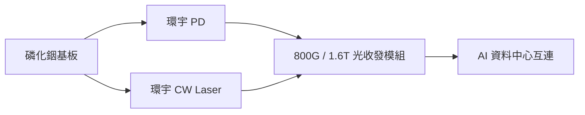

# 4991_環宇-KY（櫃）

## 基本資料

環宇是光通訊與射頻元件廠，產品涵蓋 AOC、PD、CW Laser 與 RF 元件。中信 2026-08-06 報告指出，2Q26 受磷化銦基板供應限制影響，產品組合轉向較低毛利 RF；基板供應逐步恢復後，200G PD 已小量量產，100G PD 訂單可望回補。

## 產品與應用

| 產品 | 應用 | 進度 |
|---|---|---|
| 200G / 100G PD | 800G / 1.6T 光收發模組 | 200G 已小量量產；100G 恢復出貨 |
| 70mW / 100mW CW Laser | 光模組與 AI 資料中心 | 70mW 小量量產；100mW 可靠度驗證 |
| RF 元件 | 射頻與通訊設備 | 基板受限時支撐營收，但毛利較低 |

## 供應鏈位置

- 上游：磷化銦基板，既有中國來源與非中系供應商並行。
- 下游：美系光收發模組與資料中心互連需求；特定客戶與禁令受惠仍屬券商情境，未寫為確定訂單。

## 圖片 / 架構圖

## 時間軸

| 日期 | 事件 | 類型 | 重要性 | 備註 |
|---|---|---|---|---|
| 2026Q2 | 200G PD 小量量產出貨 | 放量 | ⭐⭐⭐ | 中信 2026-08-06，來源報告 |
| 2026Q4 | 非中系磷化銦基板較大產能開出 | 供應 | ⭐⭐⭐ | 公司／券商展望，需驗證 |
| 2026Q4–2027Q1 | 100mW CW Laser 可靠度驗證與進展 | 驗證 | ⭐⭐⭐ | 量產時程尚未確定 |

### 風險補充

- 磷化銦基板供應或出口管制再度收緊。
- CW Laser 驗證延遲，或光模組客戶需求低於估計。

## 來源

- [[環宇(4991,B_買進)-CTBC260806]]（中信投顧，2026-08-06）

## 相關頁面

- [[時程_2026記憶體與AI催化劑]]
