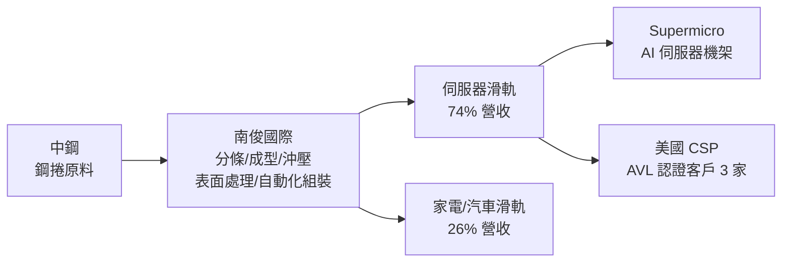

# 5163_南俊國際（市）

## 基本資料

南俊國際為台灣上市伺服器滑軌（Server Rail / Slide Rail）專業製造商，成立超過 20 年，股票代號 5163。核心業務為伺服器機架滑軌的設計與生產，並延伸至家電滑軌、汽車後車廂滑軌及政府相關採購。在 AI 伺服器快速成長的驅動下，伺服器滑軌已成為主力，2026Q1 占比達 74%，超越年度目標 60–70%。

主要客戶包括 Supermicro、Fisher & Paykel、Whirlpool、Panasonic，以及多家美國 CSP。2026 年取得第三家美國 CSP 的 AVL（Approved Vendor List）資格，客戶持續擴大。上游原料主要為中鋼（鋼捲），自行進行分條、成型、沖壓、表面處理與自動化組裝，形成垂直整合生產模式。

資料來源：[[活動_南俊國際法說_20260603]]（2026-06-03 法說）

## 核心技術／競爭優勢

- **高密度專利組合**：每年新增 80–90 件伺服器相關專利，加速 NPI（新產品導入），縮短客戶認證週期，形成技術護城河
- **快速 NPI 能力**：設計→打樣→測試→客戶認證→開模→量產一條龍，能因應 AI 伺服器每 3–4 年一代的生命週期快速換代
- **自動化組裝**：持續投入自動化生產線，顯著提升毛利率，費用率降至約 12%（2026Q1）
- **單一供應來源地位**：部分產線為客戶單一供應商，客戶產能需求超過公司產能時直接要求增設產線，具高客戶黏著性
- **多廠靈活供應**：台灣（JIT 客戶如 Supermicro/Panasonic，前段雲林、組裝桃園）+ 越南廠（地緣政治去風險）

## 產品與應用

| 產品 / 服務 | 應用 | 相關客戶 / 下游 |
|-------------|------|-----------------|
| 伺服器滑軌（Server Rail） | AI 伺服器機架滑動組件 | [[SMCI.US(supermicro)]]、美國 CSP（3 家）|
| 一般伺服器滑軌 | 1U/2U 標準伺服器 | Supermicro、Panasonic |
| 家電滑軌 | 冰箱、洗碗機、廚具 | Fisher & Paykel、Whirlpool |
| 汽車後車廂滑軌 | SUV、卡車、消防車 | 北美市場（顯著市佔率）|
| 美國廚櫃 OEM 專線（2026Q4） | 美國廚具大廠代工 | 越南廠（規劃中）|

## 圖片 / 架構圖

> 自製 供應鏈示意圖；來源：[[活動_南俊國際法說_20260603]]

## EPS 記錄

| 季度 | EPS（NT$） | 備註 |
|------|------------|------|
| 2026Q1 | **3.37** | 毛利率持續上升；費用率 ~12%；YoY 大幅提升 |

> 轉換後股本：NT$7.06 億元（截至 2026-03-31）

## 時間軸

| 時間 | 事件 | 類型 | 重要性 | 備註 |
|------|------|------|--------|------|
| 2025-03 | 越南廠開始出貨 | 產能 | ⭐⭐⭐ | 因應 NCNT 政策地緣政治分散 |
| 2026Q1 | 取得第三家美國 CSP AVL 資格 | 客戶 | ⭐⭐⭐ | 伺服器滑軌客戶擴大 |
| 2026Q4 | 越南廠設立美國廚櫃大廠 OEM 專線 | 產能 | ⭐⭐ | 拓展非伺服器家電線 |
| 2026Q3 | 越南自有廠房動工 | 產能 | ⭐⭐⭐ | |
| 2027Q4 | 越南自有廠房完工 | 產能 | ⭐⭐⭐ | 提升供應鏈彈性 |

## 供應鏈位置

- 上游原料：中鋼（鋼捲，主要供應商）
- 下游客戶：[[SMCI.US(supermicro)]]（AI 伺服器）、Fisher & Paykel（家電）、Whirlpool（家電）、Panasonic（家電/伺服器）、美國 CSP（3 家）
- 競爭同業：進入 AI 伺服器市場之同業毛利率明顯提升

## 相關公司

| 公司 | 關係 | 說明 |
|------|------|------|
| [[SMCI.US(supermicro)]] | 主要客戶 | 伺服器滑軌供應，JIT 每日交貨 |

> [!warning] 風險與注意事項
> - **客戶集中**：Supermicro 及少數美國 CSP 為主要客戶；若 Supermicro 訂單波動，影響顯著
> - **原物料波動**：鋼材（中鋼）為主要成本，鋼價上漲直接壓縮毛利率
> - **匯率 / 關稅**：產品主銷美國，強台幣及美國關稅政策（NCNT 趨勢）影響競爭力，越南廠雖可緩解但建廠需時
> - **一般伺服器 Q2 供應鏈延遲**：2026Q2 一般伺服器供應鏈有延遲，可能影響短期出貨

## 來源

- [[活動_南俊國際法說_20260603]]（2026-06-03，南俊國際法說；財務長 任忠仁主講）
