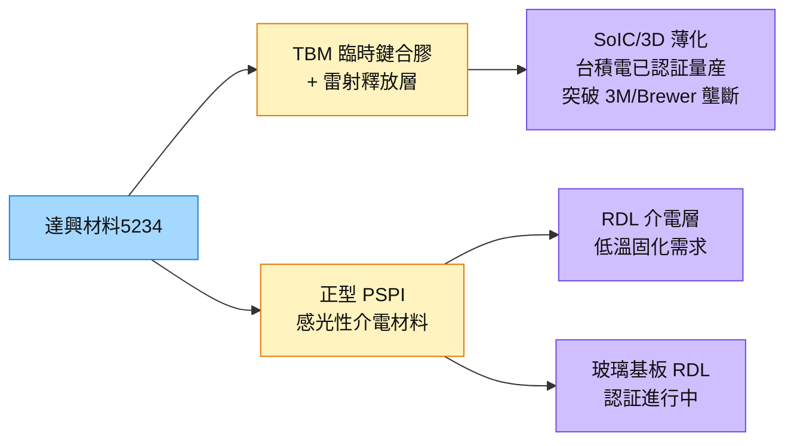

# 5234_達興材料（市）

## 基本資料

達興材料（5234 TT）是台灣電子化學材料廠，核心產品為：
- **正型 PSPI（感光性聚醯亞胺）：** RDL 製程的感光性介電材料
- **TBM 臨時鍵合膠（Temporary Bonding Material）＋雷射釋放層：** SoIC/3D 薄化製程的 TBDB 材料

達興最重要的突破是 **TBM 膠已通過晶圓代工龍頭（即台積電）認證並量産放量**，打破了 3M 和 Brewer Science 的長期壟斷。此認證代表達興進入最高規格的先進封裝供應鏈，並已開始實際出貨。

資料來源：[[報告_先進封裝技術發展方向_20260722]]（定錨產業筆記，2026-07-22）

2026H1 半導體材料營收年增 56%、占比升至 21%；公司目標 2026 全年占比 25–26%，並以晶圓製程材料與先進封裝材料各約一半的組合推進成長。2Q26 營收 12.8 億元、EPS 2.23 元，毛利率 42.9%；半導體高毛利產品占比提升是結構性驅動，原物料與匯率則造成短期波動。資料來源：[[活動_達興材料法說_20260814]]（2026-08-14）。

## 核心技術／競爭優勢

- **TBM 膠突破壟斷：** 達成晶圓代工龍頭認證量産，打破 3M / Brewer Science 雙寡頭格局——台廠進入最高等級先進封裝供應鏈的里程碑。
- **正型 PSPI：** 在感光性 PI 材料中走「正型」路線差異化，適用於低溫固化場景（chip-first 熱預算 ≤230°C 驅動低溫化材料需求）。
- **雷射釋放層技術：** TBM 膠搭配雷射釋放製程，可精確脫除臨時晶圓，不損傷薄化後的產品晶圓（50µm 以下）。
- **驗證管線擴大：** 2026H2 有 5 項較大產品開始客戶線上驗證，合計 14 項材料驗證中；公司估其中 3–4 項可於 2H26–1H27 通過並量產。
- **在地化與共同開發：** 由本地代工延伸至材料研發、製程設計與終端應用共同開發，並已供應美國 4nm 晶圓廠微影相關材料。

## 產品與應用

| 產品 / 服務 | 應用 | 相關客戶 / 下游 |
|-------------|------|-----------------|
| TBM 臨時鍵合膠＋雷射釋放層 | SoIC/3D 堆疊薄化 TBDB 製程 | [[2330_台積電（市）]]（認證量産）|
| 正型 PSPI | RDL 介電材料、低溫固化場景 | 先進封裝廠通用 |
| PSPI（玻璃基板應用）| 玻璃基板 RDL 介電層 | 玻璃基板廠（認証進度追蹤中）|
| 鐳射離型層（RL） | 玻璃承載板暫時接著／解黏，延伸 CoWoS-S、FOPLP | [[2330_台積電（市）]]等先進封裝客戶 |
| 光阻剝離劑（Stripper） | 晶圓微影製程的間接化學品 | 晶圓製造客戶 |
| 感光介電絕緣材料 | 永久介電層 | 2 家客戶已小量出貨（未具名） |

## 圖片 / 架構圖

圖說：達興最重要護城河是 TBM 膠通過台積電認証量産（打破 3M/Brewer 壟斷），PSPI 是第二條成長線。

## EPS 記錄

| 季度／期間 | EPS（元） | YoY | 備註 |
|------------|----------|-----|------|
| 2026Q2 | 2.23 | — | 營收 12.8 億元、毛利率 42.9%、淨利 2.28 億元 |
| 2026H1 | 4.44 | — | 營收 24.8 億元、毛利率 43.0%、淨利 4.5 億元 |

## 時間軸

| 時間 | 事件 | 類型 | 重要性 | 備註 |
|------|------|------|--------|------|
| 2026 前 | TBM 膠通過台積電認證 | 里程碑 | ⭐⭐⭐ | 突破 3M/Brewer 雙寡占 |
| 2026 起 | TBM 膠量産放量 | 放量 | ⭐⭐⭐ | SoIC HBM4 16-hi 薄化次數爆發放量 |
| 2026+ | 玻璃基板 PSPI 認証 | 催化劑 | ⭐⭐ | Glass Core 認証進度為觀察點 |
| 2026H2 | 5 項大型半導體材料進入客戶線上驗證 | 驗證 | ⭐⭐⭐ | 合計 14 項材料驗證中 |
| 2026H2–2027H1 | 3–4 項新材料預計陸續量產 | 放量 | ⭐⭐⭐ | 涵蓋先進／成熟製程與封裝材料；公司估計 |
| 2027Q1 | 高雄橋頭新廠動工 | 擴產 | ⭐⭐ | 土地與基建投資 22 億元，不含後續設備 |
| 2029 | 高雄橋頭新廠落成並開始營收貢獻 | 放量 | ⭐⭐⭐ | 半導體與關鍵原材料產能 |

→ 跨公司比較詳見 [[時程_2026記憶體與AI催化劑]]。

## 供應鏈位置

- 材料供應：[[2330_台積電（市）]] SoIC/CoWoS 薄化製程（TBM 膠）
- 同業比較：[[1717_長興（市）]] 在 PSPI 重疊（路線不同）；[[3595_山太士（市）]] 在減黏膜段互補
- 所屬研究鏈：[[供應鏈_先進封裝載板]]；相關製程見 [[技術_CoWoS與先進封裝]]。

## 相關公司

| 公司 | 關係 | 說明 |
|------|------|------|
| [[2330_台積電（市）]] | 客戶 | TBM 膠認証量産，先進封裝 SoIC/3D 薄化製程 |
| [[1717_長興（市）]] | 同業（PSPI 路線競爭）| 長興正型 PSPI vs 達興正型 PSPI；市場重疊 |
| [[3595_山太士（市）]] | 材料互補 | 減黏膜/TBDB 相鄰製程段 |

> [!warning] 風險與注意事項
> - **HBM4 薄化次數是雙面刃：** HBM4 16-hi 每層需一輪 TBDB，TBM 膠用量爆發，但若混合鍵合加速普及（取代 µbump + TCB），TBDB 次數長期可能減少。
> - **玻璃基板認証不確定：** Glass Core 材料要求不同，PSPI 認証時程尚不明確。
> - **3M/Brewer 反擊：** 壟斷地位被打破後，原有廠商可能降價競爭或加速認証本地化供應鏈。
> - **驗證與新廠時程：** 14 項驗證案不等於全部量產，高雄橋頭新廠至 2029 才開始貢獻，執行與籌資時程均需追蹤。
> - **匯率與原料波動：** 公司估美元每變動 1%，營收／毛利率約受影響 0.5%／0.3%；2026H1 原料上漲約壓低 2Q26 毛利率 1 個百分點。

## 來源

- [[報告_先進封裝技術發展方向_20260722]] — 定錨產業筆記講座，2026-07-22
- [[活動_達興材料法說_20260814]] — 統一投顧法說會 memo，2026-08-14

## 相關頁面

- [[技術_CoWoS與先進封裝]]
