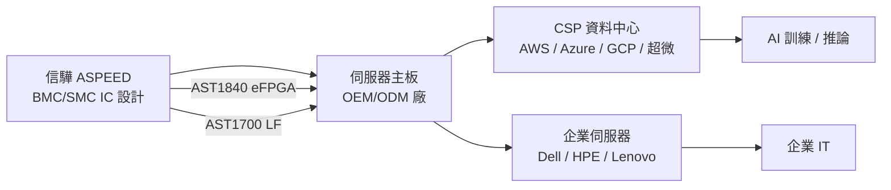

# 5274_信驊（市）

## 基本資料

信驊科技（5274.TW，ASPEED Technology）為全球 BMC（Baseboard Management Controller）晶片主要供應商，專注於伺服器遠端管理 IC 設計（Fabless）。BMC 是伺服器主板上負責頻外管理（Out-of-Band Management）的核心晶片，讓管理員能在系統關機或故障狀態下遠端控制、監控、更新伺服器。

**主要產品線**：
- **BMC**：AST2700 系列（量產中）、AST1700（LF 標準，最受歡迎）、AST1020/1080（Keynote 線）
- **SMC（Satellite Management Controller）**：AST1040/AST1840（含 eFPGA 整合），負責模組化伺服器子系統管理
- **I/O Expander**：伺服器模組化設計用
- **PFR（Platform Firmware Resilience）**：平台韌體信任核心

**財務亮點**：2025 全年 EPS 103.92 元（現金股利 80 元），2026Q1 EPS 37.4 元，毛利率 69.18%，淨利率 44.9%。AI 伺服器需求強勁，未來幾年需求年增率預估 35%。

**供應鏈位置**：伺服器管理層級 IC，位於伺服器主板（Motherboard）設計端，供應給伺服器 OEM/ODM 廠，最終進入 CSP 資料中心。

*來源：法說 2026-06-01（AlphaMemo.ai）。*

---

## 核心技術／競爭優勢

- **BMC 市場標準制定者地位**：與超大規模數據中心（Hyperscaler）及業界版權方深度合作，AST 系列已成為行業事實標準，新 OEM 廠商幾乎無法繞過信驊；與 TI 等傳統廠商相比，信驊最近兩代在 AI 伺服器 BMC 領域佔主導地位
- **eFPGA 整合（AST1840）**：將 eFPGA 嵌入 SoC 可省去客戶額外放置 FPGA 晶片，減少 BOM 複雜度，強化客戶設計黏著度；AST1840 支援帶 Flash（標準版）與不帶 Flash（Skinny Boot 版）兩版本
- **極高毛利率（約 69%）**：Fabless IC 設計模式，高度差異化與標準化後軟體生態鎖定，使毛利率遠高於一般 IC 設計公司
- **生態系軟體鎖定**：BMC 包含大量客製化韌體與 API，客戶在切換供應商時面臨極高遷移成本，形成強力護城河

---

## 產品與應用

| 產品 / 服務 | 應用 | 相關客戶 / 下游 |
|-------------|------|-----------------|
| BMC（AST2700 / AST1700 / AST1020） | 伺服器頻外管理、遠端控制 | 伺服器 OEM/ODM（鴻海、廣達等）、CSP |
| SMC / AST1040 / AST1840（含 eFPGA） | 模組化伺服器子系統管理 | AI 伺服器廠商 |
| I/O Expander | 伺服器 I/O 模組化擴充 | 伺服器 OEM |
| PFR 平台韌體信任核心 | 韌體安全 / 防篡改 | 高安全需求伺服器 |

---

## 圖片 / 架構圖

> 信驊 BMC 晶片是 AI 伺服器管理層核心，OEM 廠幾乎標配。

---

## EPS 記錄

| 季度 / 年度 | EPS (元) | YoY | 備註 |
|------------|---------|-----|------|
| 2025Q1 | 23.46 | +126.59% 淨利率 | 毛利率 66.23% 創歷史新高；來源中信 2025-05-20 |
| 2025 全年 | 103.92 | — | 現金股利 80 元（配息率 ~77.5%） |
| 2026Q1 | 37.4 | — | 毛利率 69.18%，淨利率 44.9% |
| 2026Q1 | 營收 31.47 億 | +52.38% | 全球營收 YoY +59.45% |

---

## 時間軸

| 時間 | 事件 | 類型 | 重要性 | 備註 |
|------|------|------|--------|------|
| 2026Q1 | EPS 37.4、毛利率 69.18% | 財報 | ⭐⭐⭐ | 單季新高，產業需求強勁 |
| 2026H2 | AST2700 系列量產 | 放量 | ⭐⭐⭐ | 新一代 BMC 出貨增加 |
| 2026Q3 | 預估營收 4.3–4.5 億元 | 展望 | ⭐⭐ | 缺貨風險仍存在，供應鏈緊張 |
| 進行中 | AST1840（eFPGA 整合 SoC）客戶採用 | 技術升級 | ⭐⭐⭐ | 縮減客戶 BOM 成本，深化綁定 |
| 2027 | 訂單延伸至 2027 年 | 能見度 | ⭐⭐⭐ | 每月遷移次數超 50 次，長期訂單穩定 |

---

## 供應鏈位置

- 上游：晶圓代工（台積電等）、IC 封裝測試廠
- 下游：伺服器 OEM/ODM 廠（鴻海精密工業、廣達、緯穎、超微等）→ CSP（AWS、Azure、GCP）
- 所屬供應鏈：[[供應鏈_AI伺服器PCB]]（伺服器主板管理 IC 層）
- 無獨立 BMC 供應鏈頁；可參考 AI 伺服器整體供應鏈

---

## 相關公司

| 公司 | 關係 | 說明 |
|------|------|------|
| TI（Texas Instruments） | 同業 / 競爭 | 早期 BMC 市場主要玩家；信驊近兩代已佔主導地位 |
| Lattice Semiconductor | 合作夥伴 | 聯合開發 FPGA 整合 SoC（AST1840 相關） |

---

> [!warning] 風險與注意事項
> - **供應鏈缺貨風險持續**：2026Q3 仍面臨供應商及庫存短缺，若晶片供應鏈未能及時擴產，出貨量受限可能錯失需求高峰
> - **競爭者入場風險**：BMC 市場高利潤吸引潛在競爭者；TI 及未來可能有軟體生態系更強的替代品，雖短期護城河深但不可輕忽
> - **客戶集中在 AI 伺服器**：若 AI 伺服器資本支出下滑（如 CSP 投資降速），信驊需求將直接受衝擊；伺服器通用需求較穩定可緩衝
> - **高 EPS 股價反映高預期**：本益比受高成長預期支撐，若成長不如預期（如 2026H2 季增減速），評價面有下修風險

---

## 目標價與評等

| 來源 | 日期 | 評等 | 目標價 | 評價方法 |
|------|------|------|--------|---------|
| 中信證券 | 2025-05-20 | 買進（UG↑自中立） | 4,200 元 | 38x 2026F EPS |
| 摩根士丹利 | 2025-06-09 | Overweight（UG↑） | NT$5,000 | earnings momentum |
| 摩根士丹利 | 2026-06-22 | OW（維持）| NT$23,456（↑大幅上調 from NT$5,000）| AI 伺服器 BMC 結構性需求；Greater China Semis 產業報告 | [[20260623_1351_GREATER_20260622_1746]] |
| Nomura | 2026-06-30 | Buy（維持） | NT$19,100（舊 NT$11,500） | AI 伺服器 CPU 受益者（outright CPU beneficiary） | [[報告_Nomura_亞洲AI半導體_20260630]] |

## 來源

- [[活動_信驊法說_20260601]]
- [[報告_中信證券_信驊_20250520]]（中信，2025-05-20；UG 買進，TP 4200，1Q25 EPS 23.46）
- [[報告_摩根士丹利_雲端半導體_20250609]]（MS，2025-06-09；UG to OW，TP NT$5,000）
- [[20260623_1351_GREATER_20260622_1746]]（MS，2026-06-22；維持 OW；TP 大幅上調至 NT$23,456；AI 伺服器 BMC 結構性需求強勁）

## 相關頁面

- [[時程_2026Q3Q4_AI網通與硬體催化劑]]
- [[分析_2026Q3半導體供需與AI伺服器供應鏈]]
- [[GOOGL.US(alphabet)]]
- [[2317_鴻海（市）]]
- [[2382_廣達（市）]]

### 2026-08-05 Goldman Sachs 更新

- [[gs 5274]] 預估 2Q26 營收 NT$3.871bn、季增 23%，並因基板瓶頸緩解與需求韌性上調 3Q26 營收成長預期；數字屬券商 estimate。
- 傳統 BMC 出貨預估上調至 2026–2028 年 3,260 萬／4,910 萬／6,240 萬顆；AST2700、AI ASIC 客戶市占、新 OSAT 夥伴與 E-glass 認證是主要觀察項目，均待後續驗證。

### 來源補充（2026-08 新增）

- [[gs 5274]] — Goldman Sachs，2026-08-05
- [[報告_Daiwa_信驊_20260805]]：維持買進、12 個月目標價上調至 NT$19,800；2Q26 毛利率 72.0%，Daiwa 預期 2H26 AI／一般伺服器需求維持，惟基板漲價可能使毛利率逐季回落。

### 2026-08-23 Goldman Sachs 更新補充

- [[GS-5274 20260805]]：Goldman Sachs 目標價 NT$22,000，維持 AI agentic server／BMC 需求的結構性成長觀點；基板材料成本與 4Q26 價格調整是主要風險，數字均屬券商 estimate。
