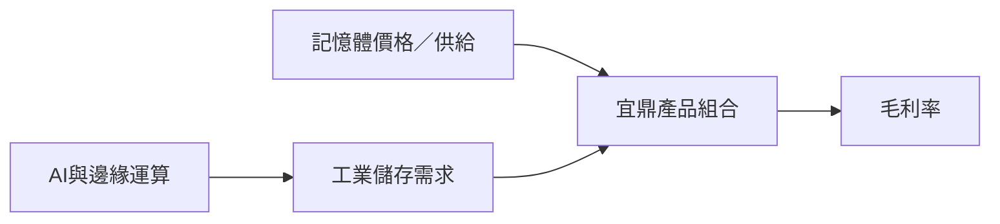

# 5289_宜鼎（櫃）

## 基本資料
宜鼎國際（Innodisk）是工業級記憶體與嵌入式儲存供應商，產品涵蓋 DRAM、SSD、模組與工業電腦儲存方案，應用於工業自動化、網通、邊緣 AI 與伺服器。TPEX 資料列示股票代號 5289。

## 核心技術／競爭優勢
- 工業級寬溫、長供貨週期與客製化模組能力。
- 記憶體價格上漲時，產品組合與庫存管理可放大毛利彈性。
- AI 應用、邊緣運算與伺服器儲存需求提供非消費性需求支撐。

## 產品與應用
| 產品 | 應用 | 相關下游 |
|---|---|---|
| 工業 DRAM／SSD | 工業電腦、網通 | IPC、設備商 |
| 嵌入式儲存模組 | 邊緣 AI、伺服器 | 系統整合商 |

## 圖片 / 架構圖

> 宜鼎的獲利彈性同時受記憶體價格、產品組合與 AI 應用需求影響。

## 目標價與評等
| 券商 | 報告日 | 評等 | 目標價 | 類型 | 來源 |
|---|---|---|---|---|---|
| Daiwa | 2026-08-06 | Buy | NT$2,385 | estimate | [[260806_daiwa_Innodisk]] |

## 時間軸
| 時間 | 事件 | 類型 | 重要性 | 備註 |
|---|---|---|---|---|
| 2026Q2 | EPS NT$108.93、毛利率 65.0% | 獲利 | ⭐⭐⭐ | Daiwa 報告數據 |
| 2H26 | 記憶體漲價與 AI 訂單展望 | 放量 | ⭐⭐⭐ | 公司展望／券商 estimate |

## 供應鏈位置
- 上游：DRAM、NAND 與控制器供應商。
- 下游：工業電腦、網通、邊緣 AI 系統；相關主題見 [[供應鏈_記憶體]]。

## 相關公司
目前本批來源未揭露需建立的明確客戶或供應商關係，`related_companies` 保持空白。

> [!warning] 風險與注意事項
> - 記憶體價格反轉或庫存跌價可能壓縮毛利。
> - AI 應用需求與高毛利產品組合若不如預期，券商估值可能下修。

## 來源
- [[260806_daiwa_Innodisk]]（Daiwa，2026-08-06）

## 相關頁面

- [[分析_2026-08記憶體_AI需求與液冷ASIC更新]]
- [[時程_2026記憶體與AI催化劑]]
