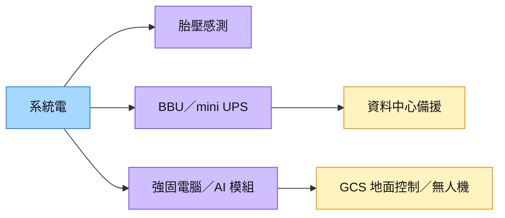

# 5309_系統電（櫃）

## 基本資料

系統電提供 TPMS 胎壓偵測器、工業／強固電腦與能源備援產品，2026H1 營收組合為 TPMS 46%、工業電腦 38%、能源 16%。[[活動_華南投顧_系統電5309_20261007]] 的主要轉型觀點，是由汽車感測器成長轉向 BBU、工業邊緣運算、無人載具地面控制與整機製造。

能源產品面向資料中心備援；工業業務包含 AI 算力模組、GCS 地面控制與無人機整機，客戶均未具名。掛牌別依 [櫃買上櫃行情](https://www.tpex.org.tw/web/stock/aftertrading/daily_close_quotes/stk_quote_result.php?l=zh-tw&o=htm) 確認；所有營收與成長展望均為華南法說轉述。

## 核心技術／競爭優勢

- **感測、運算與能源並行**：TPMS 提供既有量產基礎，工業電腦與 BBU 擴展產品組合；後兩者能否改善獲利須追蹤量產。
- **半自動／自動產線彈性**：來源稱台灣兩條全自動及一條半自動線，預留 30–40% 擴充空間，便於新專案調整；非承諾的可售產能。
- **模組至系統的產品層級**：AI 模組、GCS 與無人機整機單價不同，成長由 GCS／整機帶動時，不能用模組出貨量外推全部收入。

## 產品與應用

| 產品／服務 | 應用 | 相關客戶／下游 |
|---|---|---|
| TPMS | 車輛胎壓感測 | 未具名車用客戶 |
| BBU／mini UPS | 資料中心備援供電 | Q4／翌年 Q1 客戶逐步量產，未具名 |
| 強固電腦／AI 算力模組 | 工業與無人載具邊緣運算 | 未具名工業客戶 |
| GCS／無人機整機 | 地面控制、製造與銷售 | 專案開發及驗證中，不推定國防訂單 |

## 圖片 / 架構圖

圖說：華南 2026-10-07 所述三類業務；BBU 放量與無人載具專案須分別驗證，不視為同一成長曲線。來源只有裝飾圖，故用 Mermaid。

## EPS 記錄

| 期間 | EPS（元） | YoY | 備註 |
|---|---:|---|---|
| 2026Q2 | -0.02 | 未提供 | 營收 8.97 億元、毛利率 22.2%、營益率 -7.2%；fact／中信心，尚未外部核對 |

## 時間軸

| 時間 | 事件 | 類型 | 重要性 | 備註 |
|---|---|---|---|---|
| 2026-10（預估） | mini UPS／BBU 開始出貨 | 出貨 | ⭐⭐⭐ | 摘要指定 11kW，正文未明確指定當月功率型號；estimate／中低 |
| 2026Q4–2027Q1（預估） | BBU 客戶逐步量產 | 放量 | ⭐⭐⭐ | 預期逐月爬坡，非單月立即暴增；estimate／中 |
| 2027Q1／H1（預估） | 3kW 量產 | 放量 | ⭐⭐⭐ | 正文 Q1、摘要 H1，Q1 為較窄窗口，仍待確認 |
| 2027（預估） | 5.5kW、新無人機專案與新增 3–4 條線 | 驗證／擴產 | ⭐⭐ | 5.5kW 曾因規範測試延誤；專案貢獻未量化 |

跨公司時程：[[時程_2026-2028華南六家公司商業化節點]]。

## 供應鏈位置

在資料中心提供能源備援，在工業／無人載具鏈提供 [[技術_邊緣AI]] 模組、控制及整機服務；應用鏈見 [[供應鏈_工業自動化]]。不推定 BBU 的機櫃電壓、CSP 身分或軍工訂單量。

## 相關公司

| 公司 | 關係 | 說明 |
|---|---|---|
| 未具名能源／工業客戶 | 下游 | memo 未揭露可核對公司名，`related_companies: []` 保留 |

## 風險與注意事項

> [!warning] mini UPS 型號與時程差異
> [[活動_華南投顧_系統電5309_20261007]]（2026-10-07）摘要稱 10 月出 11kW、1H27 出 3kW、2027 出 5.5kW；正文稱 mini UPS／BBU 10 月出貨、5.5kW 曾因規範延誤、3kW 約 1Q27 量產。未將正文「問題解決」視為 5.5kW 已量產；需逐型號確認驗證、出貨與量產。

> [!warning] 低基期與獲利爬坡
> - 2027 資料中心能源成長 2–3 倍、條件良好可 4–5 倍及 BBU 3–5 倍均是低基期管理層情境，不提供絕對營收承諾。
> - 2026 毛利率 23–24%、2027 增 2–3 個百分點為 estimate／中；必須與 Q2 負營益率及新增費用一併追蹤。
> - 2027 工業業務 AI 模組／GCS／整機約 1:3:3 為來源的方向性比例；無人機約占工業電腦事業 20% 以上，不是公司總營收。

## 來源

- [[活動_華南投顧_系統電5309_20261007]] — 華南投顧，2026-10-07；法說轉述，實績 fact／中、展望 estimate／中，型號時程中低。
- [櫃買上櫃行情](https://www.tpex.org.tw/web/stock/aftertrading/daily_close_quotes/stk_quote_result.php?l=zh-tw&o=htm) — 5309 掛牌別核對，2026-10-08 查閱。

## 相關頁面

- [[分析_華南六家公司成長動能與商業化驗證_20261008]]
