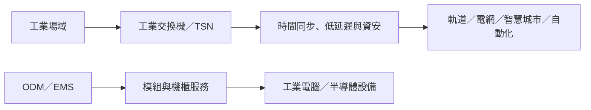

# 5353_台林（櫃）

## 基本資料

台林以 ODM 與 EMS 服務工業網通、工業電腦、車用電子及半導體設備；工業交換機、全光網路與專案型電子製造為目前主軸。國泰證期 Call Memo 指出，1H26 EPS 為 0.95 元、年增近九成，且公司以提前備料回應 2H26 至 2027 年訂單與供應鏈緊張。海外服務預計由越南新廠補強，但新技術多仍在 POC 或區域驗證階段。來源：[[memo_國泰證期_台林CallMemo_20260910]]。

## 核心技術／競爭優勢

- **工業專案導入門檻**：工業交換機需經 POC、區域認證與可靠度驗證；一旦設計導入，產品生命週期可達 10–30 年。
- **高可靠度網路功能**：布局時間同步、TSN、工業協定與資安；軌道交通交換機具低於 20 毫秒保護切換機制。
- **跨領域製造服務**：半導體設備服務由 PCB 組裝延伸至模組與機櫃，增加工程服務附加價值。
- **在地化供應韌性**：台灣與規劃中的越南據點支援短鏈及海外服務；惟新廠時程與供應取得仍須驗證。

## 產品與應用

| 產品 / 服務 | 應用 | 相關客戶 / 下游 |
|---|---|---|
| 工業交換機與 TSN 解決方案 | 軌道交通、電力、智慧城市、工廠自動化 | 專案客戶未揭露 |
| 全光網路接入產品 | 企業端高速、低延遲、低功耗網路 | 企業用戶未揭露 |
| ODM / EMS 與機櫃服務 | 工業電腦、車用電子、半導體設備 | 客戶未揭露 |
| AI switch 與邊緣網路功能 | 流量、品質與資安風險監控 | 尚在驗證 |

## 圖片 / 架構圖

*台林以工業網通專案與電子製造服務雙軸切入；AI switch、全光網路與 CPO 皆仍須經場域驗證。*

## EPS 記錄

| 期間 | EPS（元） | YoY | 備註 |
|---|---:|---:|---|
| 2026H1 | 0.95 | 近 +90% | 對比 2025H1 的 0.50 元；公司／券商轉述 |

## 時間軸

| 時間 | 事件 | 類型 | 重要性 | 備註 |
|---|---|---|---|---|
| 2026 年底（目標） | 蘆竹廠 B 棟完成 | 擴產 | ⭐⭐ | 支援新增服務專案；利用率與營收未揭露 |
| 2026H2 | 營運目標優於 1H26 | 營運 | ⭐⭐ | 受記憶體、被動元件與 PCB 供應制約 |
| 2027Q4（預估） | 越南首座工廠完工 | 建廠 | ⭐⭐⭐ | 公司展望 |
| 2028Q1（預估） | 越南工廠投產 | 放量／服務 | ⭐⭐⭐ | 在地化服務與新增專案待驗證 |

→ 跨公司追蹤詳見 [[時程_2026工業自動化與人形機器人]]。

## 供應鏈位置

- 上游：記憶體、被動元件與 PCB；公司稱供給偏緊，已提前備料。
- 下游：工業自動化、軌道交通、智慧城市、電力與半導體設備專案。
- 所屬供應鏈：[[供應鏈_工業自動化]]。

## 相關公司

本次來源未揭露可確認的客戶、供應商或競爭公司；暫不建立未證實關係。

> [!warning] 風險與注意事項
> - TSN、AI 網路、全光網路與 CPO 多為 POC、小批量或樣品階段，不能視為短期營收。
> - 記憶體、被動元件與 PCB 供應緊張，以及在地製造與關稅要求，可能壓縮交付與毛利。
> - 越南廠完工、投產及客戶在地化需求均屬公司規劃，應追蹤實際進度。

## 來源

- [[memo_國泰證期_台林CallMemo_20260910]]（國泰證期研究部，2026-09-10；僅供內部使用）

## 相關頁面

- [[分析_台林工業網通專案化與越南產能_20260910]]
