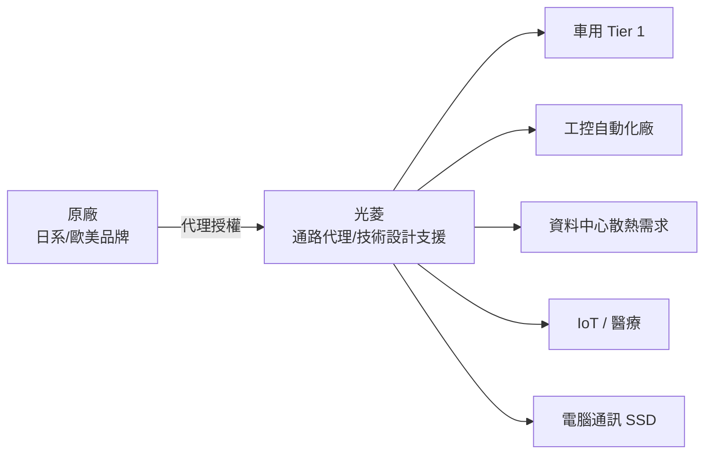

# 5371_光菱（市）

## 基本資料

光菱（5371.TW）為台灣電子零件通路商（代理商），以日系品牌代理起家，成立於 1976 年，1992 年上市。核心業務為代理電子零件並銷售至終端客戶，覆蓋車用、工控、IoT、醫療、電腦通訊、資料中心等多元產業。

**主要產品／服務**：代理電子零件（含 SSD、散熱模組、電力模組、工控零件、感測器等），近年積極導入資料中心散熱材料及伺服器應用產品，力推高附加價值產品線。

**營收驅動**：資料中心（散熱、資料傳輸）2026Q1 成長最多；電腦通訊（SSD 需求放大）次之；整體 2026Q1 營收 11.87 億元，YoY +41%。

**客戶結構**：以台灣、中國為主要市場，日本已逐步上軌道；未來計畫進駐南亞市場分散地緣政治風險。

**資本額**：約 5.18 億元（2026 年）。公司定位穩健保守，人員約 100 人出頭，著重彈性與前端技術設計推廣能力。

*來源：法說 2026-06-29（AlphaMemo.ai）。*

---

## 核心技術／競爭優勢

- **前端技術佈局能力**：以技術設計背景推廣通路產品，比純粹報價型通路商更早介入客戶開發設計端，產品導入黏著度高
- **日系品牌根基與彈性**：早期以日系代理起家，建立品質信任基礎；規模不大使公司能與客戶及原廠快速配合，彈性優於大型通路商
- **多元產業分散風險策略**：同時布局車用、工控、IoT、醫療、電腦通訊、資料中心，避免單一產業波動造成重大衝擊；資料中心成長帶動整體結構升級
- **主動避險機制**：已建立遠期外匯避險，有效控制匯損對財務目標的影響，財務紀律優於同規模小型通路商

---

## 產品與應用

| 產品 / 服務 | 應用 | 相關客戶 / 下游 |
|-------------|------|-----------------|
| SSD、儲存模組代理 | 電腦、伺服器儲存 | 台灣電腦廠、伺服器 OEM |
| 散熱材料、散熱機代理 | AI 伺服器散熱、工業冷卻 | 資料中心、工業客戶 |
| 電力模組 | 工控、伺服器電源 | 工廠自動化廠商、伺服器廠 |
| 車用電子零件 | ADAS、車身電子 | 車用 Tier 1 / 整車廠 |
| IoT、醫療電子元件 | 工廠感測、醫療設備 | 工控廠、醫療設備廠 |

---

## 圖片 / 架構圖

> 光菱以技術設計能力為差異化，從代理商升格為早期技術導入夥伴。

---

## EPS 記錄

| 季度 | 數據 | YoY | 備註 |
|------|------|-----|------|
| 2026Q1 | EPS 0.94 元 | — | 稅前淨利 +104%，淨利 +93% |
| 2026Q1 | 毛利率 YoY +43% | — | |
| 2026Q1 | 營業淨利 5,420 萬 | +140% | |

---

## 時間軸

| 時間 | 事件 | 類型 | 重要性 | 備註 |
|------|------|------|--------|------|
| 2026Q1 | 營收 YoY +41%，淨利 +93% | 財報 | ⭐⭐⭐ | 資料中心散熱、通訊 SSD 拉貨 |
| 2026 持續 | 高附加價值產品（電力模組、醫療電子）加速開發 | 新產品 | ⭐⭐ | 提升毛利率空間 |
| 2026-2027 | 進駐南亞市場（印度等） | 地域擴張 | ⭐⭐ | 分散地緣政治與貿易風險 |
| 進行中 | 日本市場逐步上軌道 | 市場拓展 | ⭐ | 日系品牌代理根基拓展 |

---

## 供應鏈位置

- 上游（原廠）：日系、歐美電子零件品牌廠商
- 下游（客戶）：台灣車用 Tier 1、工控廠、伺服器 OEM、醫療設備廠
- 通路商定位，無直接對應供應鏈頁
- # 無對應供應鏈頁

---

## 相關公司

| 公司 | 關係 | 說明 |
|------|------|------|
| 資料中心散熱原廠（未具名） | 上游代理品牌 | 資料中心成長動能最強 |

---

> [!warning] 風險與注意事項
> - **產能排擠與缺貨風險**：SSD 等熱門產品市場供貨不足，小客戶資源受排擠，可能影響成長上限
> - **地緣政治與匯率雙重風險**：中國市場佔比較大，台美中貿易政策調整及台幣升值均對通路毛利造成壓力；避險操作雖已啟動但仍有缺口
> - **規模較小、客戶集中**：消費電子主要依靠少數大客戶，若大客戶需求波動或轉換代理商，短期衝擊大
> - **毛利率空間有限**：通路商本業毛利率受限，高附加價值產品開發若不如預期，整體獲利彈性受壓

---

## 來源

- [[活動_光菱法說_20260629]]
