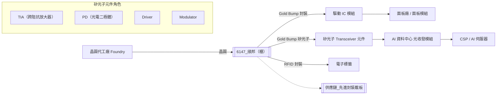

# 6147_頎邦（櫃）

## 基本資料

頎邦（Chipbond Technology，6147）是台灣 COF（Chip on Film）及金凸塊（Gold Bump）封裝專業廠，長期以來以面板驅動 IC（Driver IC）的金凸塊封裝服務為核心業務，並向 RF Front-end、RFID 電子標籤等延伸。2025 年起公司切入高速成長的**矽光子封裝**領域，利用現有 8 吋金凸塊設備服務矽光子設計公司（TIA、PD、Driver、Modulator），成為矽光子 Transceiver 供應鏈中的關鍵連接器件廠。

**主要產品/服務**：
- **金凸塊（Gold Bump）封裝**：面板驅動 IC（Driver IC）用 COF 封裝
- **矽光子金凸塊**：矽光子 Transceiver 元件（TIA、PD、Driver、Modulator）高速訊號連接用
- **RF Front-end 封裝**：手機射頻前端 IC 封裝服務
- **RFID 電子標籤封裝**：UHF RFID 標籤（Uniqlo、迪卡農等零售業應用）
- **（規劃中）測試與切割服務**：預計 2027 年起推動，提供一站式服務

**營收結構（2025 年基準）**：
- 驅動 IC（Driver IC）：60-65%
- RF Front-end：約 20%
- RFID 電子標籤：約 3%
- 其他（矽光子新業務成長中）：約 10%+

**產能利用率**：
- 8 吋金凸塊：~70%（矽光子與驅動 IC 共用產線）
- 12 吋金凸塊：~90%（手機 Driver IC、RF Front-end 用）

**成長驅動**：矽光子需求爆發（AI 帶動光通訊升級）、驅動 IC 報價調漲、RFID 年成長約 30%。

**供應鏈位置**：IC Foundry 的下游封裝服務方，為矽光子設計公司提供 Gold Bump Bonding 服務，縮短訊號傳輸距離（打線→凸塊），是矽光子高速 Transceiver（200G per lane 以上）的製造關鍵節點。

**資料來源**：[[活動_JPM_頎邦訪談_20260527]]（2026-05-27，J.P. Morgan NDR 訪談）、[[活動_頎邦法說_20260624]]（2026-06-24，發言人鄭凱元經理）

---

## 核心技術／競爭優勢

1. **矽光子技術升級的關鍵卡位**：矽光子 Transceiver 速度從 100G 升級至 200G per lane，打線（Wire Bonding）因距離長、訊號雜訊無法滿足要求，必須改用金凸塊縮短 PD 到 TIA 的傳輸距離並提升訊號純淨度。頎邦是金凸塊技術的台灣主要廠商，在矽光子設計公司大量湧入時，成為技術卡位點。

2. **黃金材質的訊號純淨優勢**：金凸塊使用黃金作為連接材料，黃金在所有金屬中信號傳輸純淨度最佳，符合高速光電整合對低損耗、低雜訊的嚴格要求，形成技術護城河。

3. **矽光子新客戶快速累積**：2025Q2 起超過 10 家矽光子設計公司主動與頎邦接洽，開案超過 30 個，5-6 款產品已獲客戶認證並量產（TIA、PD 已量產），Driver 與 Modulator 預計 2026 年底或 2027 年陸續量產。

4. **COF 驅動 IC 的長期基盤**：驅動 IC 業務雖受消費性電子景氣影響，但 2026Q2 已完成全面提價（反映三年通膨），客戶普遍接受，量減價增維持金額穩定；長期以來客戶對製程認證要求高，切換成本大。

5. **RFID 高速成長細分市場**：RFID 電子標籤年增長約 30%，零售大廠（Uniqlo、迪卡農等）持續擴大採用，預期更多通路業者跟進，小但穩定的現金流來源。

## 2026-05-27 JPM 訪談重點

- **矽光營收與客戶進度**：管理層將 2026 年 CPO／Silicon Photonics Bumping 營收佔比由 3 月的約 2% 上修至約 5%（約 NT$1bn 的量級理解）。截至 5 月有 3 家客戶完成認證，惟當時僅 [[MRVL.US(marvell)]] 已正式大量下單；其餘客戶與約 20–30 個專案仍處驗證或導入。以當時已有客戶為基準，管理層認為 2027、2028 年各有翻倍潛力，但屬 company estimate，不代表確定訂單。
- **製程與獲利結構**：200G per lane 對訊號完整性要求提高，使 TIA、PD、Driver、Modulator 由較長的 Wire Bond 轉向 Gold Bump／Flip-Chip 短距離互連。管理層估矽光 Bumping 毛利率約 30%–35%，營業利益率約高於傳統 Driver 產品 10 個百分點，屬訪談口徑。
- **一條龍延伸**：客戶希望頎邦從 Bumping 延伸至 Testing 與 Dicing；管理層以單位營收比例示意為 Bumping 1、Testing 約 1、Dicing 約 0.2–0.3，這只是規模關係，不是 ASP 指引。
- **RF Front-End**：2025 年 [[AVGO.US(broadcom)]] 與 Skyworks 合計約佔營收 20%，其中 70%–80% 最終供應 iPhone；2026 年增長主要來自 [[AAPL.US(apple)]] 出貨與市佔策略，而非整體 RF 市場擴張。
- **韓系轉單**：Samsung System LSI 因三星體系收縮 Legacy Driver 內製，將產品滾動轉移至台灣代工與後段；轉換可能延續至 2027 年底，2026Q2 已有少量貢獻，但客戶未承諾最終量，不宜推導固定營收。
- **馬來西亞廠**：當時預計 2026H2 開始有少量產能貢獻，滿載情境約相當於全公司 20%，但沒有滿載時程；初期主要是 NCNT 備援與成熟 COG／COF 產線複製。

> [!warning] Testing／Dicing 時程口徑變化
> - [[活動_JPM_頎邦訪談_20260527]]（2026-05-27）：當時預計 2026 年底開始。
> - [[活動_頎邦法說_20260624]]（2026-06-24）：更新為 2027 年開始陸續推動。
> - 狀態：以較新的 2026-06-24 口徑作為目前基準，實際設備、客戶認證與收入起點仍待驗證。

## 券商觀點

### Citi — 買進，TP NT$230（2026-07-30）

頎邦 2Q26 營收季增 15% 至 NT$6,632mn，毛利率 30.3%，較 1Q26 增加 6.8 個百分點，主要受報價調漲與 OLED DDIC 需求改善帶動。Citi 預估 2026E／2027E／2028E EPS 為 NT$5.55／8.24／9.73，目標價由 NT$210 上調至 NT$230，維持 Buy。

LPO 業務已於 2Q26 起步，Citi 預期 3Q26 之後需求逐季增加，2027 年更具規模且毛利率高於公司平均；ChipMOS 競爭加入是風險，但 Citi 認為市場仍在早期、頎邦具先發優勢。以上 LPO 需求、競爭與 EPS 均屬券商 estimate／判斷，不能改寫為公司 fact。

| 年度 | Citi EPS（報告日：2026-07-30） | 備註 |
|------|-------------------------------|------|
| 2026E | NT$5.55 | EPS 年增 48.2% |
| 2027E | NT$8.24 | EPS 年增 48.4%；LPO 放量 |
| 2028E | NT$9.73 | EPS 年增 18.1% |

來源：[[報告_Citi_頎邦_20260730]]

---

## 產品與應用

| 產品 / 服務 | 應用 | 相關客戶 / 下游 |
|-------------|------|-----------------|
| 面板驅動 IC 金凸塊（12 吋） | OLED/LCD 面板驅動 | 面板廠（AUO、群創等）、Driver IC 設計公司 |
| 矽光子 TIA / PD 金凸塊（8 吋） | 矽光子 Transceiver 光電轉換 | 矽光子設計新創（10+ 家新客戶） |
| 矽光子 Driver / Modulator 金凸塊 | 矽光子 Transceiver 電光調變（量產中規劃） | 矽光子設計公司，預計 2026 年底/2027 量產 |
| RF Front-end 封裝（12 吋） | 手機射頻前端模組（PA、LNA、Switch） | 手機 RF IC 設計公司（美系大客戶為主） |
| RFID 電子標籤封裝 | 零售業庫存管理、電子標籤 | Uniqlo、迪卡農及其他零售業者 |
| 測試 & 切割（規劃中） | 矽光子 IC 一站式服務 | 現有矽光子客戶群，預計 2027 年推出 |

---

## 圖片 / 架構圖

> 頎邦在矽光子 Transceiver 中負責 TIA/PD/Driver/Modulator 的 Gold Bump 連接，縮短訊號傳輸路徑從打線的毫米級降至凸塊的微米級，是 200G+ per lane 高速光通訊的關鍵製程。

---

## 時間軸

| 時間 | 事件 | 類型 | 重要性 | 備註 |
|------|------|------|--------|------|
| 2026Q2 | 全面調漲報價（反映三年通膨）生效 | 獲利提升 | ⭐⭐⭐ | 客戶普遍接受，驅動 IC 量減價增，金額至少持平 |
| 2026Q2 | LPO 業務開始爬坡 | 新業務放量 | ⭐⭐⭐ | Citi 估 3Q26 起需求逐步增加 |
| 2026H2 | Samsung System LSI Legacy Driver 轉單滾動增加 | 放量 | ⭐⭐ | 5/27 訪談指 2Q26 已有少量；最終量未承諾 |
| 2026H2 | 馬來西亞廠建立首條可運作產線 | 產能開出 | ⭐⭐ | 初期以 NCNT 備援及 COG／COF 成熟製程為主，時程仍待驗證 |
| 2026Q3 | 高階手機旺季與 OLED DDIC 需求回升 | 營運修復 | ⭐⭐ | Citi 預估營收季增 3%、毛利率 30.7% |
| 2026 下半年 | Driver & Modulator 矽光子產品量產 | 新業務放量 | ⭐⭐⭐ | TIA/PD 已量產，Driver/Modulator 跟進 |
| 2027 | LPO 需求更具規模 | 新業務放量 | ⭐⭐⭐ | 高於公司平均毛利率的產品組合，Citi estimate |
| 2026 年底/2027 | 矽光子業務金額大幅提升 | 結構轉型 | ⭐⭐⭐ | 管理層明言「明年及後年有顯著成長」 |
| 2027 | 測試 & 切割服務開始推動 | 業務延伸 | ⭐⭐ | 一站式服務提升客戶黏著度，提高 ASP |
| 2027 年底 | Samsung System LSI Legacy Driver 轉換預計完成 | 產能轉移 | ⭐⭐ | 客戶並未承諾最終給頎邦的量，屬 company outlook |
| 2027 起 | 折舊重新增加（矽光子資本支出） | 成本壓力 | ⭐⭐ | 疫情期資本支出少，今年折舊已降至 NT$30 億，明年回升 |
| 中長期 | 擴充 12 吋產能（8 吋矽光子產品逐步移往 12 吋） | 產能升級 | ⭐⭐ | Driver IC 轉 12 吋可釋出 8 吋產能給矽光子客戶 |

---

## 供應鏈位置

- **上游**：IC Foundry（提供晶圓）、黃金材料供應商（Gold Bump 主要材料）、InP 晶圓（3/4 吋，PD/Modulator 用）、矽鍺（SiGe，8 吋，PD 用）
- **下游 / 客戶**：
  - 面板廠（面板驅動 IC 模組）
  - 矽光子設計公司（新興 AI 光通訊供應鏈）
  - 手機 RF 模組廠
  - 零售業 RFID 應用
- **所屬供應鏈**：[[供應鏈_先進封裝載板]]（矽光子封裝角色）
- **AI 光互聯供應鏈**：[[供應鏈_AI光互聯]]（TIA／PD／Driver／Modulator 的 Gold Bump、測試與切割潛在機會）

---

## 相關公司

| 公司 | 關係 | 說明 |
|------|------|------|
| [[MRVL.US(marvell)]] | 下游 / 矽光客戶 | 2025 年 11 月通過認證，2026-05-27 訪談時為唯一已大量下單者，先以 TIA 為主、Driver 尚在驗證 |
| [[AVGO.US(broadcom)]] | 下游 / RF 客戶 | 與 Skyworks 合計約佔 2025 年營收 20%，其中多數最終應用於 iPhone |
| [[AAPL.US(apple)]] | 終端應用 | RF Front-End 與部分 DDIC／穿戴產品的最終需求來源 |
| [[8150_南茂（市）]] | 同業 / 競爭者 | 金凸塊與 iPhone 相關訂單會隨客戶季度分配動態調整；矽光當時尚在評估進入 |

---

> [!warning] 風險與注意事項
> - **驅動 IC 消費性需求疲弱**：記憶體漲價壓縮手機/NB 出貨量，驅動 IC 數量下滑；頎邦依賴提價彌補量損，若面板廠拒絕轉嫁漲價，毛利率壓力回升
> - **矽光子新業務集中在設計新創**：10 家以上矽光子客戶均為新興設計公司，財務體量小、量產時程存在不確定性；若客戶驗證進度延遲，矽光子業務成長幅度將低於預期
> - **黃金原料成本波動**：Gold Bump 主要材料為黃金，金價大幅波動時成本結構難以對沖，且合約可能無法即時反映成本變化
> - **8 吋 vs 12 吋產能結構**：矽光子目前在 8 吋設備上生產，長期轉向 12 吋仍需資本支出與認證時間；InP（3/4 吋）基材短期內無法轉換至 12 吋，產品組合轉換路徑較長
> - **競爭格局**：金凸塊市場集中，若三星、TSMC 等大廠擴大自製矽光子封裝能力，外包量可能縮減

---

## 來源

- [[活動_頎邦法說_20260624]]（2026-06-24，來源類型：法說/法人說明會，信心水準：高）
- [[活動_JPM_頎邦訪談_20260527]]（J.P. Morgan NDR 訪談，2026-05-27；管理層口徑，關鍵訂單、營收與時程屬 company outlook／estimate，信心水準：中）
- [[報告_Citi_頎邦_20260730]]（Citi，TP NT$230 Buy，LPO 與毛利率上修，2026-07-30）

## 相關頁面

- [[技術_矽光子（SiPh）]]
- [[時程_2026記憶體與AI催化劑]]
- [[分析_頎邦矽光GoldBump與營運轉型2026]]
