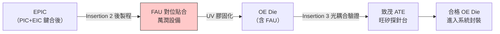

# 6187_萬潤（市）

## 基本資料

萬潤科技（6187.TW，TWSE 上市）是台灣精密機械設備廠，核心定位為 **CPO 光耦合與 FAU 貼合設備**。在 AI 驅動 CPO 量產的背景下，萬潤掌握 Insertion 2-3 間的關鍵瓶頸環節——光耦合設備，可提供優於主要競爭對手（ficonTEC）的 UPH（Unit Per Hour）效能。研究社報告指出，預期 **3Q26 CPO 耦合業務將實現首次營收貢獻**，為未來主要成長動能。

CPO 光耦合精度要求 < 0.3µm（約傳統光模塊的 1/10），是整條產線技術難度最高的環節，現由德國 ficonTEC 實質壟斷，萬潤是少數具備挑戰能力的台廠之一。

資料來源：[[光測試期中產業報告]]（Securities Research Society 期中，2026-07-01）

## 核心技術／競爭優勢

- **高精度光耦合機台**：CPO 對位精度 < 0.3µm，偏差 0.5µm 即造成 50% 光功率流失，萬潤聲稱 UPH 效能優於競爭對手 ficonTEC
- **掌握 Insertion 2-3 關鍵環節**：EPIC Wafer Level Test 後的 FAU 貼合對準（Insertion 2 後製程）及 Die Level 光耦合驗證（Insertion 3）
- **FAU 貼合設備**：光纖陣列（FAU）與 PIC 的精密貼合，使用 UV 膠固化，是 CPO 量產爬坡的關鍵良率管控點
- **台廠 UPH 優勢**：相較於 ficonTEC 的 9-12 個月交期和高單價（~$500 萬 USD/台），萬潤有機會以更短交期和更高產能效率切入

## 產品與應用

| 產品 / 服務 | 應用 | 相關客戶 / 下游 |
|-------------|------|-----------------|
| CPO 光耦合設備 | Insertion 2-3 光路對準與耦合 | TSMC COUPE、OSAT（封測廠）|
| FAU 貼合設備 | 光纖陣列與 PIC 精密貼合 + UV 固化 | CPO 模組製造商 |

## 圖片 / 架構圖

![[光測試期中產業報告_015.png]]
*圖（SRS，2026）：高精密對位為低損耗耦合關鍵——光纖與 PIC 需在 < 0.3µm 精度下對準，任何位置偏差都會放大插入損耗。*

![[光測試期中產業報告_016.png]]
*圖（SRS，2026）：貼合與固化設備支撐耦合良率——UV 膠固化流程，萬潤聚焦此環節設備供應。*

> 萬潤在 CPO 製程中負責 Insertion 2 後段至 Insertion 3 前段的光耦合與 FAU 貼合，是良率管控的關鍵瓶頸設備環節。

## 時間軸

| 時間 | 事件 | 類型 | 重要性 | 備註 |
|------|------|------|--------|------|
| 2026 3Q | CPO 耦合業務首次實現營收貢獻 | 放量節點 | ⭐⭐⭐ | SRS 報告預期；信心：中（研究社估算，非公司指引）|
| 2026-2027 | CPO OE 需求：2026 年 121.6 萬顆 → 2027 年 783.9 萬顆 | 產業放量 | ⭐⭐⭐ | 年增 6.4 倍，帶動耦合設備需求乘數效應 |
| 2027 | CPO 滲透加速，耦合設備台數需求倍增 | 設備放量 | ⭐⭐⭐ | 精度升級每台耦合時間更長，台數需求 > 出貨量增幅 |

## 供應鏈位置

- **所屬供應鏈**：[[供應鏈_CPO]]（Insertion 2-3 光耦合設備環節）、[[供應鏈_光測試設備]]
- **同環節競爭者**：ficonTEC（德國，主要競爭對手，實質壟斷，交期 9-12 個月）；ADST（同環節台廠，未建頁）
- **協作環節**：
  - Insertion 3 ATE + 光學對準：[[2360_致茂（市）]]
  - Insertion 3 探針台：[[6223_旺矽（櫃）]]
- **下游（設備使用方）**：[[2330_台積電（市）]] COUPE 產線 / OSAT

## 相關公司

| 公司 | 關係 | 說明 |
|------|------|------|
| [[2360_致茂（市）]] | 同 CPO 測試鏈（協作） | 致茂主 Insertion 3/4 ATE，萬潤主光耦合設備 |
| [[6223_旺矽（櫃）]] | 同 CPO 測試鏈（協作） | 旺矽主探針台，萬潤主光耦合機台 |
| [[2330_台積電（市）]] | 下游（設備採購方） | TSMC COUPE 產線需大量光耦合設備 |

> [!warning] 風險與注意事項
> - **來源信心偏低**：本資料來源為學生研究報告，業績預測（3Q26 營收貢獻）未獲公司法說確認；信心水準：中
> - **ficonTEC 壟斷風險**：ficonTEC 在 CPO 耦合設備具技術先行優勢，萬潤需在精度與客戶認證上持續突破
> - **CPO 量產時程風險**：若 CPO 放量延後（SemiAnalysis 6 月已下修預期），萬潤業績貢獻時間點同步延後
> - **認證周期長**：CPO 耦合設備需與 TSMC/OSAT 深度整合校準，導入後黏著度高但認證門檻亦高

## 來源

- [[光測試期中產業報告]]（Securities Research Society，期中報告，2026-07-01 ingest）

## 相關頁面

- [[時程_2026工業自動化與人形機器人]]
- [[供應鏈_AI光互聯]]
- [[技術_CPO]]
- [[供應鏈_CPO]]

### 2026-08 高盛更新

- 2Q26 毛利率 54.8%、營益率 33.3%、EPS NT$8.50，均優於高盛估計與市場共識；高盛認為高毛利 CoWoS 相關業務組合改善是主因。來源：[[260811_gs_allring]]（2026-08-11；初步業績／券商整理）。
- 高盛維持 Buy，將 12 個月目標價由 NT$1,550 調整至 NT$1,450；2027E／2028E CPO 營收模型為 NT$1,861m／NT$9,726m，分別占 14%／58%，屬券商估計，尚非公司指引。
- 觀察重點：CoWoS 持續擴產、CPO 新產品線、面板級封裝內容價值與美國新客戶拓展；後三者的量產／客戶進度仍待公司公告確認。
## UBS 2026-08-18 更新

- 來源報告將萬潤列為 AI／CPO 相關精密設備觀察標的；CPO 耦合、光學組裝與測試設備的實際訂單節奏仍需公司公告或法說確認。
- 來源：[[260818_ubs_allring]]（UBS，2026-08-18）；本段不把券商情境改寫為已確認客戶訂單，信心水準：中低。
- 來源：[[260818_ubs_allring]]（UBS，2026-08-18）；本段不把券商情境改寫為已確認客戶訂單，信心水準：中低。

### 2026-08 批次更新

- 摩根士丹利指出 2Q26 營收 NT$2.355bn、毛利率 54.8%、EPS NT$8.50，CoWoS 組合提升是毛利改善主因；維持 OW、目標價 NT$1,580。
- 券商預估 CPO 4Q26 起貢獻營收、2026 年出貨約 75 台、2027 年 200 台以上；美系先進封裝客戶新 dispensing solution 訂單與 2027 年量產出貨為供應鏈調查，信心中低，待公司公告驗證。
- CoPoS 試產資格預估於 2027 年中完成、2028H1 量產屬券商 estimate；不得視為台積電正式時程。

來源：[[報告_MorganStanley_萬潤_20260810]]。

### 2026-07-21 Morgan Stanley 產業路演補充

- ASML、記憶體與 Apple AI 路演資料未直接揭露萬潤訂單；僅可作為先進製程、記憶體與 AI 資本支出背景，不把其轉寫為萬潤已確認需求。
- 來源：[[20260721_歐洲半導體：全球科技網路直播—ASML管理層路演、儲存創新與蘋果AI_MS]]（Morgan Stanley，2026-07-21）。

### Morgan Stanley 2026-08-23 更新

- 市場傳言的 CPO 耦合設備份額流失、CoW dispensing 遭取消資格，以及 Rubin Ultra 散熱件不確定性，均未獲該行供應鏈查核支持；其認為耦合設備與次世代 GPU 散熱件份額仍在。[[260823_ms_allring]]
- CoW dispensing 仍在資格驗證，預計於 4Q26 有更多進度；這不是已取得量產訂單的確認，信心：中低。美系先進封裝客戶合作的細節待 2026-08-27 法說／現場活動進一步揭露。

### 2026-08-31 中信投顧更新

- 2Q26 營收 23.6 億元、毛利率 54.8%、營益率 33.3%、EPS 8.50 元；CoWoS 相關客戶追加點膠／貼合站點是季增主因。來源：[[報告_CTBC_萬潤_20260831]]。
- 中信投顧預估 2027 年 CPO 設備營收占比約 20%，Insertion 3 光耦合機台出貨 200 台以上；這是券商 estimate，需以設備驗收、客戶導入與公司公告驗證。
- 2026 年 CoWoS 設備營收占比估 87.7%，2027 年轉為 CoWoS 70%、Non-CoWoS 8%、CPO 20%；組合變化可能帶來成長，也可能因新產品驗證造成毛利波動。

### 來源補充（2026-08-31）

- [[報告_CTBC_萬潤_20260831]] — 中信投顧，2026-08-31；Buy，TP NT$1,680
