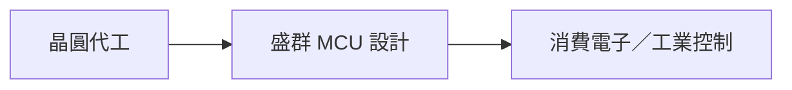

# 6202_盛群（市）

## 基本資料

盛群半導體（6202 TT，Holtek Semiconductor）為 MCU IC 設計公司，產品以 8 位元 MCU 為主，並布局 32 位元 MCU、消費性與工業控制應用。

### 2026-08-04 券商更新

- 中信投顧給予「增加持股」、目標價 NT$67；以 2027E EPS NT$3.35、20 倍 PER 評價，屬券商 estimate。
- 1H26 公司未完全轉嫁成本，短期毛利率受壓；MCU 需求與晶圓廠產能是主要風險。

## 圖片 / 架構圖

圖說：盛群位於 MCU 設計環節，產品由晶圓代工製造後供應消費與工控終端。

## 供應鏈位置

- 上游：晶圓代工與封裝測試服務，具體供應商待查證。
- 下游：消費電子、家電與工業控制應用。

## 時間軸

| 日期 | 事件 |
|---|---|
| 2026-08-04 | 中信投顧以 2027E EPS NT$3.35、20 倍 PER 給予目標價 NT$67 |

## 來源

- [[盛群(6202,OW_增加持股)-CTBC260804]]（中信投顧，2026-08-04）
