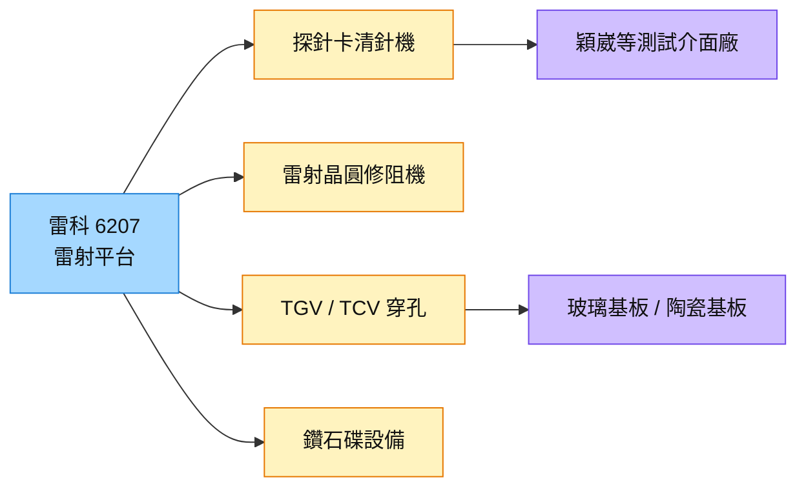

# 6207_雷科（櫃）

## 基本資料

雷科為雷射加工與自動化設備廠，近年將雷射技術延伸至半導體測試介面與先進封裝：探針卡清針機、雷射晶圓修阻機（Wafer Trim）、TGV（玻璃穿孔）與 TCV（陶瓷穿孔）設備、鑽石碟相關設備。

- **群友 2026 年 6–7 月致電發言人筆記（信心低至中）：** 探針卡清針機客戶為穎崴（毛利率約 40–50%）；TGV 設備持續驗證；鑽石碟 1–5 月有 1–2 台，後續仍有訂單；雷射晶圓修阻機為自製，今年約 10 台、明年 25 台視客戶需求；客戶多走 TGV、TSV 較少，主要為 TCV 與 TGV。
- 後續新聞亦報導清針、Wafer Trim 與 TCV 設備陸續取得訂單（群友轉述）。

資料來源：[[活動_雷科6207_發言人通話群友筆記_202607]]（LINE 群組成員筆記，2026 年 6–7 月通話）

## 核心技術／競爭優勢

- **雷射微加工平台：** 同一雷射技術延伸至探針卡清針、晶圓修阻、玻璃與陶瓷穿孔。
- **測試介面耗材週期：** 清針機服務探針卡維護，與 AI 晶片測試量同步成長。
- **TGV／TCV 卡位：** 玻璃基板與陶瓷基板穿孔仍在客戶驗證期，屬先期布局。

## 產品與應用

| 產品 / 服務 | 應用 | 相關客戶 / 下游 |
|-------------|------|-----------------|
| 探針卡清針機 | AI 晶片測試介面維護 | [[6515_穎崴（市）]] |
| 雷射晶圓修阻機（Wafer Trim） | 被動元件／晶圓電阻修調 | 半導體客戶 |
| TGV／TCV 雷射穿孔設備 | 玻璃基板、陶瓷基板 | 驗證中 |
| 鑽石碟相關設備 | CMP 耗材 | 客戶小量訂單 |

## 圖片 / 架構圖

圖說：雷科以雷射加工平台延伸到測試介面維護與先進封裝穿孔，玻璃／陶瓷穿孔仍在驗證期。

## 時間軸

| 時間 | 事件 | 類型 | 重要性 | 備註 |
|------|------|------|--------|------|
| 2026 | 雷射晶圓修阻機出貨約 10 台 | 出貨 | ⭐ | 群友筆記，信心低 |
| 2027 | 修阻機約 25 台（視客戶） | 出貨 | ⭐ | 群友筆記，信心低 |
| 2027–2028 | TGV／TCV 設備隨玻璃基板量產 | 規格升級 | ⭐⭐ | 業界普遍預期 TGV 2028 年前後量產 |

→ 跨公司時程詳見 [[時程_2026-2027高速互連與分散式算力]]

## 供應鏈位置

- 下游：測試介面廠、玻璃／陶瓷基板廠、被動元件與半導體客戶
- 所屬供應鏈：[[供應鏈_先進封裝載板]]（TGV 設備，玻璃核心基板）、[[供應鏈_半導體測試設備]]
- 技術背景：[[技術_玻璃基板]]

## 相關公司

| 公司 | 關係 | 說明 |
|------|------|------|
| [[6515_穎崴（市）]] | 客戶 | 探針卡清針機（群友筆記） |

## 風險與注意事項

> [!warning] 風險與注意事項
> - **資訊來源為群友通話筆記：** 未經公司正式公告或法說證實，信心低至中。
> - **TGV 商業化時程：** 玻璃基板大量採用多數業者認為落在 2028–2030 年。
> - **設備業務波動：** 訂單量小、認列時點集中。

## 來源

- [[活動_雷科6207_發言人通話群友筆記_202607]] — LINE 群組成員筆記，2026 年 6–7 月

## 相關頁面

- [[分析_2026Q3法說季_AI供應鏈瓶頸與擴產節奏_LINE彙整]]
