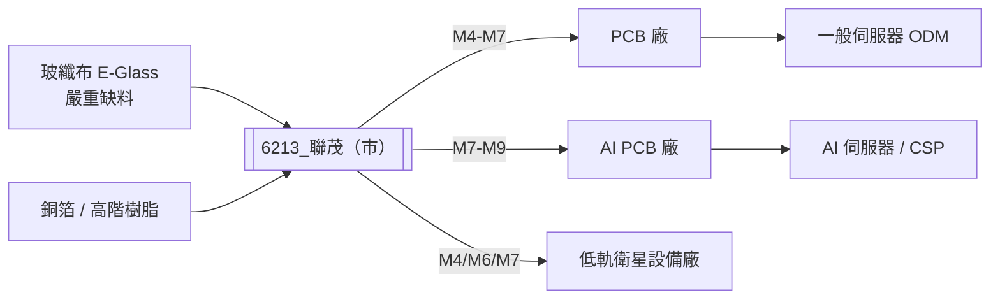

# 6213_聯茂（市）

## 基本資料

聯茂電子（ITEQ Corp），台系 CCL（覆銅板）第三大，產品規格橫跨 M2-M9，主力在 M4-M7 中高階伺服器 CCL。一般伺服器 CPU 主板佔營收約 **50-60%**（近期已達 60%），為主要現金牛；AI GPU 配板（M4-M7）及 AI ASIC（M7-M8）為成長動能；低軌衛星（M4/M6/M7）為新興業務，預計 2027H1 開始貢獻營收。

生產基地：中國江西（240 萬張/月，占總產能近半）、泰國（現有 30 萬張，2026 底擴至 60 萬張，2028H1 再 +60 萬張）、台灣（高階材料研發中心，隨時可擴）。主設備供應商：亞台精機（交期已拉長至 1.5 年）。

**2026 年關鍵動態（來自 2026-05-28 法說）**：
- 1Q26 毛利率低於預期（漲價 3 月才啟動，僅 ~10% 且非全線）
- 2Q26E 營收 +~20% QoQ，GM 目標 45%+
- 2026 全年每季進行漲價循環（Q2 漲幅至少 20%）
- E-Glass 玻纖布嚴重缺料，抑制出貨；預計年底供應緩解

**主要資料來源**：[[報告_HSBC_CCL展望2026_27_20260413]]（HSBC，2026-04-13）；[[報告_GS_台灣CCL_PCB_20260418]]（GS，2026-04-18）；[[活動_聯茂法說_20260528]]（富邦，2026-05-28）。

## 核心技術／競爭優勢

- **CPU 平台市占領先**：一般伺服器 Server CPU 主板 CCL 市占一直領先，PCIe Gen6 升級（M6→M7）將直接擴大 ASP；AMD Venice 新平台上線後預期市占大幅提升
- **全線產品規格 M2-M9**：M4/M6 佔主力（60-70%），M7（5-6%），M8（低單位數），M9 已通過美系 GPU 大廠認證（2025），M10 亦送樣中（2026-03 CPCA 展示）
- **AI + CSP 滲透率持續上升**：AWS、Meta 均有一定市占（M7-M8 等級）；2027 年起新增重要 CSP 客戶（非 Microsoft，M7/M8/M9 送樣認證中）
- **泰國廠供應鏈多元化**：客戶要求非中國產能，泰國廠可滿足，且設備交期 1.5 年已鎖產能
- **每季價格調整能力**：部分 PCB 客戶每月調價，CCL 漲幅可每季滾動轉嫁；2026 全年確定持續漲價循環

## 產品與應用

| 產品 / 服務 | 規格等級 | 應用 | 主要客戶 / 下游 |
|-------------|---------|------|-----------------|
| 一般伺服器 CCL | M4/M6（主力） | Intel / AMD CPU 主板 | PCB 廠 → ODM → 品牌伺服器 |
| AI 伺服器 CCL | M7/M8 | GPU Server 配板（Riser/Network Card）| NVIDIA GB200 配板廠 |
| AI ASIC CCL | M7-M9 | AWS、Meta 等 ASIC 基板 | 代工 PCB 廠 |
| 低軌衛星 CCL | M4/M6/M7 | LEO 衛星地面設備 | 低軌衛星廠（IPO 中） |
| 高階材料研發 | M9/M10 | 下一代高速 PCB | 美系 GPU 大廠（認證中） |

## 圖片/架構圖

> 聯茂是 PCB 的上游材料廠（CCL），E-Glass 缺料為 2026 年最大產能瓶頸；泰國廠 2026 底達 60 萬張，2028H1 再 +60 萬張。

## 圖片/架構圖

`[待補來源圖]` 需官方 IR CCL 或高頻板材料產品圖佐證，現有研究筆記不足以支撐產品示意圖。

## EPS 記錄

| 季度 | 指標 | 數值 | 備註 |
|------|------|------|------|
| 1Q26 毛利率 | GM | 低於預期 | 漲價 3 月才啟動、非全線漲足 10%；HSBC 預期 14.5% vs 實際 12.5% |
| 2Q26E 毛利率 | GM | 45%+ | 初步估計，視漲價幅度及客戶接受度；法說管理層揭露 |
| 2Q26E 營收 | QoQ | +~20% | — |

## EPS 預估

| 年度 | HSBC（2026-04-13） | GS（2026-04-18） | 備註 |
|------|-------------------|-----------------|------|
| 2025A | NT$（原始數值待核對）$4.16 | NT$（原始數值待核對）$4.16 | — |
| 2026E | NT$（原始數值待核對）$7.19 | NT$（原始數值待核對）$5.52 | HSBC 較樂觀（Hold）；GS 較悲觀（Sell） |
| 2027E | NT$（原始數值待核對）$8.82 | NT$（原始數值待核對）$7.62 | 兩家差異縮小 |

> [!warning] 聯茂評等分歧：HSBC Hold vs GS Sell
> HSBC：看好 Server CPU 需求回升（Intel/AMD 新平台），中高端 CCL 規格升級帶動 ASP，TP NT$（原始數值待核對）（PE 20x）。
> GS：技術落後，中低端 CCL 市場競爭持續，TP NT$（原始數值待核對）（PE 13.5x，低於過去 10 年平均）。

## 目標價與評等

| 券商 | 報告日 | 評等 | 目標價 | 評價基礎 | 來源 |
|------|--------|------|--------|----------|------|
| HSBC | 2026-04-13 | Hold | NT$（原始數值待核對） | 20x 2027E EPS NT$（原始數值待核對）.82 | [[報告_HSBC_CCL展望2026_27_20260413]] |
| Goldman Sachs | 2026-04-18 | Sell | NT$（原始數值待核對） | 13.5x 2Q26-1Q27E EPS | [[報告_GS_台灣CCL_PCB_20260418]] |

## 時間軸

| 時間 | 事件 | 類型 | 重要性 | 備註 |
|------|------|------|--------|------|
| 2026-03-中 | 中國 CPCA 展示 M10 等級材料樣品 | 技術 | ⭐⭐ | 下一代高速材料 |
| 2026-Q1 | 毛利率低於預期（漲價遲緩）；上半年稼動率約 75% | 財務 | ⭐⭐ | E-Glass 缺料抑制出貨 |
| 2026-6月底/7月初 | 一般型伺服器 PCIe Gen6 平台資格認證，M6→M7 升級 | 升級 | ⭐⭐⭐ | CPU 升級 ASP 跳升，市占提升 |
| 2026-Q2起 | 每季漲價循環確定，Q2 漲幅至少 20%；GM 目標 45%+ | 漲價 | ⭐⭐⭐ | 全年持續漲幅 |
| 2026 年底 | 泰國廠 +30 萬張，達 60 萬張；E-Glass 供應開始緩解 | 擴產 | ⭐⭐⭐ | 供需缺口持續 |
| 2027-H1 | 低軌衛星客戶開始量產，CCL 營收貢獻啟動 | 新業務 | ⭐⭐⭐ | 已完成送樣認證 |
| 2027 | M9 等級放量（美系 GPU 大廠）；新 CSP 客戶（M7/M8/M9）導入 | 放量 | ⭐⭐⭐ | M9 今年量少 |
| 2028-H1 | 泰國廠再 +60 萬張，達 120 萬張（總產能大幅擴增）| 擴產 | ⭐⭐⭐ | 設備交期 1.5 年已鎖 |

## 供應鏈位置

- **上游材料**：玻纖布（E-Glass，多家；嚴重缺料）、銅箔（約佔 BOM 45%，玻纖布已追平）、高階樹脂、化學劑
- **下游 PCB 廠**：一般伺服器（CPU）PCB 廠 → ODM 伺服器廠
- **直接客戶**：PCB 廠（一般伺服器、AI 伺服器配板）→ CSP（AWS、Meta 最終用途）
- **競爭者**：[[2383_台光電（市）]]（技術領先，M8-M9+）、[[6274_台燿（市）]]（中高端）
- **所屬供應鏈**：[[供應鏈_AI伺服器PCB]]

## 相關公司

| 公司 | 關係 | 說明 |
|------|------|------|
| [[2383_台光電（市）]] | 競爭者（技術領先）| M8-M9+ 規格，AI 高端 CCL 市場主導 |
| [[6274_台燿（市）]] | 競爭者（中高端）| M7-M8 重疊，策略相近 |

> [!warning] 風險與注意事項
> - **技術規格仍落後台光電**：M9/M10 等高端規格追趕中，量產時程延後則 AI ASIC 高端訂單難拿；GS 給 Sell 主要因此
> - **E-Glass 供應瓶頸**：2026 年供不應求抑制出貨，年底供應才預期緩解，中間存在交貨延誤風險
> - **泰國廠良率爬坡**：東南亞廠操作難度高，交期 1.5 年的設備一旦良率不佳，損失難以彌補
> - **漲價議價持續性**：若 2026 年底玻纖布供應充裕後需求放緩，客戶可能要求降價；漲價循環持續性存疑

## 來源

- [[報告_HSBC_CCL展望2026_27_20260413]]（HSBC，2026-04-13）
- [[報告_GS_台灣CCL_PCB_20260418]]（Goldman Sachs，2026-04-18）
- [[活動_聯茂法說_20260528]]（富邦，2026-05-28；1Q26 GM 情況、Q2 漲價、泰國廠擴產、E-Glass 缺料、AMD Venice、M9 認證、LEO 業務）

## 相關頁面

- [[分析_2026-08_ABF_CCL與AI互連更新]]
- [[時程_2026Q3Q4_AI網通與硬體催化劑]]
- [[技術_CCL]]

### 2026-08-08 Daiwa 更新

- [[260808_daiwa_iteq-UG]] 上調 2026–2028 年營收與 EPS，核心假設為高階 CCL 需求、價格上漲與產能爬坡；2026E EPS 15.24、2027E 29.225、2028E 43.336，均屬券商 estimate，信心：中。
- 報告預估 2026–2029 年產能由 545 萬張提升至 890 萬張，並認為超大規模資料中心高階 CCL 需求自 2028 年起更明顯；規模與量產節奏待公司揭露驗證。

### 來源補充（2026-08 新增）

- [[260808_daiwa_iteq-UG]] — Daiwa，2026-08-08
