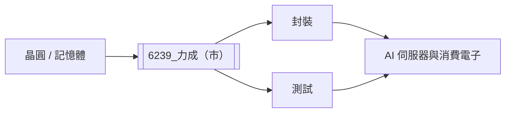

# 6239_力成（市）

## 基本資料

力成（Powertech Technology）是台灣半導體封裝與測試服務商，主要承接記憶體、邏輯與高效能運算晶片的封裝、測試及相關後段製程。2026 年券商報告指出，2Q26 營收約 231.2 億元，AI／記憶體需求與 TSV interconnection 試產為後續成長觀察點。

## 核心技術／競爭優勢

- 封裝與測試整合，能承接高複雜度記憶體與邏輯產品。
- TSV interconnection 開始試產，提供高頻寬記憶體與先進封裝的技術選擇權。
- 大規模產能與既有客戶認證形成切換成本；上述競爭優勢為券商分析，非公司逐項量化揭露。

## 產品與應用

| 產品 / 服務 | 應用 | 相關客戶 / 下游 |
|---|---|---|
| 記憶體封裝與測試 | AI 伺服器、PC、消費電子 | 記憶體供應鏈 |
| 邏輯封裝與測試 | ASIC、處理器 | IC 設計與系統廠 |
| TSV interconnection | 高頻寬記憶體與先進封裝 | 券商報告未具名 |

## 圖片 / 架構圖

## EPS 預估

| 年度 | CTBC EPS（報告日：2026-07-29） | 備註 |
|---|---:|---|
| 2026E | 12.6 元 | estimate |
| 2027E | 17.5 元 | estimate；TSV 試產與毛利率延續 |

## 目標價與評等

| 券商 | 報告發布日 | 評等 | 目標價 | 評價基礎 | 來源 |
|---|---|---|---:|---|---|
| 中信 | 2026-07-29 | 買進 | NT$400 | 23x 2027E EPS | [[力成(6239,B_買進)-CTBC260729]] |

## 時間軸

| 時間 | 事件 | 類型 | 重要性 | 備註 |
|---|---|---|---|---|
| 2026Q3 | TSV interconnection 開始試產 | 驗證 / 放量 | ⭐⭐⭐ | 券商整理，estimate |
| 2027 | 毛利率維持高檔的觀察期 | 獲利 | ⭐⭐ | 受 AI 與記憶體需求影響 |

## 供應鏈位置

- 上游：晶圓與封裝材料供應商。
- 下游：記憶體、AI 伺服器與高效能運算晶片供應鏈。
- 所屬環節：封裝、測試。

## 相關公司

目前本報告未具名揭露可確定建立 wikilink 的客戶或供應商，`related_companies` 維持空白。

> [!warning] 風險與注意事項
> - AI／記憶體需求若低於預期，產能利用率與毛利率可能回落。
> - TSV 試產到量產仍有驗證、良率與客戶導入風險。

## UBS 2Q26 更新：FOPLP 進度後移

- 2Q26 營收 NT$23.1bn（QoQ +8.5%）、毛利率 21.8%、EPS NT$3.00；UBS 預估 3Q26 營收約季增 5%、毛利率 22.1%。
- FOPLP 首波 2K 片／月安裝後，額外 4–5K 片／月產能改為 2027 年底前建置；相較先前 2026 年底 3K、2027H1 再 3K 的節奏後移。設備交期、安裝、NPI 與驗證均為瓶頸。
- AMD 首顆 AI FOPLP 晶片仍以 2027 年中前放量為目標；與 [[AVGO.US(broadcom)]] 的合作則包括 2026 年底前 micro-bump OE 試產、2027H2 switch 整合、AI 晶片整合目標至 2028 年底。時程均為公司／券商展望，信心中。

來源：[[報告_UBS_力成_20260728]]（2026-07-28）。

## 來源

- [[力成(6239,B_買進)-CTBC260729]]（中信，2026-07-29）

## 相關頁面

- [[時程_2026記憶體與AI催化劑]]
