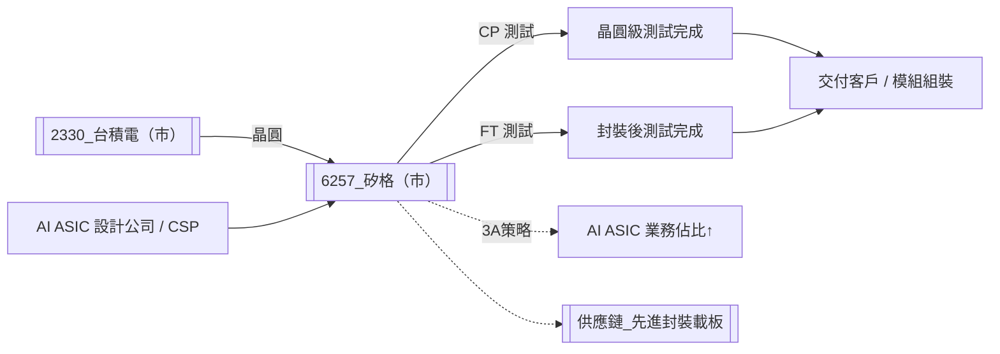

# 6257_矽格（市）

## 基本資料

矽格（Sigurd Microelectronics，6257）是台灣主要 IC 封裝測試（OSAT，Outsourced Semiconductor Assembly and Test）廠商，以測試服務（CP/FT Testing）為核心競爭力，並具備完整 IC 封裝服務能力。公司的成長主軸已從傳統消費性 IC 測試轉向 AI ASIC、矽光子（Silicon Photonics）、AI connectivity 等高成長高毛利應用，提出「3A 策略」（AI ASIC、AI Connectivity、Automotive IC）作為中長期發展方向。

**主要產品/服務**：
- **IC 測試服務**（主力）：CP（晶圓探針）與 FT（最終測試），測試業務無原物料成本，毛利率高
- **IC 封裝**：傳統 OSAT 封裝服務

**產品組合（2026 年 1-5 月，佔比）**：
- AI ASIC + 矽光子：23%（去年 19%，成長 40% YoY，金額 NT$24 億 vs 去年 NT$15 億）
- 智慧手機：31%（去年 33%）
- 網通 / 物聯網：22%（去年 23%）
- 汽車 / 醫療：6.2%（去年 7%）
- 記憶體：4%
- 消費電子 / 智慧家庭：其餘

**產品組合（1Q25，佔比，CTBC 2025-06 報告）**：
- AI + 光通訊：4%（YoY +3ppts，矽光子 EIC 測試量產，PIC 仍研發中）
- HPC + 資料中心：14%
- 消費性電子 / 智慧家庭：19%
- 網通 / 物聯網：22%
- 車用 / 醫療：7%
- 智慧型手機：34%

**財務表現**（資料來源：2026-06-23 法說）：
- 2026Q1 合併營收：NT$52.9 億（+13% YoY）
- 2026 年 1-5 月合併營收：NT$92.16 億（+17% YoY）
- 2026Q1 淨利：NT$11.2 億（+29.3% YoY），EPS 2.1 元，創歷史單季新高
- 毛利率：接近 32%（折舊處於低點，設備逐漸到期）
- EBITDA 年化 ROE：18.2%（去年 Q1 15.2%）
- 所得稅率：約 19%（受惠 5G 及智慧機械投抵）

**產能狀況**：稼動率 7-8 成，較佳產品線達 8 成；設備交期 6-9 個月為瓶頸。

**主要客戶**：前四大 CSP（不對外披露），ASIC / AI ASIC 測試客戶佔比高。

**供應鏈位置**：IC 設計公司、Foundry 的下游測試服務方，提供晶圓級（CP）與封裝後（FT）測試，是 AI ASIC 和矽光子芯片進入量產前的必要關卡。

**資料來源**：[[活動_矽格法說_20260623]]（2026-06-23，副董事長暨總經理葉燦鍊、主計長陳祺昌）

---

## 核心技術／競爭優勢

1. **AI ASIC 與矽光子測試的先行積累**：矽格已累積超過 20 年 AI connectivity 測試經驗，並自行研發 RF SOC 測試設備，具備 224Gbps Silicon Photonics TIA/Driver 測試能力、Wi-Fi 7/8 測試、5G/LEO/Millimeter Wave 等高頻測試能力，大客戶（CSP）在 AI ASIC 測試上已深度倚賴。

2. **自製測試設備降低供應鏈風險**：自製 RF SOC 測試設備（涵蓋 5G、LEO、毫米波、矽光子 PIC 等），不依賴特定設備廠商，可提升交期彈性並降低因設備交期（6-9 個月）造成的擴產延誤。

3. **AI 智慧工廠提升運營效率**：導入 AI 技術監控生產品質、優化 CP/FT 流程、即時品管，以 AI 測試 AI 晶片，形成技術飛輪效應。

4. **低折舊基礎帶來毛利率高峰期**：疫情期間資本支出減少，目前設備折舊僅 NT$10 億不到（歷史高峰曾達 NT$11.5 億），為毛利率短期上行創造有利條件；2026-2027 年折舊緩步回升，但有產能擴充帶來的營收增量支撐。

5. **3A 策略集中化資源**：湖口二廠（虎口二廠）7 月起量產，中興三廠提前至 2026Q4 完工（原計劃 2027Q1），廠房面積 10,000 坪，全面整合 AI ASIC、AI Connectivity、Automotive IC 三大成長賽道，產能集中投入高毛利方向。

---

## 產品與應用

| 產品 / 服務 | 應用 | 相關客戶 / 下游 |
|-------------|------|-----------------|
| AI ASIC 測試（CP/FT） | AI 加速器、HPC 晶片量產前驗證 | 前四大 CSP（ASIC 設計），AI 晶片設計公司 |
| 矽光子晶片測試 | 資料中心光收發模組、CPO | 矽光子設計公司、光模組廠 |
| AI connectivity 測試 | 高速網路交換器 ASIC、Switch Fabric | CSP 網路設備部門 |
| 智慧手機 IC 測試（FT） | 旗艦機 AP、RF Front-end 等 | 手機品牌 IC 設計供應商 |
| 網通 / 物聯網 IC 測試 | Wi-Fi 7/8、5G 基站、路由器 IC | 網通 IC 設計公司 |
| 車用 IC 測試 | ADAS、車用電源管理 | 車用 IC 設計公司 |
| 記憶體 IC 測試 | DRAM、矽電容測試 | 記憶體廠商 |

---

## 圖片 / 架構圖

> 矽格在 AI ASIC 供應鏈中扮演「出貨前最終品質守門員」角色，測試能力與設備是 AI 晶片量產速度的關鍵瓶頸之一。

---

## EPS 記錄

| 季度 | EPS（元） | YoY | 備註 |
|------|----------|-----|------|
| 2026Q1 | 2.1 | +顯著 | 創歷史單季新高，毛利率接近 32% |
| 2025Q4 | 1.82 | — | CTBC 2025-06 預估；台幣 Q4 貶值改善 FX 損失 |
| 2025Q3 | 1.11 | — | CTBC 2025-06 預估；台幣升值影響業外損益 |
| 2025Q2 | 0.38 | — | CTBC 2025-06 預估；台幣升值 9.7% QoQ → FX 損失 NT$7.5 億 |
| 2025Q1 | 1.57 | +~低個位數 YoY | 實際；rev NT$46.85 億 (+12.6% YoY)，GM 28.5% |

> CTBC 2025-06-18 全年預估：2025F EPS 4.87 元（YoY -14.9%，受台幣升值 FX 損失影響）、2026F 6.01 元（YoY +23.4%）。

---

## 時間軸

| 時間 | 事件 | 類型 | 重要性 | 備註 |
|------|------|------|--------|------|
| 2026-07 | 湖口二廠（虎口二廠）開始量產 | 產能開出 | ⭐⭐⭐ | 已被國外大客戶提前預訂滿額 |
| 2026Q4 | 中興三廠完工（提前一季） | 產能擴張 | ⭐⭐⭐ | 10,000 坪，整合 3A 策略，提升產能 10-20% |
| 2026 全年 | AI ASIC / 矽光子業務佔比持續提升（目標 >25%） | 業績催化 | ⭐⭐⭐ | 1-5 月已達 23%，成長 40% YoY |
| 2026-2027 | 設備交期 6-9 個月，設備到位後產能陸續開出 | 產能節奏 | ⭐⭐ | 設備交期是關鍵路徑，影響下半年產能曲線 |
| 2027 起 | 折舊開始緩步回升，新廠攤提增加 | 成本壓力 | ⭐⭐ | 需以收入增量超過折舊增量，維持毛利率 |
| 2025-06-18 | CTBC 重新覆蓋升評（中立 → 增加持股），TP NT$90.2（↑ from NT$54） | 評等事件 | ⭐⭐ | 基於 2026F EPS 6.01 × 15x；台幣升值為主要壓力，但 AI/光通訊訂單動能佳 |
| 2025-05 | 5M25 累計營收 NT$78.4 億（YoY +8.6%），管理層表示優於預期 | 業績 | ⭐⭐ | CTBC 報告 |
| 2025-05 | 董事會通過 CapEx 追加案：NT$35.4 億（原 NT$20 億，+77.1%）用於 AI 手機、矽光子、AI 伺服器擴產 | 資本支出 | ⭐⭐⭐ | 信心指標：公司主動在低基期升值時擴產 |
| 2025Q1 | 1Q25 rev NT$46.85 億（YoY +12.6%），GM 28.5%（YoY +4.7ppts）；AI/光通訊 4%（YoY +3ppts） | 季報 | ⭐⭐ | 矽光子 EIC 測試量產，自製 MAP 設備；美系客戶反饋佳 |

---

## 供應鏈位置

- **上游**：晶圓代工廠（[[2330_台積電（市）]]等，提供晶圓）、封裝廠（OSAT 封裝後送測）、測試設備商（ATE 廠商；部分自製）
- **下游 / 客戶**：AI ASIC 設計公司（CSP 內部 / 第三方）、矽光子公司、手機 IC 設計公司、車用 IC 廠
- **所屬供應鏈**：[[供應鏈_先進封裝載板]]（作為 AI 晶片供應鏈的測試節點）

---

## 相關公司

| 公司 | 關係 | 說明 |
|------|------|------|
| [[2330_台積電（市）]] | 上游 / 製造夥伴 | Foundry 提供晶圓，矽格提供 CP 後段測試服務 |

---

> [!warning] 風險與注意事項
> - **客戶集中**：前四大 CSP 主導 AI ASIC 測試需求，若 CSP 資本支出縮減或轉單至其他 OSAT，衝擊直接且快速
> - **設備交期瓶頸**：測試設備交期 6-9 個月，若業務成長速度超過設備到位速度，恐面臨接單卻無法出貨的窘境；反之若需求下滑後設備已到，折舊壓力上升
> - **折舊低點已過**：2026-2027 年折舊將緩步回升，毛利率有天花板壓力，需靠產品組合（AI ASIC / 矽光子佔比提升）及提價維持水準
> - **競爭外溢風險**：AI H 科（高速）測試市場是否有競爭對手的客戶外溢，管理層表示不確定，若只是大客戶內部需求增量尚可，若有競爭者搶入則護城河受壓
> - **汽車 / 消費端需求疲弱**：車用及智慧家庭目前較平淡，產品結構轉型期間若 AI ASIC 進度不如預期，整體稼動率有下行風險

---

## 來源

- [[活動_矽格法說_20260623]]（2026-06-23，來源類型：法說/法人說明會，信心水準：高）
- [[矽格(6257,OW_ 增加持股)-CTBC250618]]（2025-06-18，中信投顧，李柏賢；1Q25 法說後重新覆蓋升評，AI/光通訊展望、台幣升值影響分析）
