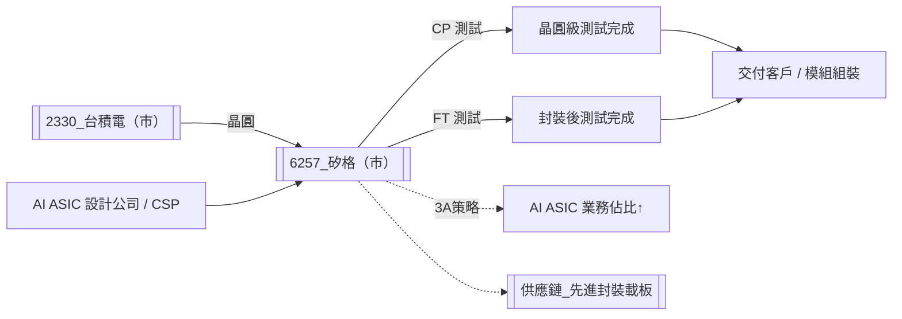
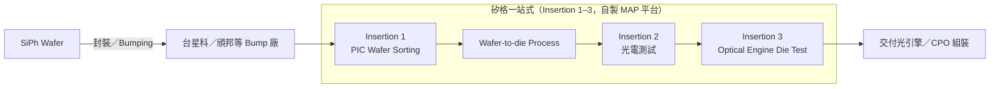

# 6257_矽格（市）

## 基本資料

矽格（Sigurd Microelectronics，6257）是台灣主要 IC 封裝測試（OSAT，Outsourced Semiconductor Assembly and Test）廠商，以測試服務（CP/FT Testing）為核心競爭力，並具備完整 IC 封裝服務能力。公司的成長主軸已從傳統消費性 IC 測試轉向 AI ASIC、矽光子（Silicon Photonics）、AI connectivity 等高成長高毛利應用，提出「3A 策略」（AI ASIC、AI Connectivity、Automotive IC）作為中長期發展方向。

**主要產品/服務**：
- **IC 測試服務**（主力）：CP（晶圓探針）與 FT（最終測試），測試業務無原物料成本，毛利率高
- **IC 封裝**：傳統 OSAT 封裝服務

**產品組合（2026 年 1-8 月，佔比，國泰 Call Memo 2026-10-06）**：
- AI CPU/GPU ASIC（含矽光子）：24%；公司目標 2027 年 >30%
- 智慧手機：30%
- 網通 / 物聯網：21%
- 消費電子 / 智慧家庭：19%
- 車用 / 醫療：6%
- 記憶體：約 10.4%（另列口徑，客戶加價搶產能、利潤佳；與上述分類可能重疊）

**產品組合（2026 年 1-5 月，佔比）**：
- AI ASIC + 矽光子：23%（去年 19%，成長 40% YoY，金額 NT$24 億 vs 去年 NT$15 億）
- 智慧手機：31%（去年 33%）
- 網通 / 物聯網：22%（去年 23%）
- 汽車 / 醫療：6.2%（去年 7%）
- 記憶體：4%
- 消費電子 / 智慧家庭：其餘

**產品組合（1Q25，佔比，CTBC 2025-06 報告）**：
- AI + 光通訊：4%（YoY +3ppts，矽光子 EIC 測試量產，PIC 仍研發中）
- HPC + 資料中心：14%
- 消費性電子 / 智慧家庭：19%
- 網通 / 物聯網：22%
- 車用 / 醫療：7%
- 智慧型手機：34%

**財務表現**（資料來源：2026-06-23 法說）：
- 2026Q1 合併營收：NT$52.9 億（+13% YoY）
- 2026 年 1-5 月合併營收：NT$92.16 億（+17% YoY）
- 2026Q1 淨利：NT$11.2 億（+29.3% YoY），EPS 2.1 元，創歷史單季新高
- 毛利率：接近 32%（折舊處於低點，設備逐漸到期）
- EBITDA 年化 ROE：18.2%（去年 Q1 15.2%）
- 所得稅率：約 19%（受惠 5G 及智慧機械投抵）

**產能狀況**：稼動率 7-8 成，較佳產品線達 8 成；設備交期 6-9 個月為瓶頸。

**主要客戶**：前四大 CSP（不對外披露），ASIC / AI ASIC 測試客戶佔比高。

**供應鏈位置**：IC 設計公司、Foundry 的下游測試服務方，提供晶圓級（CP）與封裝後（FT）測試，是 AI ASIC 和矽光子芯片進入量產前的必要關卡。

**資料來源**：[[活動_矽格法說_20260623]]（2026-06-23，副董事長暨總經理葉燦鍊、主計長陳祺昌）

---

## 核心技術／競爭優勢

1. **AI ASIC 與矽光子測試的先行積累**：矽格已累積超過 20 年 AI connectivity 測試經驗，並自行研發 RF SOC 測試設備，具備 224Gbps Silicon Photonics TIA/Driver 測試能力、Wi-Fi 7/8 測試、5G/LEO/Millimeter Wave 等高頻測試能力，大客戶（CSP）在 AI ASIC 測試上已深度倚賴。

2. **自製測試設備降低供應鏈風險**：自製 RF SOC 測試設備（涵蓋 5G、LEO、毫米波、矽光子 PIC 等），不依賴特定設備廠商，可提升交期彈性並降低因設備交期（6-9 個月）造成的擴產延誤。

3. **AI 智慧工廠提升運營效率**：導入 AI 技術監控生產品質、優化 CP/FT 流程、即時品管，以 AI 測試 AI 晶片，形成技術飛輪效應。

4. **低折舊基礎帶來毛利率高峰期**：疫情期間資本支出減少，目前設備折舊僅 NT$10 億不到（歷史高峰曾達 NT$11.5 億），為毛利率短期上行創造有利條件；2026-2027 年折舊緩步回升，但有產能擴充帶來的營收增量支撐。

5. **3A 策略集中化資源**：湖口二廠（虎口二廠）7 月起量產，中興三廠提前至 2026Q4 完工（原計劃 2027Q1），廠房面積 10,000 坪，全面整合 AI ASIC、AI Connectivity、Automotive IC 三大成長賽道，產能集中投入高毛利方向。

---

## 產品與應用

| 產品 / 服務 | 應用 | 相關客戶 / 下游 |
|-------------|------|-----------------|
| AI ASIC 測試（CP/FT） | AI 加速器、HPC 晶片量產前驗證 | 前四大 CSP（ASIC 設計），AI 晶片設計公司 |
| 矽光子晶片測試 | 資料中心光收發模組、CPO | 矽光子設計公司、光模組廠 |
| AI connectivity 測試 | 高速網路交換器 ASIC、Switch Fabric | CSP 網路設備部門 |
| 智慧手機 IC 測試（FT） | 旗艦機 AP、RF Front-end 等 | 手機品牌 IC 設計供應商 |
| 網通 / 物聯網 IC 測試 | Wi-Fi 7/8、5G 基站、路由器 IC | 網通 IC 設計公司 |
| 車用 IC 測試 | ADAS、車用電源管理 | 車用 IC 設計公司 |
| 記憶體 IC 測試 | DRAM、矽電容測試 | 記憶體廠商 |

---

## 圖片 / 架構圖

![[報告_宏遠_矽格矽光子測試與擴產_20261007_p03_siph_test.png]]

圖說：宏遠引用矽格光子一站式流程，包含台星科 Bumping、晶圓篩選、切割、雙面光電測試與光學引擎晶粒測試；原圖 Insertion 1 標示 PIC，正文另提 EIC／PIC 分別測試，依服務階段分開描述。（2026-10-07，p.3）

![[6257 矽格｜20260826｜玉山_original_page1.png]]
*玉山投顧 2026-08-26 報告首頁；矽格的湖口二廠與中興三廠擴產是本次更新的重點。*

```mermaid
graph LR
    FAB[[2330_台積電（市）]] -->|晶圓| SIG[[6257_矽格（市）]]
    ASIC[AI ASIC 設計公司 / CSP] --> SIG
    SIG -->|CP 測試| WL[晶圓級測試完成]
    SIG -->|FT 測試| PKG[封裝後測試完成]
    WL --> END[交付客戶 / 模組組裝]
    PKG --> END
    SIG -.3A策略.-> AI[AI ASIC 業務佔比↑]
    SIG -.-> SC[[供應鏈_先進封裝載板]]
```

> 矽格在 AI ASIC 供應鏈中扮演「出貨前最終品質守門員」角色，測試能力與設備是 AI 晶片量產速度的關鍵瓶頸之一。

```mermaid
graph LR
    W[SiPh Wafer] -->|封裝／Bumping| BUMP[台星科／頎邦等 Bump 廠]
    BUMP --> I1[Insertion 1<br/>PIC Wafer Sorting]
    I1 --> W2D[Wafer-to-die Process]
    W2D --> I2[Insertion 2<br/>光電測試]
    I2 --> I3[Insertion 3<br/>Optical Engine Die Test]
    I3 --> OUT[交付光引擎／CPO 組裝]
    subgraph SIG[矽格一站式（Insertion 1–3，自製 MAP 平台）]
        I1
        W2D
        I2
        I3
    end
```

> 矽光子測試流程（國泰 Call Memo 2026-10-06，公司說法）：Wafer 先在台星科等廠做封裝／Bumping，再由矽格完成 PIC 晶圓分選、晶圓轉 die、光電測試到光引擎 die 測試三道 insertion。矽光測試尚未標準化，矽格以自製平台客製並在客戶研發階段共同開發，是其與一般 OSAT 測試的主要差異。

---

## EPS 記錄

| 季度 | EPS（元） | YoY | 備註 |
|------|----------|-----|------|
| 2026Q1 | 2.1 | +顯著 | 創歷史單季新高，毛利率接近 32% |
| 2026Q2 | 2.55 | — | 國泰 2026-10-06／玉山 2026-08-26；營收 58.81 億、毛利率約 34.2%；fact／中高 |
| 2025Q4 | 1.82 | — | CTBC 2025-06 預估；台幣 Q4 貶值改善 FX 損失 |
| 2025Q3 | 1.11 | — | CTBC 2025-06 預估；台幣升值影響業外損益 |
| 2025Q2 | 0.38 | — | CTBC 2025-06 預估；台幣升值 9.7% QoQ → FX 損失 NT$7.5 億 |
| 2025Q1 | 1.57 | +~低個位數 YoY | 實際；rev NT$46.85 億 (+12.6% YoY)，GM 28.5% |

> CTBC 2025-06-18 全年預估：2025F EPS 4.87 元（YoY -14.9%，受台幣升值 FX 損失影響）、2026F 6.01 元（YoY +23.4%）。

---

## EPS 預估

| 年度 | 中信（2026-07-20） | 玉山（2026-08-26） | 宏遠（2026-10-07） |
|---|---:|---:|---:|
| 2026E | 9.20 | 10.16 | 10.56 |
| 2027E | 13.40 | 13.10 | 15.43 |

均為券商 estimate／中信心；宏遠估 2026／2027 營收 241.60／303.21 億元，毛利率 34.38%／37.97%。3Q26 EPS 2.80 為預估，原有實際 EPS 記錄維持原來源。

## 目標價與評等

| 券商 | 報告日 | 評等 | 目標價 | 評價基礎 | 來源 |
|---|---|---|---:|---|---|
| 中信 | 2026-07-20 | 買進 | 335 元 | 見原報告 | [[矽格(6257,B_買進)-CTBC260720]] |
| 玉山 | 2026-08-26 | 增加持股 | 280 元 | 見原報告 | [[6257 矽格｜20260826｜玉山]] |
| 宏遠 | 2026-10-07 | 買進 | 355 元 | 23x 2027E EPS；estimate／中信心 | [[報告_宏遠_矽格矽光子測試與擴產_20261007]] |

> [!warning] 財務口徑差異
> 宏遠歷史季度 EPS 為 1Q26 2.08、2Q26 2.52，既有國泰／玉山欄為 2.10／2.55，兩者並存待確認；報告正文與表格 2026 稅後淨利為 51.10／53.64 億元，可能涉及歸母與少數股權口徑，尚未確認，不混用淨利與 EPS 推算股數。

## 時間軸

| 新增時間 | 事件 | 類型 | 重要性 | 來源與信心 |
|---|---|---|---|---|
| 2026-07→後續 | 湖口二廠生產，報告觀察稼動率約 40% | 放量 | ⭐⭐⭐ | 宏遠 2026-10-07／中；滿載月營收 2–3 億元為估計 |
| 2026Q4→2027Q1 | 中興三廠完工→量產（預估） | 放量 | ⭐⭐⭐ | 宏遠／中；設備交期可能影響爬坡 |
| 2026 年 | 資本支出提高至 88 億元 | 擴產 | ⭐⭐⭐ | 宏遠轉述追加 28.22 億元、增幅約 48%；與舊 80 億口徑並列 |

宏遠強調 AI CPU／GPU／ASIC 及高速通訊延長測試時間，帶動 SLT／Burn-in 與報價機會。光電同測、奈米精度定位與自動光纖耦合須隨客戶規格整合，公司自有平台不代表產業已有統一測試標準。技術見 [[技術_矽光子（SiPh）]]，時程同步 [[時程_2026-2028十月券商催化劑]]。

金凸塊、測試與設備內定位的能力分工見 [[供應鏈_AI光互聯]]。

華南 2026-10-06 的湖口二廠 2027 開滿及中興三廠 2027Q1 量產，另同步 [[時程_2026-2028華南六家公司商業化節點]]；擴產仍受設備交期限制。

| 時間 | 事件 | 類型 | 重要性 | 備註 |
|------|------|------|--------|------|
| 2027 全年 | AI CPU/GPU ASIC 營收占比目標 >30%、光通訊營收倍數成長 | 業績催化 | ⭐⭐⭐ | 國泰 Call Memo 2026-10-06，公司目標（estimate） |
| 2027 | 湖口二廠開滿（80% 視為滿載，月營收貢獻約 NT$2–3 億） | 產能開出 | ⭐⭐⭐ | 2026-10 稼動約 40%；公司估算 |
| 2027Q1 | 中興三廠量產（4Q26 完工，10,993 坪） | 量產 | ⭐⭐⭐ | 7 層樓中 5 層無塵室，每層約 100 台；滿載月營收約 NT$4 億，受設備交期限制需時間爬坡 |
| 2026Q4 | 可能再上修 2026 年 CAPEX（現為 NT$88 億） | 資本支出 | ⭐⭐ | 公司稱仍有數家客戶洽談，視需求急迫性決定 |
| 2026Q4 | 成長來自 AI ASIC、矽光子、2nm 高階手機晶片、低軌衛星、矽電容 | 業績催化 | ⭐⭐ | 國泰 Call Memo 2026-10-06 |
| 2026-07 | 子公司矽格聯測追加 CAPEX NT$20 億 | 資本支出 | ⭐⭐ | 擴充美系 CPU/GPU 客戶測試產能 |
| 2026-05 | 追加 CAPEX NT$28.22 億，全年提高至 NT$88 億 | 資本支出 | ⭐⭐⭐ | 聚焦 AI Server、ASIC 與矽光子高階測試 |
| 2026-07 | 湖口二廠（虎口二廠）開始量產 | 產能開出 | ⭐⭐⭐ | 已被國外大客戶提前預訂滿額 |
| 2026Q4 | 中興三廠完工（提前一季） | 產能擴張 | ⭐⭐⭐ | 10,000 坪，整合 3A 策略，提升產能 10-20% |
| 2026 全年 | AI ASIC / 矽光子業務佔比持續提升（目標 >25%） | 業績催化 | ⭐⭐⭐ | 1-5 月已達 23%，成長 40% YoY |
| 2026-2027 | 設備交期 6-9 個月，設備到位後產能陸續開出 | 產能節奏 | ⭐⭐ | 設備交期是關鍵路徑，影響下半年產能曲線 |
| 2027 起 | 折舊開始緩步回升，新廠攤提增加 | 成本壓力 | ⭐⭐ | 需以收入增量超過折舊增量，維持毛利率 |
| 2025-06-18 | CTBC 重新覆蓋升評（中立 → 增加持股），TP NT$90.2（↑ from NT$54） | 評等事件 | ⭐⭐ | 基於 2026F EPS 6.01 × 15x；台幣升值為主要壓力，但 AI/光通訊訂單動能佳 |
| 2025-05 | 5M25 累計營收 NT$78.4 億（YoY +8.6%），管理層表示優於預期 | 業績 | ⭐⭐ | CTBC 報告 |
| 2025-05 | 董事會通過 CapEx 追加案：NT$35.4 億（原 NT$20 億，+77.1%）用於 AI 手機、矽光子、AI 伺服器擴產 | 資本支出 | ⭐⭐⭐ | 信心指標：公司主動在低基期升值時擴產 |
| 2025Q1 | 1Q25 rev NT$46.85 億（YoY +12.6%），GM 28.5%（YoY +4.7ppts）；AI/光通訊 4%（YoY +3ppts） | 季報 | ⭐⭐ | 矽光子 EIC 測試量產，自製 MAP 設備；美系客戶反饋佳 |

---

## 供應鏈位置

- **上游**：晶圓代工廠（[[2330_台積電（市）]]等，提供晶圓）、封裝廠（OSAT 封裝後送測）、測試設備商（ATE 廠商；部分自製）
- **下游 / 客戶**：AI ASIC 設計公司（CSP 內部 / 第三方）、矽光子公司、手機 IC 設計公司、車用 IC 廠
- **所屬供應鏈**：[[供應鏈_先進封裝載板]]（作為 AI 晶片供應鏈的測試節點）

---

## 相關公司

| 公司 | 關係 | 說明 |
|------|------|------|
| [[2330_台積電（市）]] | 上游 / 製造夥伴 | Foundry 提供晶圓，矽格提供 CP 後段測試服務 |
| [[6147_頎邦（櫃）]] | 合作夥伴 / 潛在競爭 | 頎邦以矽光子 Bump 為主，部分共同客戶在頎邦完成 Bump 後送矽格測試；矽格稱雙方較像合作夥伴（國泰 Call Memo 2026-10-06，公司說法） |
| 台星科（3265，尚未建頁） | 上游封裝夥伴 | SiPh wafer 可先在台星科做封裝／Bumping，再送矽格做 Insertion 1–3 測試 |
| [[GOOGL.US(alphabet)]] | AI ASIC 終端需求／客戶線索 | 華南將 Google 與 Broadcom 列在 ASIC 應用段落；未明示是否直接簽約，單一來源、中低信心 |
| [[AVGO.US(broadcom)]] | AI ASIC 客戶線索 | 華南 memo 具名提及，未提供料號、份額或合約；不視為獨家供應 |
| [[2454_聯發科（市）]] | 手機 IC 測試客戶線索 | 華南以智慧手機（聯發科）描述，未量化客戶份額；中信心 |

---

> [!warning] 風險與注意事項
> - **客戶集中**：前四大 CSP 主導 AI ASIC 測試需求，若 CSP 資本支出縮減或轉單至其他 OSAT，衝擊直接且快速
> - **設備交期瓶頸**：測試設備交期 6-9 個月，若業務成長速度超過設備到位速度，恐面臨接單卻無法出貨的窘境；反之若需求下滑後設備已到，折舊壓力上升
> - **折舊低點已過**：2026-2027 年折舊將緩步回升，毛利率有天花板壓力，需靠產品組合（AI ASIC / 矽光子佔比提升）及提價維持水準
> - **競爭外溢風險**：AI H 科（高速）測試市場是否有競爭對手的客戶外溢，管理層表示不確定，若只是大客戶內部需求增量尚可，若有競爭者搶入則護城河受壓
> - **汽車 / 消費端需求疲弱**：車用及智慧家庭目前較平淡，產品結構轉型期間若 AI ASIC 進度不如預期，整體稼動率有下行風險

---

## 來源

- [[報告_宏遠_矽格矽光子測試與擴產_20261007]] — 宏遠投顧，2026-10-07；一站式光子測試、湖口／中興廠、財務模型。

- [[活動_華南投顧_矽格6257_20261006]] — 華南投顧，2026-10-06；前三季營收、具名應用線索、一站式服務及 CAPEX 口徑差異。
### CTBC 1H26 更新（2026-07-20）

- 2Q26 營收 NT$58.8 億元，3Q26 營收估 NT$62.4 億元；2026E／2027E EPS 9.2／13.4 元，目標價 NT$335，維持買進。以上為券商 estimate。
- 來源：[[矽格(6257,B_買進)-CTBC260720]]

- [[活動_矽格法說_20260623]]（2026-06-23，來源類型：法說/法人說明會，信心水準：高）
- [[矽格(6257,OW_ 增加持股)-CTBC250618]]（2025-06-18，中信投顧，李柏賢；1Q25 法說後重新覆蓋升評，AI/光通訊展望、台幣升值影響分析）

- [[6257 矽格｜20260826｜玉山]]（2026-08-26）
- [[活動_矽格6257_國泰CallMemo_20261006]]（2026-10-06，國泰證期研究部 Call Memo，來源類型：法說／公司交流，信心水準：中高）

## 相關頁面

- [[分析_CP_FT_BI_SLT測試產業與外包]]
- [[供應鏈_半導體測試設備]]
- [[時程_2026記憶體與AI催化劑]]

## 玉山投顧更新（2026-08-26）

- 2Q26 營收 NT$58.81 億、毛利率 34.24%、EPS 2.55 元，均受 AI/HPC、矽光子與稼動率提升支持；以上為公司實績／券商整理。
- 湖口二廠於 2026 年 7 月量產，預估年底前逐步滿載；中興三廠維持 2027Q1 量產規劃，將瞄準 AI、ASIC 與矽光子。
- 玉山投顧估 2026E／2027E EPS NT$10.16／13.10，目標價 NT$280，評等增加持股；均屬券商 estimate。
- 來源：[[6257 矽格｜20260826｜玉山]]

## 國泰 Call Memo 更新（2026-10-06）

- **1H26 實績（fact，信心高）**：營收 NT$111.7 億（YoY +18.1%）、EPS 4.65 元、折舊 NT$20.29 億（1H25 為 NT$19.86 億）；2Q26 營收 NT$58.81 億、毛利率 34.2%、營益率 25.6%、EPS 2.55 元、折舊 NT$10.37 億（2Q25 NT$9.88 億）。投資抵減金額大，2H26 仍符合條件。
- **產能（公司說法，信心中高）**：湖口二廠約 8,502 坪，7 月量產、2Q26 投入約 NT$20 億廠房設備，目前開出約四成，2027 年開滿，新增產能已被國外重要客戶訂滿；80% 即視為滿載，滿載月營收約 NT$2–3 億。產線不限 EIC／PIC，客戶先到先做，自製 EIC／PIC 機台共用性高。中興三廠約 10,993 坪，4Q26 完工、1Q27 量產，正進行無塵室裝修與機電安裝；7 層樓中 5 層無塵室、每層約 100 台機台，滿載月營收約 NT$4 億，但設備交期長，爬坡需時間。
- **訂單能見度**：多家客戶簽一年以上產能保障協議（含專機預留）提前鎖產能。
- **CAPEX**：5 月追加 NT$28.22 億，2026 年全年 NT$88 億；7 月子公司矽格聯測再追加 NT$20 億，擴充美系 CPU/GPU 客戶測試產能。仍有數家客戶洽談，不排除近月再上修。
- **光通訊／矽光子（estimate／thesis）**：公司稱 AI 瓶頸在 AI Connectivity，光通訊測試涵蓋 EIC、PIC、Optical Engine、VCSEL、Micro LED、mmWave LEO；2027 年光通訊營收可倍數成長，光測試價格遠高於一般測試。EIC 測試機台三位數以上；自製 MAP 平台涵蓋 5G／LEO mmWave RFIC、224Gbps SiPh TIA／Driver、SiPh PIC／OE，448Gbps SiPh TIA 研發中。詳見 [[技術_矽光子（SiPh）]]。
- **漲價**：公司反駁「測試只是服務、漲價空間小」，稱 AI 時代良率差 1% 成本差異大，目前已在漲價；記憶體客戶亦加價搶產能。
- **全球布局**：台灣 12 座廠、中國 2 座、日本 1 座；客戶有需求即願赴海外（含美國）布局。

> [!warning] 口徑差異：記憶體營收占比
> - 舊：2026 年 1-5 月記憶體占 4%（[[活動_矽格法說_20260623]]）
> - 新：記憶體占營收約 10.4%（[[活動_矽格6257_國泰CallMemo_20261006]]，2026 年 1-8 月同場揭露）
> - 判讀：新口徑的五大應用分類合計已達 100%，記憶體 10.4% 應為跨分類另列，與 6 月法說口徑不同；需待公司下次法說確認，暫不視為記憶體業務占比單月暴增。
>
> 中興三廠面積：舊頁寫約 10,000 坪，本次 memo 為約 10,993 坪，以新數字為準（同一廠房的精確值）。

- 來源：[[活動_矽格6257_國泰CallMemo_20261006]]

## 華南法說更新（2026-10-06）：出貨實績與資本口徑

- **前三季營收**：1–9 月合併營收 173.5 億元、YoY +21.2%，7–9 月每月逾 20 億元；華南轉述 fact／中信心。AI／CPU／GPU／ASIC 營收由 25 億增至 37 億元，來源概稱增逾 40%，占比 20%→24%，但未明示比較期間，不與 1–9 月總額直接相除。
- **封裝至測試整合**：台星科先進封裝搭配矽格晶圓／die／光引擎及 SLT 測試，形成一站式服務。華南稱具「獨家光電同測」與自動耦合對位；技術可作公司能力線索，獨家／市占未有競品或官方驗證，thesis／中低信心。
- **長約及新廠**：一年以上產能保障／專機預留支持投資；湖口二廠約 40% 開出、80% 視為滿載、滿載月營收估 2–3 億；中興三廠滿載估約 4 億／月，但未有滿載日期。均為 estimate／中，不將兩廠滿載產值直接計入 2027 全年。
- **大尺寸封裝**：來源稱 FBGA 由 55×55mm 延伸至 100×100mm 以上，合作 2.5D、CPO、MCM；產品尺寸、單一晶粒或封裝口徑未詳述，不作製程量產認證。

> [!warning] 同日 CAPEX 與裝修時程口徑衝突
> [[活動_華南投顧_矽格6257_20261006]] 寫矽格 CAPEX 80 億、台星科 134 億；[[活動_矽格6257_國泰CallMemo_20261006]] 寫矽格全年 88 億、另述矽格聯測 20 億。不同主體及上限／追加口徑尚未確定，不加總、不取代 88 億。華南稱中興三廠 1Q27 裝修後量產，國泰稱目前已進行裝修與機電，兩者共同量產目標為 1Q27，但工序時點與約 10,000／10,993 坪不同；並列待公司公告確認。

來源：[[活動_華南投顧_矽格6257_20261006]]（華南投顧，2026-10-06）；比較與反證：[[分析_華南六家公司成長動能與商業化驗證_20261008]]。
